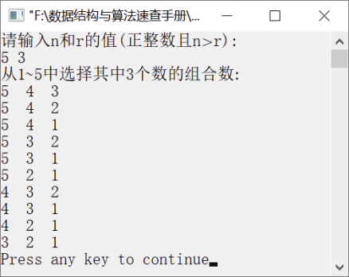

### 12.2.8　从自然数1～n中任选r个数的所有组合数


**问题描述**


实现递归算法，求从自然数1～n中任选r个数的所有组合数。


**【分析】**

利用分而治之的方法，将从n个数中选取r个数的问题分解为较小的问题进行解决。当组合数中的第一个数选定后，可从剩下的（n−1）个数中取（k−1）个数的组合。假设用数组a存放求出的组合数。在求每组组合数的时候，首先将当前组合数的第一个数字存放在a[k]中，然后调用递归函数从剩下的（n−1）个数中求其他组合数。若k1，则表明得到一组组合数，将该组合数输出即可。然后再求其他组合数，直到所有的组合数输出为止。


第12章\实例12-17.cpp

```c
/********************************************
*实例说明：从自然数1～n中任选r个数的所有组合数
*********************************************/
#include<iostream.h>
#define N 100
int a[N];
void Comb(int m,int k)
{    
    int i,j;    
    for(i=m;i>=k;i--)    
    {    
        a[k]=i;    
        if(k>1)    //未完成一个组合数    
            Comb(i-1,k-1);        
        else    //完成一个组合数，则输出该组合数的所有数字
        {
            for(j=a[0];j>0;j--)            
                cout<<a[j]<<"  ";            
            cout<<endl;        
        }    
    }
}
void main()
{
    int n,r;    
    cout<<"请输入n和r的值(正整数且n>r):"<<endl;    
    cin>>n>>r;    
    if(r>n)    
        cout<<"输入n和r的值错误!"<<endl;
    else
    {    
        cout<<"从1～"<<n<<"中选择其中"<<r<<"个数的组合数:"<<endl;
        a[0]=r;        
        Comb(n,r);    
    }
}
```

运行结果如图12.21所示。


<center class="my_markdown"><b class="my_markdown">图12.21　运行结果</b></center>


