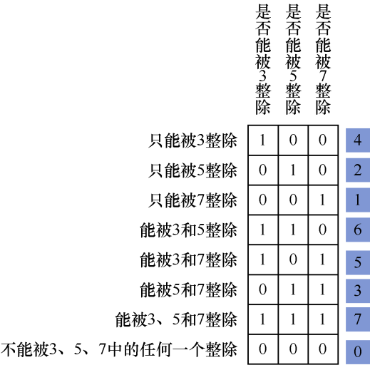
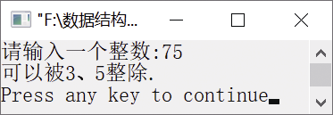

### 13.1　判断n是否能被3、5、7整除


**问题描述**


输入一个正整数n，判断n是否能被3、5、7整除，并输出以下信息。

（1）能同时被3、5、7整除。

（2）能被其中两个数（要指出是哪两个）整除。

（3）能被其中一个数（要指出是哪一个）整除。


**【分析】**

可以用简单的if…else选择语句判断n是否能被3、5、7整除。代码如下。

```c
1  if(n%3==0&&n%5==0&&n%7==0)
2      printf("该整数能同时被3、5、7整除");
3  else if(n%3==0&&n%5==0&&n%7!=0)
4      printf("该整数能被其中两个数3、5整除");
5  else if(n%3==0&&n%5!=0&&n%7==0)
6      printf("该整数能被其中两个数3、7整除");
7  else if(n%3!=0&&n%5==0&&n%7==0)
8      printf("该整数能被其中两个数5,7整除");
9  else if(n%3==0&&n%5!=0&&n%7!=0)
10     printf("该整数能被其中一个数3整除");
11 else if(n%5==0&&n%3!=0&&n%7!=0)
12     printf("该整数能被其中一个数5整除");
13 else if(n%7==0&&n%3!=0&&n%5!=0)
14     printf("该整数能被其中一个数7整除");
15 else
16     printf("该整数不能被3,5,7中的任一个整除");
```

以上代码使用了过多的选择语句，结构不是很清晰。除了以上方法之外，还可以结合二进制数的性质利用枚举算法求解，具体方法如下。

将n能被整除用1表示，不能被整除用0表示。用3位二进制数表示n是否能被3、5、7整除，从高位到低位分别表示n是否能被3、5、7整除。例如，1（即(001)<sub class="my_markdown">2</sub>）表示能被7整除，4（即(100)<sub class="my_markdown">2</sub>）表示能被3整除，6（即(110)<sub class="my_markdown">2</sub>）表示能被3和5同时整除，如图13.1所示。


<center class="my_markdown"><b class="my_markdown">图13.1　是否能被3、5、7整除的二进制表示</b></center>

从图中可以看出，共有8种可能情况。为了表示该二进制数，需要定义3个变量c1、c2、c3，分别表示n是否能被3、5、7整除。在判断n是否能被3、5、7整除前，需要先判断c1、c2、c3分别是否能被3、5、7整除。代码如下。

```c
  c1=n%3==0;
  c2=n%5==0;
  c3=n%7==0;
```

将c1左移2位，将c2左移1位，并将移位后的c1、c2与c3相加，即(c1<<2)+(c2<<1)+c3。该和有8种取值，范围为0～7，接着判断3个数的和并输出结果。


第13章\实例13-01.c

```c
/********************************************
*实例说明：判断n是否能被3、5、7整除
*********************************************/
1  #include<stdio.h>
2  void main()
3  {
4      int n,c1,c2,c3;
5      printf("请输入一个整数:");
6      scanf("%d",&n);
7      c1=n%3==0;
8      c2=n%5==0;
9      c3=n%7==0;
10     switch((c1<<2)+(c2<<1)+c3)
11     {
12         case 0:
13                printf("不能被3、5、7整除.\n");
14                break;
15         case 1:
16                printf("只能被7整除.\n");
17                break;
18         case 2:
19                printf("只能被5整除.\n");
20                break;
21         case 3:
22                printf("可以被5、7整除.\n");
23                break;
24         case 4:
25                printf("只能被3整除.\n");
26                break;
27         case 5:
28                printf("可以被3、7整除.\n");
29                break;
30         case 6:
31                printf("可以被3、5整除\n");
32                break;
33         case 7:
34                printf("可以被3、5、7整除\n");
35                break;
36    }
37 }
```

运行结果如图13.2所示。


<center class="my_markdown"><b class="my_markdown">图13.2　运行结果</b></center>

**【说明】**

（1）利用switch选择语句判断n是否能被3、5、7整除，结构上清晰、简洁明了。

（2）灵活使用了二进制数的左移运算，需要读者熟练掌握二进制数的使用。

