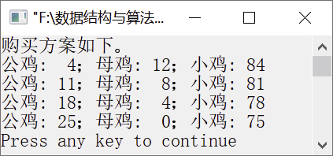

### 13.2　百钱买百鸡


**问题描述**


公鸡3元１只，母鸡5元1只，小鸡1元3只，100元钱买100只鸡。请求出公鸡、母鸡和小鸡的数目。


**【分析】**

假设公鸡数为cock，母鸡数为hen，小鸡数为chick，得到两个关系式，分别是cock+hen+ chick=100和3cock+5hen+chick/3=100。我们可以枚举公鸡、母鸡和小鸡的个数，然后以上面的两个关系式作为判定条件，当符合条件时，即是所求。

从上面的关系式中，我们不难得出公鸡、母鸡、小鸡的取值范围：公鸡最多有33只，最少为0只，即cock的范围是0～33；母鸡最多有20只，最少为0只，即hen的范围是0～20；小鸡最多有300只，最少为0只，即chick的范围是0～300。


第13章\实例13-02.c

```c
/********************************************
*实例说明：百钱买百鸡
*********************************************/
1  #include<stdio.h>
2  const int COCKPRICE=3;              
3  const int HENPRICE=5;               
4  const int CHICKS=3;                 
5  void Scheme(int money, int chooks); 
6  void main()
7  {
8      int money=100;                  
9      int chooks=100;                 
10     printf("购买方案如下0\n");
11     Scheme(money, chooks);          
12 }
13 void Scheme(int money, int chooks)
14 /*计算并输出购买方案*/
15 {
16    int maxCock=money / COCKPRICE;
17    int maxHen=money / HENPRICE;
18    int maxChick=chooks;
19    int cock, hen, chick;
20    for (cock=0; cock<maxCock; ++cock)         
21    {
22       for (hen=0; hen<maxHen; hen++)          
23       {
24          for (chick=0; chick<maxChick; chick++)/*枚举小鸡的可能数量*/
25          {
26             /*约束条件*/
27               if (0==chick%CHICKS&&cock+hen+chick==chooks
28                  &&COCKPRICE*cock+HENPRICE*hen+chick/CHICKS==money)
29              {
30                  printf("公鸡: %2d；母鸡: %2d；小鸡: %2d\n", cock,
                    hen, chick);
31              }
32          }
33       }
34    }
35 }
```

运行结果如图13.3所示。


<center class="my_markdown"><b class="my_markdown">图13.3　运行结果</b></center>

**【说明】**

在验证候选解时，需要保证小鸡的数量是3的倍数，即保证不出现小数，增加如下条件。

```c
chick%3==0
```

