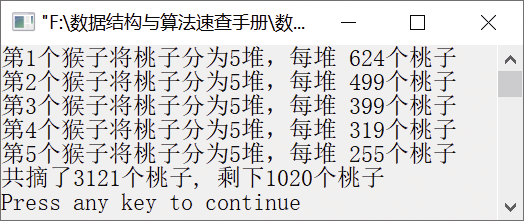

### 13.3　五猴分桃


**问题描述**


5只猴子一起摘了一堆桃子，因为太累了，它们商量决定先睡一觉再分。一会儿，第1只猴子来了，它见别的猴子没来，便将这堆桃子平均分成5份，结果多了1个，就将多的这个吃了，并拿走其中的1份。一会儿，第2只猴子来了，它不知道已经有1个同伴来过，还以为自己是第1个到的，于是将地上的桃子堆起来，再一次平均分成5份，发现也多了1个，同样吃了这1个桃子，并拿走其中1份。接着来的第3只、第4只、第5只猴子都是这样做的。

根据上面的条件，这5只猴子至少摘了多少个桃子?第5只猴子走后还剩下多少个桃子？


**【分析】**

设总的桃子数为S<sub class="my_markdown">0</sub>，5只猴子分得的桃子数分别为S<sub>1</sub>、S<sub>2</sub>、S<sub>3</sub>、S<sub>4</sub>、S<sub>5</sub>，则有以下关系式，

S<sub class="my_markdown">0</sub>=5S<sub>1</sub>+1

4S<sub class="my_markdown">1</sub>=5S<sub>2</sub>+1

4S<sub class="my_markdown">2</sub>=5S<sub>3</sub>+1

4S<sub class="my_markdown">3</sub>=5S<sub>4</sub>+1

4S<sub class="my_markdown">4</sub>=5S<sub>5</sub>+1

我们可以枚举桃子总数S<sub class="my_markdown">0</sub>。从S<sub>5</sub>=1开始枚举，由S<sub>5</sub>得到S<sub>4</sub>，即S<sub>4</sub>=5S<sub>5</sub>+1，并判断S<sub>4</sub>是否能被4整除。如果能被4整除，则由S<sub>4</sub>得到S<sub>3</sub>，即S<sub>3</sub>=5S<sub>4</sub>+1；否则，将S<sub>5</sub>加1，继续以上过程。

以此类推，直到得到S<sub class="my_markdown">0</sub>为止。此时，S<sub class="my_markdown">0</sub>的值就是最少的总桃子数。


第13章\实例13-03.c

```c
/********************************************
*实例说明：五猴分桃
*********************************************/
1  #include<stdio.h>
2  void main()
3  {
4      int s[6]={0},i;
5      for(s[5]=1;;s[5]++)
6      {
7          s[4]=5*s[5]+1;
8          if (s[4]%4)
9              continue;
10         else
11             s[4]/=4;
12         s[3]=5*s[4]+1;
13         if (s[3]%4)
14             continue;
15         else
16             s[3]/=4;
17         s[2]=5*s[3]+1;
18         if (s[2]%4)
19             continue;
20         else
21             s[2]/=4;
22         s[1]=5*s[2]+1;
23         if (s[1]%4)
24             continue;
25         else
26             s[1]/=4;
27         s[0]=5*s[1]+1;
28         break;
29     }
30     for(i=1;i<6;i++)
31         printf("第%d个猴子将桃子分为5堆，每堆%4d个桃子\n",i,s[i]);
32     printf("共摘了%d个桃子, 剩下%d个桃子\n", s[0], s[5]*4);
33 }
```

运行结果如图13.4所示。


<center class="my_markdown"><b class="my_markdown">图13.4　运行结果</b></center>

**【说明】**

第5行从S[5]=1开始枚举，验证候选解是否是所求解。

第7行根据S[5]得到S[4]。

第8～11行判断S[4]是否能被4整除。如果不能被4整除，则说明S[4]不是所求解，需要继续验证下一个候选解，并将S[5]增1；否则，将S[4]除以4，得到S[4]。

第12行根据S[4]得到S[3]。

第13～16行判断S[3]是否能被4整除。如果不能被4整除，则说明S[3]不是所求解，需要继续验证下一个候选解，并将S[5]增1；否则，将S[3]除以4，得到S[3]。

第17～21行求出S[2]。

第22～26行求出S[1]。

第27行求出S[0]。

第28行跳出for循环语句。

第30～31行输出每只猴子分成的堆数、桃子个数。

第32行输出桃子的总个数和剩下的桃子个数。

