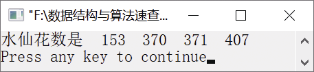

### 13.4　输出“水仙花数”


**问题描述**


输出“水仙花数”。“水仙花数”是指这样的一个3位数，其各位数字的立方和等于该数本身。例如，因为153=1<sup class="my_markdown">3</sup>+5<sup class="my_markdown">3</sup>+3<sup class="my_markdown">3</sup>，所以153是一个“水仙花数”。


**【分析】**

（1）列举出所有的候选解，即100～999的所有整数。代码如下。

```c
for(n=100;n<1000;n++)
```

（2）依次求出每个候选解的百位、十位、个位上的数字。代码如下。

```c
  i=n/100;            /*百位上的数字*/
  j=n/10%10;          /*十位上的数字*/
  k=n%10;             /*个位上的数字*/
```

（3）判断候选解是否是所求的解。如果是，则输出候选解。代码如下。

```c
  if(i*100+j*10+k==i*i*i+j*j*j+k*k*k)
      printf("%5d",n);
```


第13章\实例13-04.c

```c
/********************************************
*实例说明：输出“水仙花数”
*********************************************/
1  #include<stdio.h>
2  void main()
3  {
4      int i,j,k,n;
5      printf("水仙花数是");
6      for(n=100;n<1000;n++)
7      {
8          i=n/100;            /*百位上的数字*/
9          j=n/10%10;          /*十位上的数字*/
10         k=n%10;             /*个位上的数字*/
11         if(i*100+j*10+k==i*i*i+j*j*j+k*k*k)
12                printf("%5d",n);
13     }
14     printf("\n");
15 }
```

运行结果如图13.5所示。


<center class="my_markdown"><b class="my_markdown">图13.5　运行结果</b></center>

**【说明】**

第6行枚举每个候选解，范围是100～999。

第8行求出每个候选解的百位上的数字。

第9行求出每个候选解的十位上的数字。

第10行求出每个候选解的个位上的数字。

第11～12行判断候选解是不是所求解。如果是，则输出候选解。

