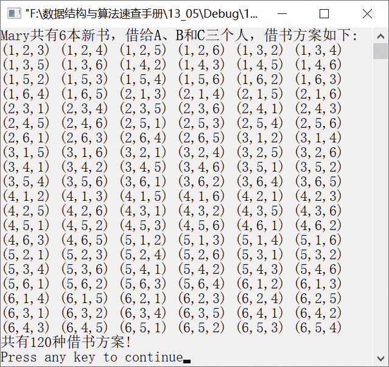

### 13.5　Mary的借书方案


**问题描述**


已知Mary有6本新书，若借给A、B和C这3位同学，每个人只能借1本，则共有多少种借书方案？


**【分析】**

假设Mary的6本新书编号为1、2、3、4、5、6，每位同学借到的新书就是这6本书的组合。A借到的书可以是1～6本新书中的任意1本，B借到的新书就是除了A借到的新书之外的5本，C借书的方案只有4种，因此总共的借书方案有6×5×4=120种。

可采用枚举算法求解该问题。A、B和C分别可以选取1～6本新书的任意1本，但是3人不能借到同一本新书，这就是该算法的约束条件，即x!=y&&x!=z&&y!=z。


第13章\实例13-05.cpp

```c
/********************************************
*实例说明：Mary的借书方案
*********************************************/
#include<iostream.h>
#include<iomanip.h>
void main()
{
    int x,y,z;
    int n=6,c,total;
    c=total=0;
    cout<<"Mary共有"<<n<<"本新书，借给A、B和C三个人，借书方案如下:"<<endl;
    for(x=1;x<=n;x++)
        for(y=1;y<=n;y++)
            for(z=1;z<=n;z++)
            {
                if(x!=y && x!=z && y!=z)
                {
                    cout<<"("<<x<<","<<y<<","<<z<<")"<<setw(2);
                    c++;
                    total++;
                }
                if(c%6==0&&c!=0)
                {
                    cout<<endl;
                    c=0;
                }
            }
    cout<<"共有"<<total<<"种借书方案!"<<endl;
}
```

运行结果如图13.6所示。


<center class="my_markdown"><b class="my_markdown">图13.6　运行结果</b></center>

