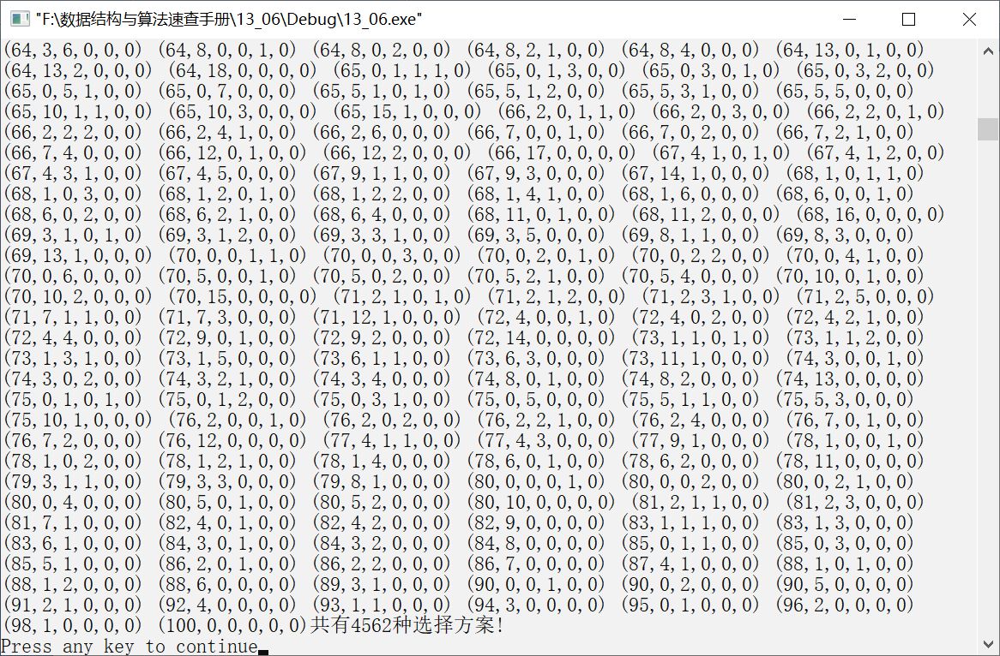

### 13.6　整币换零


**问题描述**


若将100元兑换为1元、2元、5元、10元、20元和50元，共有多少种兑换方式？


**【分析】**

假设1元、2元、5元、10元、20元和50元的张数分别为c<sub class="my_markdown">1</sub>、c<sub>2</sub>、c<sub>3</sub>、c<sub>4</sub>、c<sub>5</sub>、c<sub>6</sub>，则将100元人民币兑换为以上面值就相当于解以下六元一次方程。

1c<sub class="my_markdown">1</sub>+2c<sub>2</sub>+5c<sub>3</sub>+10c<sub>4</sub>+20c<sub>5</sub>+50c<sub>6</sub>=100

其中，c<sub class="my_markdown">1</sub>～c<sub>6</sub>为非负整数，其取值范围均为[0,100]。类似于实例13-05，以上兑换方式可利用枚举算法求解。


第13章\实例13-06.cpp

```c
/********************************************
*实例说明：整币换零
*********************************************/
#include<iostream.h>
#include<iomanip.h>
void main()
{
    int c1,c2,c3,c4,c5,c6,n=100,c=0;
    cout<<"100元兑换为1元，2元，5元，10元，20元和50元的方式："<<endl;
    for(c1=0;c1<=n;c1++)
        for(c2=0;c2<=n;c2++)
            for(c3=0;c3<=n;c3++)
                for(c4=0;c4<=n;c4++)
                    for(c5=0;c5<=n;c5++)
                        for(c6=0;c6<=n;c6++)
                        {
                            if(c1+c2*2+c3*5+c4*10+c5*20+c6*50==n)
                            {
                                cout<<"("<<c1<<","<<c2<<","<<c3<<","
                                <<c4<<","<<c5<<","<<c6<<")"<<setw(2);
                                c++;
                                if(c%6==0&&c!=0)
                                    cout<<endl;
                            }
                        }
    cout<<"共有"<<c<<"种选择方案!"<<endl;
}
```

部分运行结果（运行结果太长，这里只截取了部分结果）如图13.7所示。


<center class="my_markdown"><b class="my_markdown">图13.7　运行结果</b></center>

**【注意】**

利用枚举算法求解问题时，特别是在循环层次较多情况下，算法的效率比较低。

