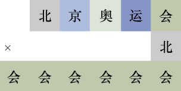
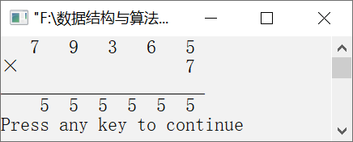

### 13.7　填数游戏


**问题描述**


如图13.8所示，每个汉字代表一个数字，不同的汉字代表的数字不同，要求填写这些汉字代表的数字。


**【分析】**

从图13.8不难看出，共有5个汉字，每个汉字代表数字0～9中的任意一个。显然，“北”和“会”两个字不能是0。利用5个循环，枚举每个汉字代表的数字，然后判断相乘的结果是否与列出的算式相等。如果相等，则说明找到一个正确的解；否则，说明没有找到正确的解。


<center class="my_markdown"><b class="my_markdown">图13.8　填数游戏</b></center>

例如，如果用1、2、3、4、5分别代表“北”“京”“奥”“运”“会”，则将12345×1与55555比较，二者显然是不相等的。因此，不是正确的解。


第13章\实例13-07.cpp

```c
/********************************************
*实例说明：填数游戏
*********************************************/
1  #include<stdio.h>
2  void main()
3  {
4      int i1,i2,i3,i4,i5;
5      long mult,r;
6      for(i1=0;i1<=9;i1++)
7      {
8          for(i2=0;i2<=9;i2++)
9          {
10             for(i3=0;i3<=9;i3++)
11             {
12                 for(i4=0;i4<=9;i4++)
13                 {
14                     for(i5=1;i5<=9;i5++)
15                     {
16                         mult=i1*10000+i2*1000+i3*100+i4*10+i5;
17                         r=i5*100000+i5*10000+i5*1000+i5*100+i5*10+i5;
18                         if(mult*i1==r&&i1!=i2&&i1!=i3&&i1!=
                           i4&&i1!=i5&&
19                             i2!=i3&&i2!=i4&&i2!=i5&&i3!=
                               i4&&i3!=i5&&i4!=i5)
20                         {
21                             printf("%4d%4d%4d%4d%4d\n",i1,i2,
                               i3,i4,i5);
22                             printf("×%18d\n",i1);
23                             printf("_____________________\n",i1);
24                             printf("%5d%3d%3d%3d%3d%3d\n",
                               i5,i5,i5,i5,i5,i5);
25                         }
26                     }
27                 }
28             }
29         }
30     }
31 }
```

运行结果如图13.9所示。


<center class="my_markdown"><b class="my_markdown">图13.9　运行结果</b></center>

**【说明】**

第6～14行枚举汉字“北”“京”“奥”“运”“会”对应的数字。

第16行求出被乘数。

第17行求出已知的积。

第18～25行判断候选解是否是正确的解，如果是，则输出解。

