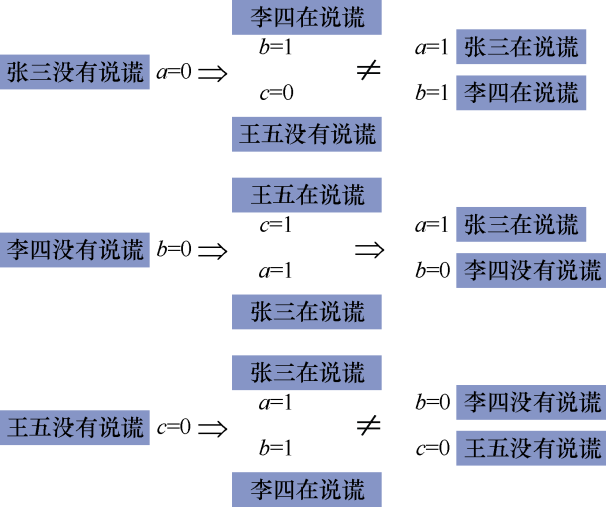
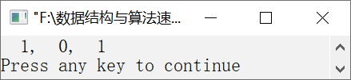

### 13.8　谁在说谎


**问题描述**


张三说李四在说谎，李四说王五在说谎，王五说张三、李四都在说谎。请判断到底谁在说谎。


**【分析】**

这是一个逻辑推理题，用正常的推理方法无法得出答案。我们可以先假设一个条件成立，然后根据这个条件进行推理。如果得出的结果不与条件矛盾，则说明条件成立；如果得出的结果与条件矛盾，则说明条件是不成立。这种方法在数学上叫反证法。

如果张三没有说谎，则李四在说谎，进一步推出王五没有说谎。如果李四没有说谎，则王五在说谎，张三在说谎。如果王五没说谎，则张三和李四都在说谎。推理过程如图13.10所示。


<center class="my_markdown"><b class="my_markdown">图13.10　推理过程</b></center>

在程序设计过程中，我们可以利用枚举算法解决这种问题。依次枚举a（张三）、b（李四）、c（王五）的候选解，然后利用候选解推出结果，将这个结果与条件比较，检查是否有矛盾出现。如果有矛盾出现，则说明当前的候选解不是正确的解；否则，候选解是正确的解。


第13章\实例13-08.cpp

```c
/********************************************
*实例说明：谁在说谎
*********************************************/
1  #include<stdio.h>
2  void main()
3  {
4      int a,b,c;
5      for(a=0;a<=1;a++)
6          for(b=0;b<=1;b++)
7              for(c=0;c<=1;c++)
8              {
9                  if(a==0)          /*如果张三没有说谎*/
10                     if(b==1)      /*如果李四在说谎*/
11                         if(c==0)  /*如果王五没有说谎*/
12                             if(a==1&&b==1)
13                                 printf("%3d,%3d,%3d\n",a,b,c);
14                  if(b==0)              /*如果李四没有说谎*/
15                      if(a==1&&c==1)    /*如果张三和王五在说谎*/
16                          if(a==0||b==0)
17                              printf("%3d,%3d,%3d\n",a,b,c);
18                  if(c==0)              /*如果王五没有说谎*/
19                      if(a==1&&b==1)    /*如果张三和李四在说谎*/
20                          if(b==0)
21                              printf("%3d,%3d,%3d\n",a,b,c);
22             }
23 }
```

运行结果如图13.11所示。


<center class="my_markdown"><b class="my_markdown">图13.11　运行结果</b></center>

**【说明】**

从运行结果上可以看出，张三和王五在说谎，李四没有说谎。

第5～7行依次枚举a、b、c的候选解。候选解只有两种取值0和1，0表示没有说谎，1表示说谎。

第9～13行假设张三没有说谎，并验证推出的结果是否矛盾。

第14～17行假设李四没有说谎，并验证推出的结果是否矛盾。

第18～21行假设王五没有说谎，并验证推出的结果是否矛盾。

