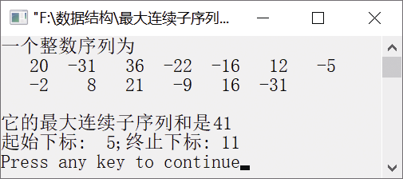

### 13.9　求最大连续子序列和


**问题描述**


已知一个包含n个元素的序列，求最大连续子序列和。例如，序列{20, −31,36, −22, −16,12, −5, −2,8,21, −9,16, −31}的最大子序列和为41，子序列下标为5～11，即该子序列为{12, −5, −2,8,21, −9,16}。


**【分析】**

假设包含n个元素的序列存放在数组a中，从第0个元素开始依次求元素的和thissum，并将最大值存放在maxsum中。然后从第1个元素开始依次求后面元素的和thissum，并与maxsum比较，将最大值存放在maxsum中。以此类推，直到得到从第n−1个元素开始的子序列和，maxsum的值即为最大连续子序列和。为了获得子序列的下标，在每次得到最大子序列和时，将起始下标和终止下标分别保存到变量index_start与index_end中。


第13章\实例13-09.cpp

```c
/********************************************
*实例说明：求最大连续子序列和
*********************************************/
#include<iostream.h>
#include<iomanip.h>
int MaxSum(int a[], int n, int *index_start, int *index_end);
void main()
{
    int a[]={20,-31,36,-22,-16,12,-5,-2,8,21,-9,16,-31};
    int n,i,index_start,index_end;
    n=sizeof(a)/sizeof(a[0]);
    cout<<"一个整数序列为"<<endl;
    for(i=0;i<n;i++)
    {
        cout<<setw(5)<<a[i];
        if(i%6==0&&i!=0)
            cout<<endl;
    }
    cout<<endl;
    cout<<"它的最大连续子序列和是"<<MaxSum(a,n,&index_start,&index_end)<<endl;
    cout<<"起始下标:"<<setw(3)<<index_start<<";终止下标:"<<setw(3)<<index_end<<endl;
}
int MaxSum(int a[], int n, int *index_start,int *index_end)
{
    int maxsum,thissum,i,j;
    for(i=0;i<n;i++)            //从下标0开始计算连续子序列和
    {
        thissum=0;              
        for(j=i;j<n;j++)        
        {
            thissum+=a[j];
            if(thissum>maxsum)   
            {
                maxsum=thissum;  
                *index_start=i;  
                *index_end=j;    
            }
        }
    }
    return maxsum;
}
```

运行结果如图13.12所示。


<center class="my_markdown"><b class="my_markdown">图13.12　运行结果</b></center>

