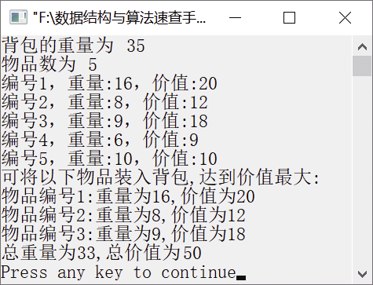

### 13.10　0/1背包问题


**问题描述**


有n个重量为w<sub class="my_markdown">1</sub>, w<sub>2</sub>, …, w<sub class="my_markdown">n</sub>的物品，编号为1～n，价值分别为v<sub class="my_markdown">1</sub>, v<sub>2</sub>, …, v<sub class="my_markdown">n</sub>。要求从中选择物品装入重量为W的背包，这些物品只能装入背包或不装入背包，不能选择物品的某一部分装入背包，请设计算法使背包中的物品价值达到最大。


**【分析】**

假设物品的个数为n，则有2n个装入背包的组合方式。穷举所有组合方式，先从第一个组合开始，依次将该组合中的物品取出。若装入背包，则检查背包中物品的重量是否超过背包的限制，若不超过限制且当前物品总价值大于之前的组合，则更新表示物品最大价值的maxvalue变量并保存选择的物品编号。为了获取所有组合方式，可模拟二进制加法从00…0加到11…1。其中，每一位0和1对应于n个物品，表示是否选择装入背包，可用数组put[]依次存放这n个数字。例如，put[i]=1表示将第i+1个物品装入背包，put[i]=0表示第i+1个物品不装入背包。


第13章\实例13-10.cpp

```c
/********************************************
*实例说明：0/1背包问题
*********************************************/
#include<stdio.h>
#define MAXN 20
typedef struct
{
    int weight[MAXN];
    int value[MAXN];
    int limitw;
    int num;
}Goods;
int Bin(int a[],int n);
void Knapsack(Goods *g,int select[]);
int BinTraverse(int a[],int n)
/*利用二进制模拟遍历数组中的每一位，达到枚举所有组合方式的目的*/
{
    int i,carry=0;
    a[0] += 1;
    for (i = 0; i < n; i++)
    {
        a[i] += carry;     
        carry = a[i] /2;   
        a[i] %= 2;         
        if (carry==0)
            return 0;
    }
    return carry;
}
void Knapsack(Goods *g,int select[])
/*使用枚举算法求解背包问题*/
{
   int i,flag;
   int put[MAXN];                      
   double maxvalue = 0,tw,tv;
   for (i = 0; i < g->num; i++)        /*初始化背包*/
       put[i] = 0;
   while(BinTraverse(put, g->num) == 0)
   {
       tw = 0;
       tv = 0;
       flag = 1;
       for (i = 0; i < g->num; i++)    
       {
           if (put[i] == 1)            
           {
               tw += g->weight[i];     
               tv += g->value[i];      
               if (tw > g->limitw)     
               {
                   flag = 0;           
                   break;
               }
           }
       }
       if(flag && maxvalue < tv)       
       {
           maxvalue = tv;              
           for(i = 0; i < g->num; i++) 
               select[i] = put[i];
       }
   }
}
void main()
{
    Goods g={{16,8,9,6,10},{20,12,18,9,10},35,5};/*初始化物品的重量、价值和背包的重量*/
    int totalweight,maxvalue,i;
    int select[MAXN];
    Knapsack(&g,select);
    totalweight=0;
    maxvalue=0;
    printf("背包的重量为%d\n",g.limitw);
    printf("物品数为%d\n",g.num);
    for(i=0;i<g.num;i++)
        printf("编号%d，重量:%d，价值:%d\n",i+1,g.weight[i],g.value[i]);
    printf("可将以下物品装入背包,达到价值最大:\n");
    for (i = 0; i < g.num; ++i)
    if (select[i])
    {
        printf("物品编号%d:重量为%d,价值为%d\n",i + 1,g.weight[i],g.value[i]);
        totalweight+=g.weight[i];
        maxvalue+=g.value[i];
    }
    printf("总重量为%d,总价值为%d\n",totalweight, maxvalue);
}
```

运行结果如图13.13所示。


<center class="my_markdown"><b class="my_markdown">图13.13　运行结果</b></center>


