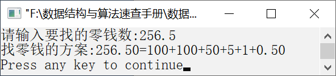

### 14.2　找零钱问题


**问题描述**


人民币的面额有100元、50元、10元、5元、2元、1元等。在找零钱时，可以有多种方案。例如，146元的找零方案如下。

（1）100+20+20+5+1。

（2）100+20+10+10+5+1。

（3）100+20+10+10+2+2+2。

（4）100+10+10+10+10+1+1+1+1+1+1。


**【分析】**

利用贪心算法，则选择的是第1种方案。首先选择一张最大面额的人民币，即100元，然后在剩下的46元中选择面额最大即20元。以此类推，每次的选择都是局部最优解。


第14章\实例14-01.cpp

```c
/********************************************
*实例说明：找零钱问题
*********************************************/
1  #include<stdio.h>
2  #define N 60
3  int exchage(float n,float *a,int c,float *r);
4  void main()
5  {
6      float rmb[]={100,50,20,10,5,2,1,0.5,0.2,0.1};
7      int n=sizeof(rmb)/sizeof(rmb[0]),k,i;
8      float change,r[N];;
9      printf("请输入要找的零钱数:");
10     scanf("%f",&change);
11     for(i=0;i<n;i++)
12         if(change>=rmb[i])
13             break;
14     k=exchage(change,&rmb[i],n-i,r);
15     if(k<=0)
16        printf("找不开!\n");
17     else
18     {
19        printf("找零钱的方案:%.2f=",change);
20        if(r[0]>=1.0)
21                printf("%.0f",r[0]);
22        else
23                printf("%.2f",r[0]);
24        for(i=1;i<k;i++)
25        {
26            if(r[i]>=1.0)
27                printf("+%.0f",r[i]);
28            else
29                 printf("+%.2f",r[i]);
30            }
31            printf("\n");
32     }
33 }
34 int exchage(float n,float *a,int c,float *r)
35 {
36     int m;
37     if(n==0.0) 
38         return 0;
39     if(c==0)   
40         return -1;
41     if(n<*a)
42         return exchage(n,a+1,c-1,r); 
43     else
44     {
45         *r=*a;           
46         m=exchage(n-*a,a,c,r+1);
47         if(m>=0)
48             return m+1;
49         return -1;
50      }
51 }
```

运行结果如图14.1所示。


<center class="my_markdown"><b class="my_markdown">图14.1　运行结果</b></center>

**【说明】**

第6行存放人民币的各种面额大小。

第11～13行找到第1个小于change的人民币面额。

第14行调用exchange函数并返回找零的零钱张数。

第15～16行中，如果返回小于或等于0的数，则表示找不开零钱。

第17～32行输出找零钱的方案。

第37～38行表示找零钱成功，返回0。

第39～40行表示没有找到合适的找零钱方案，返回−1。

第41～42行继续寻找合适的面额。

第45行将零钱保存到数组r中。

第46行继续分解剩下的零钱。

第47～48行返回找零的零钱张数。

