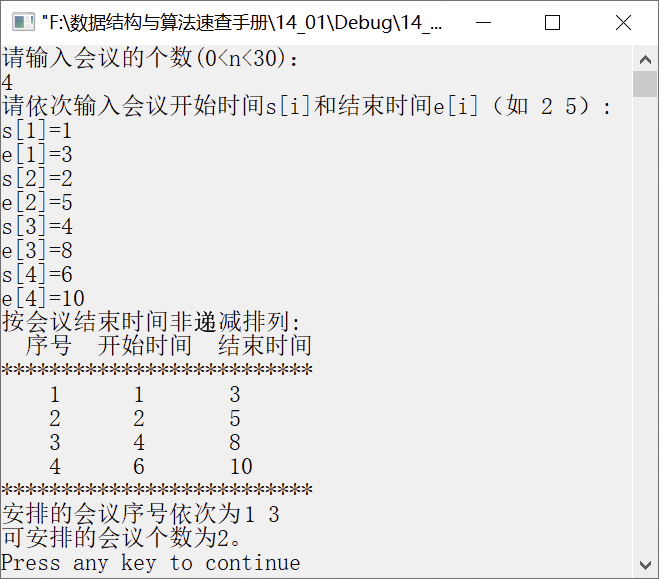

### 14.3　会议安排问题


**问题描述**


假设要在会场里安排若干个会议，每个会议i都有开始时间s<sub class="my_markdown">i</sub>以及结束时间e<sub class="my_markdown">i</sub>，并且s<sub class="my_markdown">i</sub><e<sub class="my_markdown">i</sub>。如果存在两个会议i、j，且[s<sub class="my_markdown">i</sub>,e<sub class="my_markdown">i</sub>)、[s<sub class="my_markdown">j</sub>,e<sub class="my_markdown">j</sub>)均在“有限的时间”内并且不相交，就称会议i与会议j相容。会议安排问题要求在所给的会议集合中选出最大的相容会议子集，即尽可能在有限的时间内召开更多的会议。

例如，假设有4个会议，其会议开始时间依次为1点、2点、4点、6点，会议结束时间依次为3点、5点、8点、10点，安排会议的最佳方案是什么？最多可安排几场会议？


**【分析】**

为了保证尽可能多地利用资源，可利用贪心算法求解。约束条件为一个会议的结束时间和另一场会议的开始时间没有交叉，每一步选择总是能使剩下的会议时间安排最大化，使得兼容的会议尽可能多。因此，可按会议结束时间从小到大进行排序，然后从头开始选择会议。选择会议i前，需要判断s[i]是否不小于e[j]。若会议i的开始时间晚于会议j，则将会议i标记为已选择，即令p[i]=1，同时记录下当前选择会议的编号，以便下次选择进行比较。


第14章\实例14-02.cpp

```c
/********************************************
*实例说明：会议安排问题
*********************************************/
#include<stdio.h>
#include<stdlib.h>
#define MAXN 30
void GreedySelect(int n, int s[], int f[], int p[]);
int Partition(int s[], int e[], int first, int last);
//完成以枢轴元素为中心的一次划分
{
    int i = first+1, j = last, t, x, y;
    x = e[first];
    y = s[first];
    while (1)
    {
        while (e[i]<x)
            i++;
        while (e[j]>x)
            j--;
        if (i >= j)
            break;
        else
        {
            t = e[i];
            e[i] = e[j];
            e[j] = t;
            t = s[i];
            s[i] = s[j];
            s[j] = t;
        }
    }
    e[first] = e[j];
    s[first] = s[j];
    e[j] = x;
    s[j] = y;
    return j;
}
void QuickSort(int s[], int e[], int first, int last)
//快速排序，对会议结束时间进行排序
{
    int pivot;
    if (first<last)
    {
        pivot = Partition(s, e, first, last);
        QuickSort(s, e, first, pivot - 1);/*对左半部分排序*/
        QuickSort(s, e, pivot + 1, last);/*对右半部分排序*/
    }
}
void GreedySelect(int n, int s[], int e[], int p[])
{
    int i,j;
    p[1] = 1;  //从第一个会议开始选择，加入会议安排中
    j = 1;     //j记录最近一次加入会议安排中的会议
    for (i = 2; i <= n; i++)
    {
        if (s[i] >= e[j])  
        {
            p[i] = 1;  
            j = i;
        }
        else  
            p[i] = 0;
    }
}
void main()
{
    int n, i,c=0;
    int s[MAXN];/*会议开始时间*/
    int e[MAXN];/*会议结束时间*/
    int p[MAXN];/*p[]存放是否安排会议,1表示安排，0表示不安排*/
    printf("请输入会议的个数(0<n<30)：\n");
    scanf("%d", &n);
    printf("请依次输入会议开始时间s[i]和结束时间e[i]（如 2 5）:\n");
    for (i = 1; i <= n; i++)
    {
        printf("s[%d]=", i, i);
        scanf("%d", &s[i]);
        printf("e[%d]=", i, i);
        scanf("%d", &e[i]);
    }
    QuickSort(s, e, 1, n); //按结束时间非降序排列
    printf("按会议结束时间非递减排列:\n"); /*输出排序结果*/
    printf("  序号\t开始时间 结束时间\n");
    printf("**************************\n");
    for (i = 1; i <= n; i++)
        printf("    %d\t   %d\t   %d\n", i, s[i], e[i]);
    printf("**************************\n");
    GreedySelect(n, s, e, p); 
    printf("安排的会议序号依次为");
    for (i = 1; i <= n; i++)
    {
        if (p[i])
        {
            printf("%d ", i);
            c++;
        }
    }
    printf("\n可安排的会议个数为%d。\n",c);
}
```

运行结果如图14.2所示。


<center class="my_markdown"><b class="my_markdown">图14.2　运行结果</b></center>

