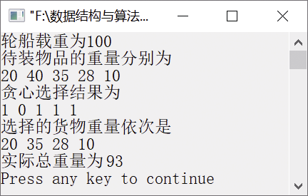

### 14.4　最优装载问题


**问题描述**


有一批集装箱要装上一艘载重量为c的轮船。其中，集装箱i的重量为w<sub class="my_markdown">i</sub>。要求确定在装载体积不受限制的情况下，将尽可能多的集装箱装上轮船的方案。


**【分析】**

这是一个最优装载问题，可采用贪心算法求解。对w<sub class="my_markdown">i</sub>从小到大排列得到{w<sub>1</sub>,w<sub>2</sub>,…,w<sub class="my_markdown">n</sub>}，设(x<sub>1</sub>,x<sub>2</sub>,…，x<sub class="my_markdown">n</sub>)是最优装载问题的满足贪心选择性质的全局最优解，则有x<sub>1</sub>=1，而(x<sub>2</sub>,x<sub>3</sub>,…，x<sub class="my_markdown">n</sub>)是轮船载重为c−w<sub>1</sub>，并且待装船集装箱为{w<sub>2</sub>,w<sub>3</sub>,…,w<sub class="my_markdown">n</sub>}时相应最优装载问题的全局最优解。因此，最优装载问题具有最优子结构性质。采用重量最轻者先装上轮船的贪心选择策略，即可产生最优装载问题的全局最优解。


第14章\实例14-03.cpp

```c
/********************************************
*实例说明：最优装载问题
*********************************************/
#include <iostream.h>
#include<string.h>
#include<malloc.h>
void Swap1(int *a,int *b);
void Swap2(float *a,float *b);
void Loading(int x[],  float w[], float c, int n);
void SelectSort(float w[],int *t,int n);
const int N = 5;
 void main()
 {    
     float c = 100,w[] = {20,40,35,28,10},total=0.0;
     int goods[N],i;
     cout<<"轮船载重为"<<c<<endl;    
     cout<<"待装物品的重量分别为"<<endl;    
     for(i=0; i<N; i++)            
         cout<<w[i]<<" ";
     cout<<endl;    
     Loading(goods,w,c,N);     
     cout<<"贪心选择结果为"<<endl;    
     for(i=0; i<N; i++)    
         cout<<goods[i]<<" ";
     cout<<endl<<"选择的货物重量依次是"<<endl;
     for(i=0;i<N;i++)
         if(goods[i])
         {
             cout<<w[i]<<" ";
             total+=w[i];
         }
     cout<<endl<<"实际总重量为"<<total<<endl;
 }
void Loading(int goods[],float w[], float c, int n)
 {
     int i,*t = (int*)malloc(n*sizeof(int));//存放排完序后数组w的原始索引
     SelectSort(w, t, n);
     for(i=0; i<n; i++)
         goods[i] = 0;//初始化数组x    
     for(i=0; i<n && w[t[i]]<c; i++)    
     {    
         goods[t[i]] = 1;    
         c -= w[t[i]];    
     }
     free(t);
 }
void SelectSort(float w[],int *t,int n)
{    
     float a[N];
     int min,i,j;
     memcpy(a,w,n*sizeof(float));//将w复制到临时数组a中    
     for(i=0;i<n;i++)        
         t[i] = i;    
     for(i=0;i<n;i++)    
     {    
         min=i;    
         for(j=i+1;j<n;j++)    
         {        
             if(a[min]>a[j])        
                 min=j;            
         }    
         Swap2(&a[i],&a[min]);    
         Swap1(&t[i],&t[min]);    
     }
}
void Swap2(float *a,float *b)
 {    
     float t;
     t= *a;
     *a = *b;
     *b = t;
 }
void Swap1(int *a,int *b)
 {    
     int t;
     t= *a;
     *a = *b;
     *b = t;
 }
```

运行结果如图14.3所示。


<center class="my_markdown"><b class="my_markdown">图14.3　运行结果</b></center>

