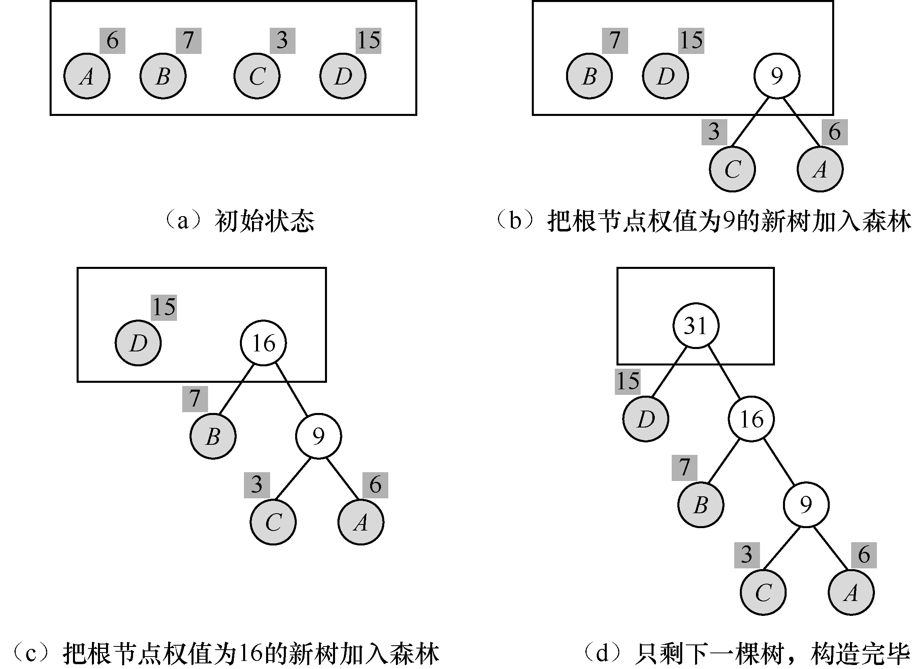
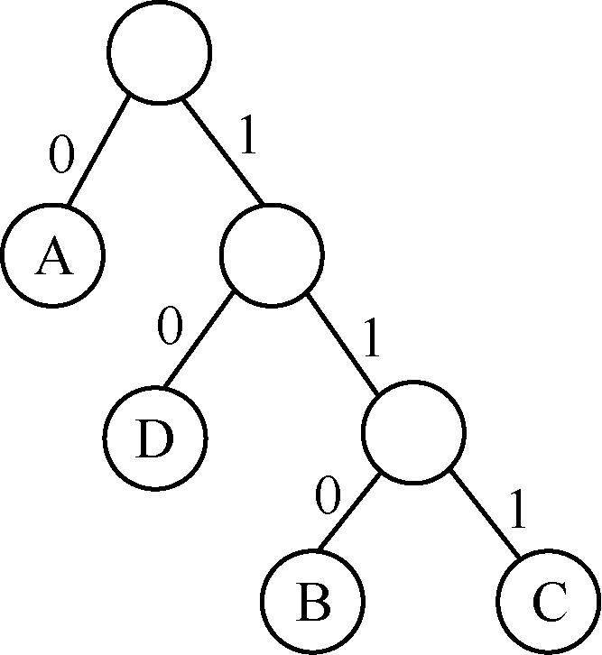
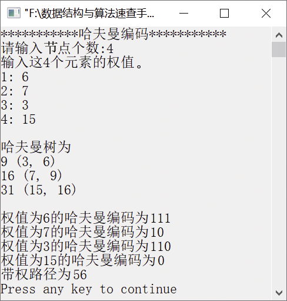

### 14.5　哈夫曼编码


**问题描述**


利用给定的节点权值构造哈夫曼树，并输出每个节点的哈夫曼编码。


**【构造哈夫曼树】**

假设有n个叶子节点，对应的权值分别是w<sub class="my_markdown">1</sub>,w<sub>2</sub>,…,w<sub class="my_markdown">n</sub>，则哈夫曼树的构造方法如下。

（1）将w<sub class="my_markdown">1</sub>,w<sub>2</sub>,…,w<sub class="my_markdown">n</sub>看成有n棵树的森林（每棵树仅有一个节点）。

（2）在森林中选出两棵根节点权值最小的树合并，作为一棵新树的左、右子树，且新树的根节点权值为其左、右子树根节点权值之和。

（3）从森林中删除选取的两棵树，并将新树加入森林。

（4）重复执行步骤（2）和（3），直到森林中只剩一棵树为止，该树即为所求的哈夫曼树。

例如，用A、B、C、D节点构造哈夫曼树的过程如图14.4（a）～（b）所示。


<center class="my_markdown"><b class="my_markdown">图14.4　构造哈夫曼树的过程</b></center>

**【示例】**

哈夫曼编码常应用在数据通信中，在传送数据时，需要将字符转换为二进制的字符串。例如，如果传送的电文是ACBAADCB，电文中有A、B、C和D这4种字符。如果规定A、B、C和D的编码分别为00、01、10和11，则上面的电文编码为0010010000111001，共16个二进制数。

在传送电文时，通常希望电文的编码尽可能短。如果每个字符进行长度不等的编码，出现频率高的字符采用尽可能短的编码，那么电文的编码长度就会缩短。可以利用哈夫曼树对电文进行编码，最后得到的编码就是长度最短的编码。具体构造方法如下。

假设需要编码的字符集合为{c<sub class="my_markdown">1</sub>,c<sub>2</sub>,…,c<sub class="my_markdown">n</sub>}。相应地，字符在电文中的出现次数为{w<sub class="my_markdown">1</sub>,w<sub>2</sub>,…,w<sub class="my_markdown">n</sub>}。以字符c<sub class="my_markdown">1</sub>,c<sub>2</sub>,…,c<sub class="my_markdown">n</sub>作为叶子节点，以w<sub class="my_markdown">1</sub>,w<sub>2</sub>,…,w<sub class="my_markdown">n</sub>作为对应叶子节点的权值构造一棵哈夫曼树，规定哈夫曼树的左子节点分支为0，右子节点分支为1，从根节点到每个叶子节点经过的分支组成的0和1序列就是节点对应的编码。

例如，字符集合为{A,B,C,D}，各个字符相应的出现次数为{4,1,1,2}。将这些字符作为叶子节点，出现次数作为叶子节点的权值，相应的哈夫曼树如图14.5所示。


<center class="my_markdown"><b class="my_markdown">图14.5　哈夫曼树</b></center>

从图14.5中不难看出，字符A的编码为0，字符B的编码为110，字符C的编码为111，字符D的编码为10。因此，可以得到电文ACBAADCB的哈夫曼编码为01111100010111110，这样就保证了电文的编码长度最短。

在设计不等长编码时，必须使任何一个字符的编码都不是另外一个字符编码的前缀。例如，若字符A的编码为11，字符B的编码为110，则字符A的编码就称为字符B的编码的前缀。如果一个编码为11010，在进行译码时，就无法确定是将前两位译为A，还是要将前3位译为B。但是在利用哈夫曼树进行编码时，不会出现一个字符的编码是另一个字符编码的前缀。

**【分析】**

构造哈夫曼树的过程利用了贪心选择性质，每次都是从节点集合中选择权值最小的两个节点构造一棵新树。这就保证了贪心选择的局部最优解的性质。


第14章\实例14-04.cpp

```c
/********************************************
*实例说明：哈夫曼编码
*********************************************/
1  #include<stdio.h>
2  #include<stdlib.h>
3  #include<string.h>
4  typedef struct
5  {
6      unsigned int weight;                  
7      unsigned int parent,LChild,RChild;    
8  } HTNode, *HuffmanTree;                   
9  typedef char *HuffmanCode;                
10 void CreateHuffmanTree(HuffmanTree *ht,int *w,int n);
11 void Select(HuffmanTree *ht,int n,int *s1,int *s2);
12 void CreateHuffmanCode(HuffmanTree *ht, HuffmanCode *hc, int n);
13 void main()
14 {
15     HuffmanTree HT;
16     HuffmanCode HC;
17     int *w,i,n,w1;
18     printf("***********哈夫曼编码***********\n" );
19     printf("请输入节点个数:" );
20     scanf("%d",&n);
21     w=(int *)malloc((n+1)*sizeof(int));
22     printf("输入这%d个元素的权值。\n",n);
23     for(i=1; i<=n; i++)
24     {
25         printf("%d: ",i);
26         scanf("%d",&w1);
27         w[i]=w1;
28     }
29     CreateHuffmanTree(&HT,w,n);       
30     CreateHuffmanCode(&HT,&HC,n);     
31 }
32 void CreateHuffmanTree(HuffmanTree *ht,int *w,int n)
33 /*构造哈夫曼树ht,w存放已知的n个权值*/
34 {
35     int m,i,s1,s2;
36     m=2*n-1;                           /*节点总数*/
37     *ht=(HuffmanTree)malloc((m+1)*sizeof(HTNode));
38     for(i=1; i<=n; i++)                /*初始化叶子节点*/
39     {
40         (*ht)[i].weight=w[i];
41         (*ht)[i].LChild=0;
42         (*ht)[i].parent=0;
43         (*ht)[i].RChild=0;
44     }
45     for(i=n+1; i<=m; i++)              /*初始化非叶子节点*/
46     {
47         (*ht)[i].weight=0;
48         (*ht)[i].LChild=0;
49         (*ht)[i].parent=0;
50         (*ht)[i].RChild=0;
51     }
52     printf("\n哈夫曼树为 \n");    
53     for(i=n+1; i<=m; i++)       /*创建非叶子节点，构造哈夫曼树*/
54     /*在(*ht)[1]～(*ht)[i-1]的范围内选择两个权值最小的节点*/
55     {
56         Select(ht,i-1,&s1,&s2);
57         (*ht)[s1].parent=i;
58         (*ht)[s2].parent=i;
59         (*ht)[i].LChild=s1;
60         (*ht)[i].RChild=s2;
61         (*ht)[i].weight=(*ht)[s1].weight+(*ht)[s2].weight;
62         printf("%d (%d, %d)\n",
63         (*ht)[i].weight,(*ht)[s1].weight,(*ht)[s2].weight);
64     }
65     printf("\n");
66 }
67 void CreateHuffmanCode(HuffmanTree *ht, HuffmanCode *hc, int n)
68 /*从叶子节点到根，逆向求每个叶子节点对应的哈夫曼编码*/
69 {
70     char *cd;                      
71     int a[100];
72     int i,start,p,w=0;
73     unsigned int c;
74     /*分配n个编码的头指针*/
75     hc=(HuffmanCode *)malloc((n+1)*sizeof(char *));
76     cd=(char *)malloc(n*sizeof(char));
77     cd[n-1]='\0';
78     for(i=1; i<=n; i++)
79     /*求n个叶子节点对应的哈夫曼编码*/
80     {
81         a[i]=0;
82         start=n-1;  /*起始指针位置在最右边*/
83         for(c=i,p=(*ht)[i].parent; p!=0; c=p,p=(*ht)[p].parent)
84         /*从叶子节点到根节点求哈夫曼编码*/
85         {
86             if( (*ht)[p].LChild==c)
87             {
88                 cd[--start]='0'; 
89                 a[i]++;
90             }
91             else
92             {
93                 cd[--start]='1'; 
94                 a[i]++;
95             }
96         }
97         /*为第i个哈夫曼编码分配空间*/
98         hc[i]=(char *)malloc((n-start)*sizeof(char));
99         strcpy(hc[i],&cd[start]); /*将cd复制到hc*/
100     }
101     free(cd);
102     for(i=1; i<=n; i++)
103         printf("权值为%d的哈夫曼编码为%s\n",(*ht)[i].weight,hc[i]);
104     for(i=1; i<=n; i++)
105         w+=(*ht)[i].weight*a[i];
106     printf("带权路径为%d\n",w);    
107 }
108 void Select(HuffmanTree *ht,int n,int *s1,int *s2)
109 /*选择两个parent为0且weight最小的节点s1和s2*/
110 {
111     int i,min;
112     for(i=1; i<=n; i++)
113     {
114         if((*ht)[i].parent==0)
115         {
116            min=i;
117            break;
118         }
119     }
120     for(i=1; i<=n; i++)
121     {
122         if((*ht)[i].parent==0)
123         {
124             if((*ht)[i].weight<(*ht)[min].weight)
125                 min=i;
126         }
127     }
128     *s1=min;
129     for(i=1; i<=n; i++)
130     {
131         if((*ht)[i].parent==0 && i!=(*s1))
132         {
133             min=i;
134             break;
135         }
136    }
137    for(i=1; i<=n; i++)
138    {
139        if((*ht)[i].parent==0 && i!=(*s1))
140        {
141             if((*ht)[i].weight<(*ht)[min].weight)
142                 min=i;
143        }
144     }
145     *s2=min;
146 }
```

运行结果如图14.6所示。


<center class="my_markdown"><b class="my_markdown">图14.6　运行结果</b></center>

**【说明】**

第36行求出哈夫曼树所有节点的总数。

第38～44行初始化叶子节点，将每个节点看作一棵树。

第45～51行初始化非叶子节点。

第53～64行构造哈夫曼树，找出两个权值最小的节点，构造它们的根节点。

第56行调用Select函数选择权值最小的两个节点。

第57～58行将第i个节点作为权值最小的节点s1和s2的根节点。

第59～60行分别让第i个节点的左右子节点指针指向s1和s2。

第61行将s1和s2的权值之和作为第i个节点的权值。

第62～63行输出第i个节点、s1节点和s2节点的权值。

第83～96行从第0个节点开始向上直到根节点，为每个叶子节点构造哈夫曼编码。

第86～90行中，如果是左子节点分支，则用0表示。

第91～95行中，如果是右子节点分支，则用1表示。

第99行将每个叶子节点的哈夫曼编码复制到hc中。

第102～103行输出每个叶子节点的哈夫曼编码。

第104～105行求出每个叶子节点的带权路径长度。

第112～119行先找出一个参考节点的权值编号。

第120～128行找出权值最小的节点。

第129～136行找出一个编号不是min的参考节点的权值编号。

第137～145行找出一个编号不是min且权值最小的节点，即权值次小的节点。

