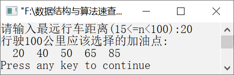

### 14.6　加油点问题


**问题描述**


一辆汽车加满油后可以行驶n千米。沿途中有若干个加油点，为了使沿途加油次数最少，实现一个算法，输出最佳的加油方案。

例如，假设沿途有9个加油点，总路程为100km，加满油后汽车行驶的最远距离为20km。汽车加油的位置如图14.7所示。


<center class="my_markdown"><b class="my_markdown">图14.7　汽车加油的位置</b></center>

**【分析】**

在行驶的过程中，为了使汽车在沿途加油次数最少，应行驶到汽车能到达并且离起点最远的加油点。即需要让汽车加过一次油后行驶的路程尽可能远，然后再加下一次油。按照这种思想，制订以下贪心选择策略。

（1）汽车从起点出发，行使到20km时，选择一个距离终点最近的加油点，应选择在距离起点为20km的加油点（即第2个加油点）加油。

（2）加完一次油后，汽车处于满油状态，这与汽车出发前的状态一致，这样就将问题归结为求加油点到终点汽车加油次数最少的一个规模更小的子问题。

按照以上策略不断地解决子问题，即每次找到从前一次选择的加油点开始往前n千米、距离终点最近的加油点加油。

在具体的程序设计中，设置一个数组x，用于存储加油点距离起点的距离。全程长度用S表示，用数组a存储选择的加油点，total表示已经行驶的最长路程。


第14章\实例14-05.cpp

```c
/********************************************
*实例说明：加油点问题
*********************************************/
1  #include<stdio.h>
2  #define S 100                             /*S为全程长度*/
3  void main()
4  {
5      int i,j,n,k=0,total,dist;
6      int x[]={10,20,35,40,50,65,75,85,100};
7      int a[10];                            
8      n=sizeof(x)/sizeof(x[0]);             /*n为沿途加油点的个数*/
9      printf("请输入最远行车距离(15<=n<100):");
10     scanf("%d",&dist);                
11     total=dist;                           /*total为已经行驶的最长路程*/
12     j=1;                                  /*j为选择的加油点个数*/
13     while(total<S)                        /*如果汽车未走完全程*/
14     {
15         for(i=k;i<n;i++)
16         {
17             if(x[i]>total)                
18             {
19                 a[j]=x[i-1];              
20                 j++;
21                 total=x[i-1]+dist;        
22                 k=i;                      
23                 break;                    
24             }
25         }
26     }
27     printf("行驶%d公里应该选择的加油点:\n",S);
28     for(i=1;i<j;i++)                      /*输出选择的加油点*/
29         printf("%4d",a[i]);
30     printf("\n");
31 }
```

运行结果如图14.8所示。


<center class="my_markdown"><b class="my_markdown">图14.8　运行结果</b></center>

**【说明】**

第11行初始化刚开始时能行驶的最远距离。

第13行判断汽车是否已经行驶了全程。

第15行循环变量i表示从第k个加油点开始计算加油的位置。

第17行中，如果距离下一个加油点太远，则说明汽车行驶不到该加油点，需要在当前加油点加油。

第19行表示在当前加油点加油，将加油点存放在数组a中。

第21行求出在当前加油点加完油后能行驶的最远距离。

第22行将下一个加油点的位置下标赋值给k，表示下一次加油应从x[k]开始。 - 第28～29行输出选择加油点的位置。

