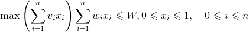
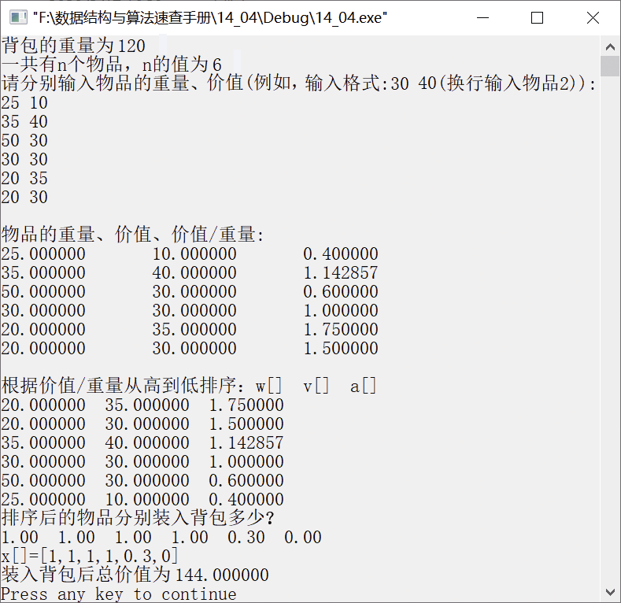

### 14.7　背包问题


**问题描述**


设有一个背包，重量是W=120，若现有6个物品A、B、C、D、E、F，其重量分别是25、 35、 50、30、20、20，价值分别是10、40、30、30、35、30。

物品可以分割成任意大小。要求尽可能让装入背包中的物品总价值最大，但物品重量不能超过背包总重量。请设计算法并实现。


**【分析】**

该问题可利用贪心算法求解，设x<sub class="my_markdown">i</sub>表示物品i是否装入背包，其中0
x<sub class="my_markdown">i</sub>
1。根据问题描述和要求，其目标函数和约束条件如下。



其中，n为物品总数，v<sub class="my_markdown">i</sub>为物品i的价值，w<sub class="my_markdown">i</sub>为物品i的重量。所求问题就是在以上约束条件下，找到一个使目标函数达到最大值的解向量(x<sub>1</sub>,x<sub>2</sub>,…, x<sub class="my_markdown">n</sub>)。对于以上物品，有n=6，W=120，(w<sub>1</sub>, w<sub>2</sub>, w<sub>3</sub>, w<sub>4</sub>, w<sub>5</sub>, w<sub>6</sub>)=(25, 35, 50, 30, 20, 20)，(v<sub>1</sub>, v<sub>2</sub>, v<sub>3</sub>, v<sub>4</sub>, v<sub>5</sub>, v<sub>6</sub>)=(10, 40, 30, 30, 35, 30)。为了使背包中装入的物品价值最大，就要让单位物品的价值最大，可分别求出每个物品的价值与重量的比值，优先选择比值大的物品装入背包，利用贪心选择策略的求解过程如下。

（1）求出每个物品的价值和重量的比值v[i]/w[v]，并按比值从高到低的顺序进行排序，以上物品的价值和重量比值排序结果为(1.75, 1.5, 1.14, 1, 0.6, 0.4)，并对物品的编号重新排序。

（2）按照价值和重量的比值，从大到小将物品依次装入背包。每装入一个物品，就需要判断背包中是否还能继续装入其他物品。设背包还能装入物品的重量为c。初始时，c=W。在试着将第1个物品装入背包时，先判断物品重量是否小于c，即w[0]<c。若判断结果为真，则表明第1个物品即物品E可以装入，然后令x[0]=1，计算背包中的物品价值，即sum+=v[0]，并重新调整背包剩余能装物品的重量，使c=c−w[0]。继续判断是否能装入第2个物品，重复执行上述过程，直至背包中不能装入物品。此时，背包里已经装入了物品E、F、B、D，背包中的物品总重量为105，还能装入的重量为15，不能将第5个物品（即物品C）全部装入，计算装入比例15/50=0.3，则x[4]=0.3，c=0。算法结束，得到x[6]=（1, 1, 1, 1, 0.3, 0）。


第14章\实例14-06.cpp

```c
/********************************************
*实例说明：背包问题
*********************************************/
#include<stdio.h>
#include<malloc.h>
float Knapsack(float w[],float v[],float x[],float c,int n);
float Knapsack(float w[],float v[],float x[],float c,int n)
{
    int i,j,l;
    float t,sum=0;
    float *a=(float*)malloc(sizeof(float)*n);
    for(i=0;i<n;i++)
        a[i]=v[i]/w[i];
    printf("\n");
    printf("物品的重量、价值、价值/重量: \n");
    for(i=0;i<n;i++)
    {
        printf("%f\t%f\t%f\t",w[i],v[i],a[i]);
        printf("\n");
    }
    for(i=0;i<n-1;i++)
        for(j=0;j<n-1-i;j++)
        {
            if(a[j]<a[j+1])
            {
                t=a[j];
                a[j]=a[j+1];
                a[j+1]=t;
                t=w[j];
                w[j]=w[j+1];
                w[j+1]=t;
                t=v[j];
                v[j]=v[j+1];
                v[j+1]=t;
            }
        }
        printf("\n");
        printf("根据价值/重量从高到低排序：w[]  v[]  a[]  \n");
        for(i=0;i<n;i++)
            printf("%f  %f  %f\n",w[i],v[i],a[i]);
        for(l=0;l<n;l++)
        {
            if(w[l]<=c)
            {
                x[l]=1;
                sum=sum+v[l];
                c=c-w[l];
            }
            else
                break;
        }
        x[l]=c/w[l];
        sum=sum+x[l]*v[l];
        for(i=l+1;i<n;i++)
            x[i]=0;
        free(a);
        printf("排序后的物品分别装入背包多少?\n");
        for(i=0;i<n;i++)
            printf("%.2f  ",x[i]);
        printf("\n");
        printf("x[]=[");
        for(i=0;i<n-1;i++)
            printf("%g,",x[i]);
        printf("%g]\n",x[n-1]);
        printf("装入背包后总价值为%f\n",sum);
        return sum;
}
void main()
{
    float c;
    int n,i;
    printf("背包的重量为 ");
    scanf("%f",&c);
    printf("一共有n个物品，n的值为 ");
    scanf("%d",&n);
    float *w=(float*)malloc(sizeof(float)*n);
    float *v=(float*)malloc(sizeof(float)*n);
    float *x=(float*)malloc(sizeof(float)*n);
    printf("请分别输入物品的重量、价值(例如，输入格式:30 45(换行输入物品2)):\n");
    for(i=0;i<n;i++)
        scanf("%f %f",&w[i],&v[i]);
    Knapsack(w,v,x,c,n);
    free(w);
    free(v);
    free(x);
}
```

运行结果如图14.9所示。


<center class="my_markdown"><b class="my_markdown">图14.9　运行结果</b></center>


