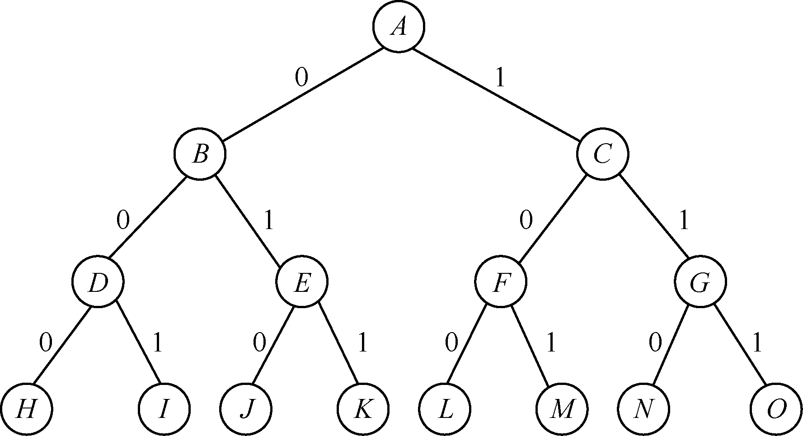

### 15.1.1　回溯算法的解空间

一个复杂问题的解决方案是由若干个小的决策步骤组成的决策序列，而找出一个问题的所有可能决策序列就构成了此问题的解空间。在利用回溯算法解决实际问题时，首先要明确问题的解空间。一个问题的可行解可以表示成解向量X=(x1, x2, …, xn)。其中，xi表示第i步的选择，X中各分量xi的所有取值组成问题的解空间或解空间树。0/1背包问题对应的解空间就是一棵解空间树，树中所有节点都可能成为问题的一个可行解。解空间树中至多有2n个叶子节点。n=3时，0/1背包问题的解空间树如图15.1所示。解空间是{(0,0,0), (0,0,1), (0,1,0), (0,1,1),(1,0,0), (1,0,1), (1,1,0), (1,1,1)}。

<b class="my_markdown">图15.1　0/1背包问题的解空间树</b>

当n=3时，对应的解空间树的高度为4（即n+1）。通常情况下，从根节点到叶子节点的路径构成解空间的一个可行解。

