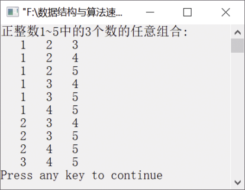

### 15.2　求自然数1～n中r个数的所有组合


**问题描述**


找出从自然数1～n中任取r个数的所有组合。例如n=5，r=3的所有组合如下。

（1）1，2，3。

（2）1，2，4。

（3）1，2，5。

（4）1，3，4。

（5）1，3，5。

（6）1，4，5。

（7）2，3，4。

（8）2，3，5。

（9）2，4，5。

（10）3，4，5。


**【分析】**

按回溯算法的思想，将找到的组合按从小到大的顺序存放在数组a[0],a[1],…,a[r−1]中，组合中的元素满足以下性质。

（1）a[i+1]>a[i]，即后一个数大于前一个数。

（2）a[i]−i
n−r+1。

按照回溯法思想，求解的过程描述如下。

首先暂时不考虑组合数个数为r的条件，从候选组合中只有一个数字1开始。因为该候选解满足除问题规模之外的全部条件，所以扩大其规模，并使其满足上述条件（1），得到候选解1、2。继续这一过程，得到候选解1、2、3。该候选解满足包括问题规模在内的全部条件，因而是一个解。在该候选解的基础上，找出下一个候选解。因为3调整为4和5都满足问题的全部条件，所以解为1、2、4和1、2、5。由于5不能继续进行调整，因此就要从a[2]回溯到a[1]，可以将a[1]从2调整为3，并向前试探，得到解1、3、4。重复上述向前试探和向后回溯过程，直到从a[0]再回溯为止，此时表明已经找完问题的全部可行解。


第15章\实例15-01.cpp

```c
/********************************************
*实例说明：求自然数1～n中r个数的所有组合
*********************************************/
1  #include<stdio.h>
2  #define MAX 100
3  int a[MAX];
4  void comb(int n,int r)
5  {
6      int i,j;
7      i=0;
8      a[i]=1;
9      do
10     {
11         if(a[i]-i<=n-r+1)           
12         {
13             if (i==r-1)              
14             {
15                 for(j=0;j<r;j++)     
16                     printf("%4d",a[j]);
17                 printf("\n");
18                 a[i]++;
19                 continue;
20              }
21              i++;                     
22              a[i]=a[i-1]+1;
23          }
24          else                         /*回溯*/
25          {
26              if(i==0)                 
27                 return;
28              a[--i]++;
29          }
30      }while(1);
31 }
32 void main()
33 {
34     printf("正整数1～5中的3个数的任意组合:\n");
35     comb(5,3);
36 }
```

运行结果如图15.2所示。


<center class="my_markdown"><b class="my_markdown">图15.2　运行结果</b></center>

**【说明】**

第11行用于判断是否还可以向前试探。

第13行表示如果找到一个候选解。

第15～16行输出该候选解。

第18行扩大候选解的规模。

第21～22行继续向前试探。

第26～27行表示若找完全部候选解则返回。

第28行向后回溯，继续寻找候选解。

