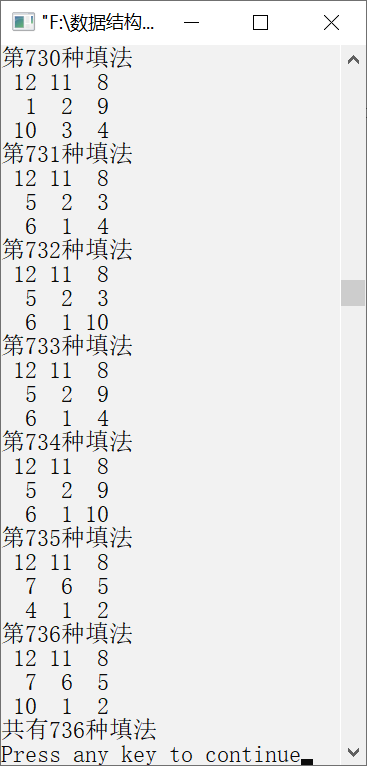

### 15.3　填字游戏


**问题描述**


在3×3的方格中填入整数1～N（N
0）中的某9个整数，每个方格填1个整数，使相邻的两个方格中的整数之和为质数。求满足以上要求的各种填法。


**【分析】**

利用回溯算法找到问题的解，即从第一个方格开始，为当前方格寻找一个合理的整数填入，并在当前位置正确填入后，为下一方格寻找可填入的合理整数。如果不能为当前方格找到一个合理的可填整数，就要回退到前一方格，调整前一方格的填入整数。当第9个方格也填入合理的整数后，就找到了一个解，将该解输出，并调整第9个填入的整数，继续寻找下一个解。为了检查当前方格填入整数的合理性，引入二维数组checkmatrix，存放需要合理性检查的相邻方格的序号。

为了找到一个满足要求的9个整数的填法，按照某种顺序（如从小到大）每次在当前位置填入一个整数，然后检查当前填入的整数是否能够满足要求。在满足要求的情况下，继续用同样的方法为下一方格填入整数。如果最近填入的整数不能满足要求，就改变填入的整数。如果对当前方格试尽所有可能的整数，都不能满足要求，就得回退到前一方格（回溯），并调整该方格填入的整数。如此重复扩展、检查、调整，直到找到一个满足问题要求的解，将解输出。

用回溯算法找一个解。

```c
    int m=0,ok=1;
    int n=8;
    do
    {
        if (ok)
            扩展;
        else
            调整;
        ok=检查前m个整数填放的合理性;
    } while ((!ok||m!=n)&&(m!=0));
    if (m!=0)
        输出解;
    else
        输出无解报告；
```

如果程序要找全部解，则将找到的解输出后，应继续调整最后位置上填放的整数，试图去找下一个解。相应的算法如下。

用回溯算法找全部解。

```c
    int m=0,ok=1;
    int n=8;
    do
    {
        if (ok)
        {
            if (m==n)
            {
                输出解；
                调整；
            }
            else
                扩展;
        }
        else
            调整;
        ok=检查前m个整数填放的合理性;
    } while (m!=0);
```

为了确保程序能够终止，调整时必须保证曾被放弃过的填数序列不会被再次试探，即要求按某种序列模型生成填数序列，并设定一个被检验的顺序，按这个顺序逐一形成候选解并检验。调整时，找当前候选解中下一个未使用过的整数。


第15章\实例15-02.cpp

```c
/********************************************
*实例说明：填字游戏
*********************************************/
1    #include<stdio.h>
2    #define N 12
3    int b[N+1];
4    int a[10];/*存放方格填入的整数*/
5    int total=0;/*共有多少种填法*/
6    int checkmatrix[][3]={ {-1},{0,-1},{1,-1},
7                    {0,-1},{1,3,-1},{2,4,-1},
8                    {3,-1},{4,6,-1},{5,7,-1}};
9    void write(int a[])
10    /*输出方格中的整数*/
11    {
12        int i,j;
13        for (i=0;i<3;i++)
14        {
15            for (j=0;j<3;j++)
16                printf("%3d",a[3*i+j]);
17            printf("\n");
18        }
19    }
20    int isprime(int m)
21    /*判断m是否是质数*/
22    {
23        int i;
24        int primes[]={2,3,5,7,11,17,19,23,29,-1};
25        if(m==1||m%2==0)
26            return 0;
27        for(i=0;primes[i]>0;i++)
28            if (m==primes[i])
29                return 1;
30        for (i=3;i*i<=m;)
31        {
32            if (m%i==0)
33                return 0;
34            i+=2;
35        }
36        return 1;
37    }
38    int selectnum(int start)
39    /*从start开始选择没有使用过的整数*/
40    {
41        int j;
42        for (j=start;j<=N;j++)
43            if (b[j])
44                return j;
45        return 0;
46    }
47    int check(int pos)
48    /*检查填入第pos个位置的整数是否合理*/
49    {
50        int i,j;
51        if(pos<0)
52            return 0;
53        /*判断相邻的两个整数是否是质数*/
54        for(i=0;(j=checkmatrix[pos][i])>=0;i++)
55            if(!isprime(a[pos]+a[j]))
56                return 0;
57        return 1;
58    }
59    int extend(int pos)
60    /*为下一个方格找一个还没有使用过的整数*/
61    {
62        a[++pos]=selectnum(1);
63        b[a[pos]]=0;
64        return pos;
65    }
66    int change(int pos)
67    /*调整填入的整数，为当前方格寻找下一个还没有使用过的整数*/
68    {
69        int j;
70        /*找到第一个没有使用过的整数*/
71        while (pos>=0&&(j=selectnum(a[pos]+1))==0)
72            b[a[pos--]]=1;
73        if (pos<0)
74            return -1;
75        b[a[pos]]=1;
76        a[pos]=j;
77        b[j]=0;
78        return pos;
79    }
80    void find()
81    /*查找*/
82    {
83        int ok=0,pos=0;
84        a[pos]=1;
85        b[a[pos]]=0;
86        do
87        {
88            if (ok)
89                if (pos==8)
90                {
91                    total++;
92                    printf("第%d种填法\n",total);
93                    write(a);
94                    pos=change(pos);    /*调整*/
95                }
96                else
97                    pos=extend(pos);    /*扩展*/
98            else
99                pos=change(pos);        /*调整*/
100            ok=check(pos);             /*检查*/
101        } while (pos>=0);
102    }
103    void main()
104    {
105        int i;
106        for (i=1;i<=N;i++)
107            b[i]=1;
108        find();
109        printf("共有%d种填法\n",total);
110    }
```

运行结果（部分）如图15.3所示。


<center class="my_markdown"><b class="my_markdown">图15.3　运行结果（部分）</b></center>

**【说明】**

第6～8行中，数组checkmatrix是一个二维数组，可作为检测两个相邻整数是否是质数的辅助数组。

第9～19行输出方格中的整数。

第20～37行判断m是否是质数。

第38～46行选择一个还没有使用过的整数。

第47～58行检查在第pos个位置填入的整数是否合理。

第59～65行为下一个方格找还没有使用过的整数，并将该整数的使用标志置为0。

第66～79行调整填入的整数，为当前方格寻找下一个还没有使用过的整数。

第84行表示初始时将方格中的第一个位置设置为1。

第89～95行中，如果填满该方格，则输出方格中的整数，并调整最后一个方格中的整数。

第97行扩展第pos个位置中的整数。

第99行从第pos个位置开始调整填入的整数，试求其他位置填入的整数。

第100行检查填入的整数是否正确。

