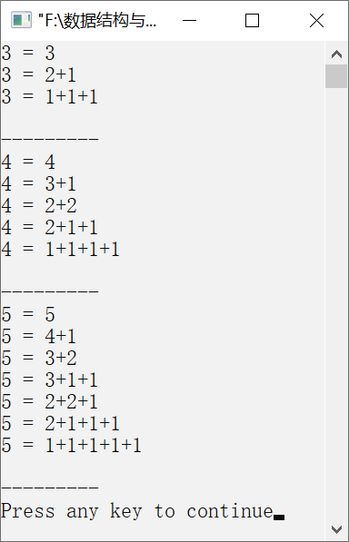

### 15.4　和式分解（非递归实现）


**问题描述**


编写非递归算法，要求输入一个正整数n，输出和等于n且不增的所有序列。例如，n=4时，输出结果如下。


4=4

4=3+1

4=2+2

4=2+1+1

4=1+1+1+1

**【分析】**

利用数组a存放分解出的和数。其中，a[k+1]存放第（k+1）步分解出来的和数。利用数组r存放分解出和数后还未分解的余数，r[k+1]用于存放分解出和数a[k+1]后，还未分解的余数。为保证上述要求能对第一步（k=0）分解也成立，在a[0]和r[0]中的值设置为n，表示第一个分解出来的和数为n。第（k+1）步要继续分解的数是前一步分解后的余数，即r[k]。在分解过程中，当某步欲分解的数r[k]为0时，表明已完成一个完整的和式分解，将该和式输出。然后在前提条件a[k]>1时，调整原来所分解的和数a[k]和余数r[k]，进行新的和式分解，即令a[k] −1作为新的待分解和数，r[k]+1就成为新的余数。若a[k]=1，则表明当前和数不能继续分解，需要进行回溯。回退到上一步，即令k=k−1，直至a[k]>1停止回溯，调整新的和数与余数。为了保证分解出的和数依次构成不增的正整数序列，要求从r[k]分解出的最大和数不能超过a[k]。当k=0时，表明完成所有的和式分解。


第15章\实例15-03.cpp

```c
/********************************************
*实例说明：和式分解（非递归实现）
*********************************************/
#include<conio.h>
#include<stdio.h>
#define MAXN 100
int a[MAXN];
int r[MAXN];
void Sum_Depcompose(int n)            //非递归实现和式分解
{
    int i = 0;
    int k = 0;
    r[0] = n;                         //r[0]存放余数
    do
    {
        if (r[k] == 0)                //表明已完成一次和式分解，输出和式分解
        {
            printf("%d = %d", a[0], a[1]);
            for (i = 2; i <= k; i++)
            {
                printf("+%d", a[i]);
            }
            printf("\n");
            while (k>0 && a[k]==1)    //若当前待分解的和数为1，则回溯
            {
                k--;
            }
            if (k > 0)//调整和数与余数
            {
                a[k]--;
                r[k]++;
            }
        }
        else//继续和式分解
        {
            a[k+1] = a[k]<r[k]? a[k]:r[k];
            r[k+1] = r[k] - a[k+1];
            k++;
        }
    } while (k > 0);
}
void main()
{
    int i,test_data[] = {3,4,5};
    for (i =0; i <sizeof(test_data)/sizeof(int); i++)
    {
        a[0] = test_data[i];  //a[0]存放待分解的和数
        Sum_Depcompose (test_data[i]);
        printf("\n---------\n\n");
    }
}
```

运行结果如图15.4所示。


<center class="my_markdown"><b class="my_markdown">图15.4　运行结果</b></center>

