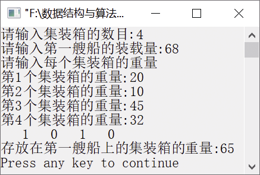

### 15.5　装箱问题


**问题描述**


有n个集装箱要装到两艘船上，每艘船的装载量分别为c<sub class="my_markdown">1</sub>、c<sub>2</sub>，第i个集装箱可以承载的重量为w<sub class="my_markdown">i</sub>，同时满足w<sub class="my_markdown">1</sub>+w<sub>2</sub>+…+w<sub class="my_markdown">n</sub>
c<sub class="my_markdown">1</sub>+c<sub>2</sub>。确定一个最佳的方案把这些集装箱装入这两艘船。


**【分析】**

首先将第一艘船尽量装满，再把剩下的集装箱装在第二艘船上。第一艘船尽量装满，等价于从n个集装箱中选取一个子集，使得该子集的总重量与第一艘船的装载量c<sub class="my_markdown">1</sub>最接近，这样就类似于0/1背包问题。

问题解空间为(x<sub class="my_markdown">1</sub>,x<sub>2</sub>,x<sub>3</sub>,…,x<sub class="my_markdown">n</sub>)。其中，x<sub class="my_markdown">i</sub>为0表示不装在第一艘船上，为1表示装在第一艘船上。

约束条件如下。

+ 可行性约束条件：w<sub class="my_markdown">1</sub>x<sub class="my_markdown">1</sub>+w<sub>2</sub>x<sub>2</sub>+…+w<sub class="my_markdown">i</sub>x<sub class="my_markdown">i</sub>+…+w<sub class="my_markdown">n</sub>x<sub class="my_markdown">n</sub>
+ c<sub class="my_markdown">1</sub>。
+ 最优解约束条件：remain+cw>bestw（remain表示剩余集装箱重量，cw表示当前已装上的集装箱的重量，bestw表示当前的最优装载量）。

例如，集装箱的个数为4，重量分别是10t、20t、35t、40t，第一艘船的最大载重量是50t，则最优装载是将重量为10t和40t的集装箱装入。首先从第一个集装箱开始，将重量为10t的集装箱装入第一艘船，然后将重量为20t的集装箱装入，此时有10t+20t
50t。然后试探将重量为35t的集装箱装入，但是10t+20t+35t>50t，所以不能装入重量为35t的集装箱。紧接着试探装入重量为40t的集装箱，因为10t+20t+40t>50t，所以也不能装入。因此30t成为当前的最优装载量。

取出重量为20t的集装箱（回溯，重新调整问题的解），如果将重量为35t的集装箱装入第一艘船，因为10t+35t
50t，所以能够装入。因为45t>bestw，所以以45t作为当前最优装载量。

继续取出重量为35t的集装箱，如果将重量为40t的集装箱装入第一艘船，因为10t+40t
50t，所以装入第一艘船。因为50t>bestw，所以以50t作为当前最优装载量。


第15章\实例15-04.cpp

```c
/********************************************
*实例说明：装箱问题
*********************************************/
1  #include<stdio.h>
2  #include<malloc.h>
3  int *w;                   /*存放每个集装箱的重量*/
4  int n;                    /*集装箱的数目*/
5  int c;                    /*第一艘船的装载量*/
6  int cw=0;                 /*当前装载量*/
7  int remain;               /*剩余装载量*/
8  int    *x;                /*存放搜索时每个集装箱是否选取*/
9  int bestw;                /*存放最优的放在第一艘船的重量*/
10 int    *bestx;            /*存放最优的集装箱装载方案*/
11 void Backtrace(int k)
12 {    
13     int i;
14     if(k>n)               /*递归的出口，如果找到一个解*/
15     {    
16         for(i=1;i<=n;i++) /*则将解存入bestx数组中*/
17            bestx[i]=x[i];    
18         bestw=cw;         /*记下当前的最优装载量*/
19         return;
20     }
21     else    
22     {    
23         remain-=w[k];
24         if (cw+w[k]<=c)             /*如果装入w[k]，还小于或等于c*/
25         {    
26            x[k]=1;                  /*则装入w[k]*/
27            cw+=w[k];
28            Backtrace(k+1);    
                                       /*继续检查剩下的集装箱是否能装入*/
29            cw-=w[k];    /*不装入w[k]*/
30         }
31         if (remain+cw > bestw)    
                          /*如果剩余的集装箱不能完全装入*/
32         {    
33                x[k]=0;    
34                Backtrace(k+1);       /*继续从剩余的集装箱中检查是否能装入*/
35         }
36         remain+=w[k];       
37     }
38 }
39 int BestSoution(int *w,int n,int c)
40 /*搜索最优的装载方案:w存放每个集装箱的重量,
41 n表示集装箱数目，c表示第一艘船的装载量*/
42 {    
43     int i;
44     remain=0;                /*第一艘船剩下的装载量*/
45     for(i=1;i<=n;i++)    
46     {    
47         remain+=w[i];    
48     }
49     bestw=0;                
50     Backtrace(1);
51     return bestw;    
52 }
53 void main()
54 {
55     int i;
56     printf("请输入集装箱的数目:");
57     scanf("%d",&n);
58     w=(int*)malloc(sizeof(int)*(n+1));
59     x=(int*)malloc(sizeof(int)*(n+1));
60     bestx=(int*)malloc(sizeof(int)*(n+1));
61     printf("请输入第一艘船的装载量:");
62     scanf("%d",&c);
63     printf("请输入每个集装箱的重量\n");
64     for (i=1;i<=n;i++)    
65     {
66         printf("第%d个集装箱的重量:",i);
67         scanf("%d",&w[i]);    
68     }
69     bestw=BestSoution(w,n,c);
70     for (i=1;i<=n;i++)    
71     {    
72        printf("%4d",bestx[i]);    
73     }
74     printf("\n");
75     printf("存放在第一艘船上的集装箱的重量:%d\n",bestw);
76     free(w);
77     free(x);
78     free(bestx);
79 }
```

运行结果如图15.5所示。


<center class="my_markdown"><b class="my_markdown">图15.5　运行结果</b></center>

**【说明】**

第14～20行是递归的出口，如果找到问题的一个解，则将解存入bestx数组中，并将cw记作当前的最优装载量。

第23行从剩余的集装箱中取出第k个集装箱（重量为w[k]）。

第24行中，如果将第k个集装箱装入第一艘船上，总重量小于或等于c，则说明可以装入第一艘船。

第26～27行表示将第k个集装箱装入第一艘船上。

第28行继续检查剩下的集装箱，并选择合适的集装箱装入第一艘船。

第29行取出第k个集装箱，用来调整装入第一艘船的货物。

第31行中，如果剩余的集装箱不能完全装入第一艘船。

第33～34行表示不装入第k个集装箱，并检查剩余的集装箱是否能装入第一艘船。

第36行表示第k个集装箱重新成为待装入的集装箱。

第45～48行表示初始时将所有的集装箱都作为即将装入第一艘船的集装箱。

第49行初始化第一艘船的最优装载量。

第50行调用Backtrace函数从第1个集装箱开始试探装入第一艘船。

