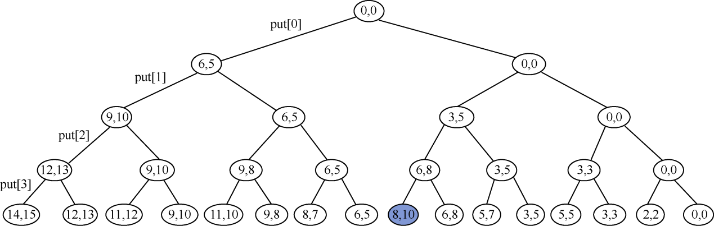
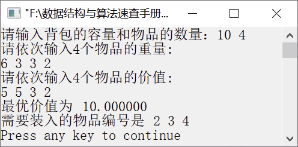

### 15.6　 0/1背包问题


**问题描述**


有n个重量分别为w<sub class="my_markdown">1</sub>,w<sub>2</sub>,…,w<sub class="my_markdown">n</sub>的物品，物品编号分别为1～n，其价值分别为v<sub class="my_markdown">1</sub>,v<sub>2</sub>,…,v<sub class="my_markdown">n</sub>。设背包容量为W。利用回溯算法思想，从这些物品中选取一部分物品放入背包，每个物品或者选中，或者不选中，求放入背包的物品的最优价值。


**【分析】**

假设n个物品的重量和价值依次存放在数组w和v中，物品的编号存放在数组itemOrder中，用数组put记录物品是否装入背包。由于每个物品只有装入和不装入两种状态，因此其解空间就构成了一棵解空间树，树中每个节点表示背包的一种选择状态，记录当前放入背包的物品总重量和总价值，每个分支节点下的两棵子树分别表示物品是否放入背包。

对于第i层的某个分支节点，其对应的状态为Backtrack(i, cw, cv, put)。其中，i表示层数，cw表示装入背包的物品总重量，cv表示装入背包的总价值，put记录是否装入背包。通过对每个节点进行以下扩展求解。

（1）选择第i个物品放入背包，则cw+=w[i]，cv+=v[i]，put[i]=1；然后转向下一层，即Backtrack(i+1, cw, cv, put)，对应解空间树的左分支。

（2）不选择第i个物品，越过当前节点进入下一层，保持cw、cv和put不变，调用Backtrack(i+1,cw, cv, put)，即直接转入解空间树的右分支节点执行。

设背包容量为10，物品数量为4，物品的重量依次为6、3、3、2，价值依次为5、5、3、2。其求解过程的解空间树如图15.6所示。


<center class="my_markdown"><b class="my_markdown">图15.6　0/1背包问题求解过程的解空间树</b></center>

图中每个节点包含两个值——选中物品后的当前背包中的物品总重量和总价值。解空间树的根节点为(0,0)，表示初始时没有选择任何物品。从根节点出发，沿着左右子树到叶子节点，可得到最佳装入方案。最佳装入方案是选择编号为2、3、4的物品，其总重量为8，总价值为10。


第15章\实例15-05.cpp

```c
/********************************************
*实例说明：0/1背包问题
*********************************************/
#include<stdio.h>
#define MAXN 100
double c;              //背包容量
int n;                 //物品数量
double v[MAXN];        //各个物品的价值
double w[MAXN];        //各个物品的重量
int itemOrder[MAXN];   //物品编号
int put[MAXN];         //记录物品是否装入，1表示装入，0表示不装入
double cw = 0.0;       //当前背包重量
double cv = 0.0;       //当前背包中物品总价值
double bestVal = 0.0;  //当前最优价值
double pVal[MAXN];     //单位物品价值(排序后)
void Knapsack();
void Backtrack(int i);
double Bound(int i);
void Swap1(double *a, double *b)
{
    double t;
    t=*a;
    *a=*b;
    *b=t;
}
void Swap2(int *a, int *b)
{
    int t;
    t=*a;
    *a=*b;
    *b=t;
}
void Knapsack()
//对物品按单位价值从大到小排序
{
    int i,j;
    for(i=1;i<=n;i++)
        pVal[i]=v[i]/w[i];                   //计算单位价值
    for(i=1;i<=n-1;i++)
    {
        for(j=i+1;j<=n;j++)
            if(pVal[i]<pVal[j])              //对数组pVal、itemOrder、v、w中的数据排序
            {
                Swap1(&pVal[i],&pVal[j]);    //对数组pVal中的数据排序
                Swap2(&itemOrder[i],&itemOrder[j]); //对数组itemOrder中的数据排序
                Swap1(&v[i],&v[j]);          //对数组v中的数据排序
                Swap1(&w[i],&w[j]);          //对数组w中的数据排序
            }
    }
}
void Backtrack(int i)
//回溯
{
    //i用来指示到达的层数（从0开始）
    if(i>n) //递归出口
    {
        bestVal = cv;
        return;
    }
    //如若左子树节点可行，则直接搜索左子树;
    //对于右子树，先计算上界函数，以判断是否将其减去
    if(cw+w[i]<=c)            //将物品i放入背包,搜索左子树
    {
        cw+=w[i];              
        cv+=v[i];              
        put[i]=1;
        Backtrack(i+1);        
        cw-=w[i];              
        cv-=v[i];              
    }
    if(Bound(i+1)>bestVal)    //如若符合条件则搜索右子树
    {
        Backtrack(i+1);
    }
}
double Bound(int i)
//计算上界（剪枝）
{   //判断当前背包的总价值和剩余容量可容纳的最大价值是否小于或等于当前最优价值
    double leftW= c-cw;       //剩余背包容量
    double b = cv;            //记录当前背包的总价值cv
    while(i<=n && w[i]<=leftW)
    {
        leftW-=w[i];
        b+=v[i];
        i++;
    }
    if(i<=n)  //若装满背包
        b+=v[i]/w[i]*leftW;
    return b; //返回计算出的上界
}
void main()
{
    int i;
    printf("请输入背包的容量和物品的数量：");
    scanf("%lf %d",&c,&n);
    printf("请依次输入%d个物品的重量:\n",n);
    for(i=1;i<=n;i++)
    {
        scanf("%lf",&w[i]);
        itemOrder[i]=i;
    }
    printf("请依次输入%d个物品的价值:\n",n);
    for(i=1;i<=n;i++){
        scanf("%lf",&v[i]);
    }
    Knapsack();
    Backtrack(1);
    printf("最优价值为%lf\n",bestVal);
    printf("需要装入的物品编号是");
    for(i=1;i<=n;i++)
    {
        if(put[i]==1)
            printf("%d ",itemOrder[i]);
    }
    printf("\n");
}
```

运行结果如图15.7所示。


<center class="my_markdown"><b class="my_markdown">图15.7　运行结果</b></center>


