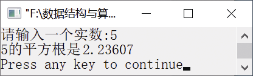

### 16.1　求实数的平方根


**问题描述**


输入一个实数，求这个实数的平方根。


**【分析】**

求平方根的迭代公式是x<sub class="my_markdown">1</sub>=(1/2)(x<sub>0</sub>+a/x<sub>0</sub>)。

算法步骤如下。

（1）自定一个初值x<sub class="my_markdown">0</sub>，作为a的平方根值，取a/2作为a的初值。

（2）利用上述迭代公式求出一个x<sub class="my_markdown">1</sub>，把求得的x<sub class="my_markdown">1</sub>代入x<sub>0</sub>中。

（3）再次利用迭代公式求出一个新的x<sub class="my_markdown">1</sub>，比较x<sub>0</sub>和x<sub class="my_markdown">1</sub>，如果它们的差值小于指定的EPS（精度，假设为1e−6），则该值趋于真正的平方根，x<sub class="my_markdown">1</sub>可以作为平方根的近似值；否则，将x<sub class="my_markdown">1</sub>代入x<sub>0</sub>，执行步骤（2）。


第16章\实例16-01.cpp

```c
/********************************************
*实例说明：求实数的平方根
*********************************************/
1  #include<stdio.h>
2  #include<math.h>
3  void main() 
4  { 
5      double a,x0,x1; 
6      printf("请输入一个实数:"); 
7      scanf("%lf",&a); 
8      if(a<0) 
9          printf("输入错误，请重新输入!\n"); 
10     else 
11     { 
12         x0=a/2; 
13         x1=(x0+a/x0)/2; 
14         do 
15         { 
16             x0=x1; 
17             x1=(x0+a/x0)/2; 
18         }while(fabs(x0-x1)>=1e-6); 
19     } 
20     printf("%g的平方根是%g\n",a,x1); 
21 }
```

运行结果如图16.1所示。


<center class="my_markdown"><b class="my_markdown">图16.1　运行结果</b></center>

**【说明】**

① 设定一个初值x<sub class="my_markdown">0</sub>，从x<sub class="my_markdown">0</sub>开始不断“逼近”真正的平 方根。

② 利用迭代公式求出x<sub class="my_markdown">1</sub>。第一次求出的x<sub class="my_markdown">1</sub>是一个不精确的值，与真正的平方根相比，误差很大，还需要进一步迭代，不断“靠近”真正的平方根。

③ 不断迭代，直到x<sub class="my_markdown">1</sub>与x<sub>0</sub>的差值的绝对值小于1e−6时，我们就将x<sub class="my_markdown">1</sub>作为a的平方根。

