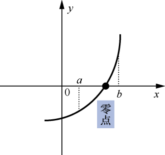

### 16.2　利用二分法求方程的根


**问题描述**


利用二分法求方程3x<sup class="my_markdown">3</sup>−13x+2=0在区间[1,9]的根。


**【分析】**

#### 1．相关概念

函数y=f(x)的零点就是f(x)=0的根；如果y=f(x)有根，则说明函数y=f(x)的图像与x轴有交点。

#### 2．零点存在的判断方法

函数y=f(x)在区间[a,b]上连续，且f(a) f(b)<0，则y=f(x)在[a,b]内有零点，如图16.2所示。


<center class="my_markdown"><b class="my_markdown">图16.2　函数的零点</b></center>

#### 3．二分法定义

对于在区间[a,b]上连续且f(a)f(b)<0的函数y=f(x)，通过不断地将函数f(x)的零点所在的区间一分为二，使区间的两个端点逐步逼近零点，进而得到零点近似值的方法叫作二分法。

具体做法如下。

（1）如果f(a)f(b)<0，则说明区间[a,b]内存在零点，求出中间值c=0.5(a+b)，判断f(a)f(c)的正负。

（2）如果f(a)f(c)<0，则说明区间[a,c]内存在零点，令b=c；否则，说明区间[c,b]内存在零点，令a=c。

（3）如果|f(c)|>EPS且|a−b|>EPS，则转到步骤（1）；否则，停止执行，将c作为近似值。

**【示例】**

利用二分法求函数f(x)= 3x<sup class="my_markdown">3</sup>−13x+2在区间[1,4]内的零点。

计算过程如下。

（1）令a=1，b=4，计算a和b的中间值c=0.5(a+b)=2.5。

（2）因为f(1)=−8，f(2.5)=16.375，所以f(1)f(2.5)<0。因此，零点位于区间[1,2.5]内，令b=2.5。

（3）求出a和b的中间值c=(1+2.5)×0.5=1.75。

（4）因为f(1)= −8，f(1.75) ≈ −4.67188，所以f(1)f(1.75)>0。因此，零点位于区间[1.75,2.5]内，令a=1.75。

（5）不断重复执行以上过程，直到|f(c)|<EPS时，停止执行，将c看作零点的近似值。

利用二分法求f(x)=3x<sup class="my_markdown">3</sup>−13x+2的零点的过程中得到的中间值如表16.1所示。

<center class="my_markdown"><b class="my_markdown">表16.1　利用二分法求f(x)= 3x<sup class="my_markdown">3</sup>−13x+2的零点的过程中得到的中间值</b></center>

| 区间[a,b] | 中间值c的值 | 中间值对应的函数值 |
| :-----  | :-----  | :-----  | :-----  | :-----  |
| [1,4] | 2.5 | 16.375 |
| [1,2.5] | 1.75 | −4.67188 |
| [1.75,2.5] | 2.125 | 3.162109 |
| [1.75,2.125] | 1.9375 | −1.36792 |
| [1.9375,2.125] | 2.03125 | 0.73642 |
| [1.9375,2.03125] | 1.984375 | −0.354992 |
| [1.984375,2.03125] | 2.007813 | 0.180799 |
| [1.984375,2.007813] | 1.996094 | −0.08956 |
| [1.996094,2.007813] | 2.001954 | 0.045011 |
| [1.996094,2.001954] | 1.999024 | −0.02243 |

从表16.1中不难看出，随着迭代的进行，中间值c的函数值不断趋近于0，而c不断趋近于零点，即逼近f(x)=0的根。


第16章\实例16-02.cpp

```c
/********************************************
*实例说明：利用二分法求方程的根
*********************************************/
1  #include<stdio.h>
2  #include<math.h>
3  #define EPS 1e-6
4  double f(double x);
5  void main()
6  {
7      double a,b,c;
8      printf("请输入一个区间(如:1,4):"); 
9      scanf("%lf,%lf",&a,&b);
10     printf("方程3*x*x*x-13*x+2=0的解:x="); 
11     if (fabs(f(a))<=EPS) 
12     { 
13         printf("%lg\n", a); 
14     } 
15     else if (fabs(f(b))<=EPS) 
16     { 
17         printf("%lg\n", b); 
18     } 
19     else if (f(a)*f(b)>0) 
20     { 
21         printf("f(%lg)*f(%lg)>0请重新输入,
22             使f(%lg)*f(%lg)<=0 !\n",a,b); 
23     } 
24     else 
25     { 
26         while (fabs(f(c))>EPS&&fabs(b-a)>EPS) 
27         { 
28             c=(a+b)/2.0; 
29             if (f(a)*f(c)<0) 
30                 b=c; 
31             else 
32                 a=c; 
33         } 
34         printf("%lg\n", c); 
35     }
36 }
37 double f(double x)
38 {
39     return 3*x*x*x-13*x+2;
40 }
```

运行结果如图16.3所示。


<center class="my_markdown"><b class="my_markdown">图16.3　运行结果</b></center>

**【注意事项】**

在利用二分法求方程的根时，需要注意两个循环条件：一个是c的函数值趋于0，另一个是区间[a,b]变得无穷小。只有这样才能保证求得的c可以作为方程的根。

