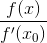
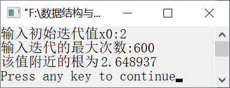

### 16.3　利用牛顿迭代法求方程的根


**问题描述**


利用牛顿迭代法求方程x<sup class="my_markdown">4</sup>−3x<sup>3</sup>+1.5x<sup>2</sup>−4=0的根。


**【定义】**

牛顿迭代法是求方程或方程组近似根的一种常用的方法。

#### 1．推导过程

设方程f(x)=0的近似根为x<sub class="my_markdown">0</sub>，则在x<sub class="my_markdown">0</sub>处的泰勒展开式为

f(x)=f(x<sub class="my_markdown">0</sub>)+f '(x<sub class="my_markdown">0</sub>)(x−x<sub class="my_markdown">0</sub>)+ 
(x−x<sub class="my_markdown">0</sub>)<sup class="my_markdown">2</sup>+…

取线性部分即泰勒展开式的前两项作为非线性方程f(x)=0的近似方程，则有

f(x<sub class="my_markdown">0</sub>)+f '(x<sub class="my_markdown">0</sub>)(x−x<sub class="my_markdown">0</sub>)=0

如果f(x)≠0，则方程的解为x<sub class="my_markdown">1</sub>=x<sub>0</sub> −
，这样就得到了一个迭代序列。

x<sub class="my_markdown">n</sub><sub>+1</sub>=x<sub class="my_markdown">n</sub>−


接下来，就可以利用该迭代公式求方程的近似根了。

#### 2．算法描述

利用迭代公式x<sub class="my_markdown">n</sub><sub>+1</sub>=x<sub class="my_markdown">n</sub> −
求方程f(x)=0的近似根的算法步骤如下。

（1）选一个方程的近似根，赋给变量x<sub class="my_markdown">0</sub>。

（2）将x<sub class="my_markdown">0</sub>的值存放到变量x<sub>1</sub>中，然后计算f(x<sub>1</sub>)，并将结果存于变量x<sub class="my_markdown">0</sub>中。

（3）当x<sub class="my_markdown">0</sub>与x<sub>1</sub>的差的绝对值还小于指定的精度时，重复执行步骤（2）；否则，算法结束。

若方程有根，并且用上述方法计算出来的根序列收敛，则按上述方法求得的x<sub class="my_markdown">0</sub>就被视为方程的根。


第16章\实例16-03.cpp

```c
/********************************************
*实例说明：利用牛顿迭代法求方程的根
*********************************************/
1  #include<stdio.h>
2  #include<math.h>
3  #define EPS 1e-6
4  double f(double x);
5  double f1(double x);
6  int Newton(double *x,int iteration);
7  void main() 
8  { 
9      double x; 
10     int iteration;
11     printf("输入初始迭代值x0:"); 
12     scanf("%lf",&x);
13         printf("输入迭代的最大次数:"); 
14     scanf("%d",&iteration);
15     if(1==Newton(&x,iteration))
16         printf("该值附近的根为%lf\n",x);
17     1else
18         printf("迭代失败!\n");
19 }
20 double f(double x) 
21 /*函数*/ 
22 { 
23      return x*x*x*x-3*x*x*x+1.5*x*x-4.0; 
24 } 
25 double f1(double x) 
26 /*导函数*/ 
27 { 
28      return 4*x*x*x-9*x*x+3*x; 
29 }
30 int Newton(double *x,int iteration) 
31 /*迭代次数*/ 
32 { 
33    double x1,x0; 
34    int i; 
35    x0=*x;                       /*初始方程的近似根*/
36    for(i=0;i<iteration;i++)     /*iteration是迭代次数*/
37    { 
38        if(f1(x0)==0.0)          /*如果导数为0，则返回0（该方法失效）*/
39        { 
40           printf("迭代过程中导数为0!\n"); 
41           return 0; 
42        } 
43        x1=x0-f(x0)/f1(x0);      /*开始牛顿迭代计算*/
44        if(fabs(x1-x0)<EPS || fabs(f(x1))<EPS)     /*达到结束条件*/
45        { 
46           *x=x1;                /*返回结果*/ 
47            return 1; 
48        } 
49        else                     /*未达到结束条件*/ 
50            x0=x1;               /*准备下一次迭代*/ 
51    } 
52 /*迭代次数达到规定的最大值，仍没有达到精度*/ 
53    printf("超过最大的迭代次数!\n");
54    return 0; 
55 }
```

运行结果如图16.4所示。


<center class="my_markdown"><b class="my_markdown">图16.4　运行结果</b></center>

**【说明】**

牛顿迭代法是牛顿提出的一种在实数域和复数域上求方程近似根的方法。牛顿迭代法是求方程根的重要方法之一，其最大优点是在方程f(x) = 0的单根附近具有平方收敛的性质，而且该方法还可以用来求方程的重根、复根。

