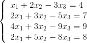
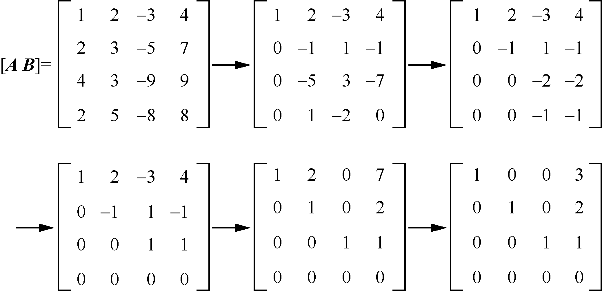
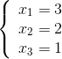
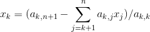
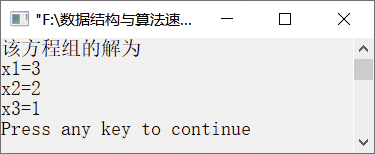

### 16.4　利用高斯消元法求解线性方程组


**问题描述**


利用高斯消元法求解以下线性方程组。



**【分析】**

线性方程组可写作**Ax**=**B**。其中，**A**为系数矩阵，**x**为变量的列向量，**B**为常数列向量。设该线性方程组有equ_num个方程，每个方程有v_num个变量。将**A**和**B**组合在一起，构成增广矩阵**A**'，利用初等行变换，将方程组的增广矩阵**A**'化为阶梯阵，再进行求解。以上线性方程组的初等行变换过程如图16.5所示。


<center class="my_markdown"><b class="my_markdown">图16.5　初等行变换过程</b></center>

因此，其一般解为 。


为了实现求解以上线性方程组的算法，我们通过模拟以上消元过程，然后再进行回代就可得到方程组的解。循环处理增广矩阵中的每一行，每次找到第k行第col列中绝对值最大的系数，并与第k行第col列的系数交换，然后依次求出第k+1行到第equ_num−1行与第k行系数之间的最小公倍数，对第k+1行到第equ_num−1行的系数进行消元，再进行以下回代。

x<sub class="my_markdown">n</sub>=a<sub class="my_markdown">n</sub>,<sub class="my_markdown">n</sub><sub>+1</sub>/a<sub class="my_markdown">n</sub>,<sub class="my_markdown">n</sub>



其中，k=n−1,n−2,…,1。

在利用高斯消元法求解方程组的解时，分为以下几种情况。

+ 有唯一解。经过行变换后，增广矩阵变为严格的上三角矩阵，即k=equ_num，这种情况下方程组有唯一解，通过回代可得到方程组的解。
+ 有无穷多解。若经过行变换后增广矩阵不能变为上三角矩阵，行数小于变量的个数，即k<equ_num，这种情况下方程组有无穷多解。
+ 无解。经过行变换后，若阶梯阵最后一行中出现（0,0,…,0,b）的形式，且其中b不为0，则表明该方程组无解。


第16章\实例16-04.c

```c
/********************************************
*实例说明：利用高斯消元法求解线性方程组
*********************************************/
#include<iostream.h>
#include<math.h>
#define N 10
int u_result[N];
int Gcd(int a, int b)                              //最大公约数
{
    if(a%b==0)
        return b;
    else
        return Gcd(b,a%b);
}
int GaussFun(int a[][N], int equ_num, int v_num, int r[])
{
    int i,j,k,col,b,c,max_r,coef1,coef2,gcd,lcm;
    int t,u_x_num,u_index;
    col=0;
for(k=0;k<equ_num && col<v_num;k++,col++)          //循环处理增广矩阵的各行
    {
        max_r=k;
        for(i=k+1;i<equ_num;i++)
        {
            if(abs(a[i][col])>abs(a[max_r][col]))  //保存绝对值最大的行
                max_r=i;
        }
        if(max_r!=k)
        {
            for(j=k;j<v_num+1;j++)
            {
                t=a[k][j];
                a[k][j]=a[max_r][j];
                a[max_r][j]=t;
            }
        }
        if(a[k][col]==0)
        {
            k--;
            continue;
        }
        for(i=k+1;i<equ_num;i++)
        {
            if(a[i][col]!=0)
            {
                b=abs(a[i][col]);
                c=abs(a[k][col]);
                gcd=Gcd(b,c);                            //最大公约数
                lcm=(abs(a[i][col])*abs(a[k][col]))/gcd; //最小公倍数
                coef1 = lcm/abs(a[i][col]);
                coef2 = lcm/abs(a[k][col]);
                if(a[i][col]*a[k][col]<0)
                    coef2= -coef2;
                for(j=col;j<v_num+1;j++)
                    a[i][j]=a[i][j]*coef1-a[k][j]*coef2;
           }
        }
    }
    for(i=k;i<equ_num;i++)
    {
        if(a[i][col]!=0)
            return -1;
    }
    //若方程组有无穷多解，则将不确定变量的系数存放在数组r中
    if(k<v_num)//自由变量为v_num-k
    {
        for(i=k-1;i>=0;i--)
        {
            u_x_num=0;//当前行中不确定变量的个数为0
            for(j=0;j<v_num;j++)
            {
                if(a[i][j]!=0 && u_result[j])
                {
                    u_x_num++;
                    u_index=j;
                }
            }
            if(u_x_num>1)
                continue;
            t=a[i][v_num];
            for(j=0;j<v_num;j++)
            {
                if(a[i][j]!=0 && j!=u_index)
                    t -=a[i][j]*r[j];
            }
            r[u_index]=t/a[i][u_index];
            u_result[u_index]=0;
        }
        return v_num-k;
    }
//若方程组有唯一解，则将方程组的解依次存放在数组r中
    for(i=v_num-1;i>=0;i--)
    {
        t=a[i][v_num];
        for(j=i+1;j<v_num;j++)
        {
            if(a[i][j]!=0)
            {
                t -=a[i][j]*r[j];
            }
        }
 r[i]=t/a[i][i];
    }
    return 0;
}
void main()
{
    int i,flag,equ_num,var_num,r[N];
    int aa[N][N] = {{1,2,-3,4},
    {2,3,-5,7},
    {2,5,-8,8}};//输入的增广矩阵
    equ_num =3;
    var_num = 3;
    flag=GaussFun(aa,equ_num,var_num,r);//调用高斯函数
    if(flag ==-1)
        cout<<"该方程无解。"<<endl; 
    else if(flag==-2)
        cout<<"该方程有浮点数解,没有整数解。"<<endl; 
    else if(flag>0)
    {
        cout<<"该方程有无穷多解！自由变量的数量为"<<flag<<endl; 
        for(i=0;i<var_num;i++)
        {
            if(unuse_result[i])
                cout<<i+1<<"是不确定的"<<endl; 
            else
                cout<<i+1<<r[i]<<endl;
        }
    }
    else
    {
        cout<<"该方程的解为"<<endl;
        for(i=0;i<var_num;i++)
            cout<<"x"<<i+1<<"="<<r[i]<<endl;
    } 
}
```

运行结果如图16.6所示。


<center class="my_markdown"><b class="my_markdown">图16.6　运行结果</b></center>

