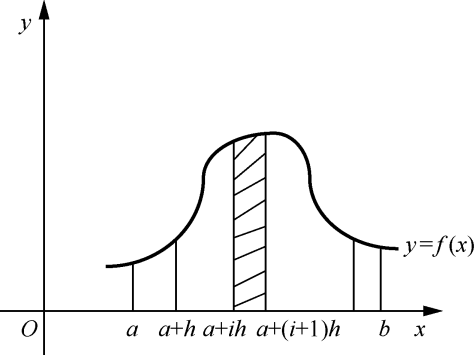
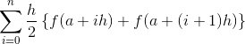
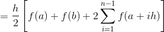
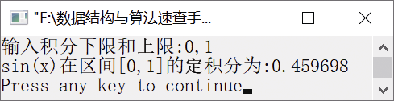

### 16.5　利用梯形法求定积分


**问题描述**


利用梯形法求定积分
dx的值。


**【分析】**

定积分I =
dx的几何意义就是曲线f(x)与y=0、x=a、x=b所围成的曲顶梯形的面积。为了得到定积分的值，需要将连续的图像分割为容易求解的子图像，然后利用迭代法对表达式反复操作。求定积分的方法有两种——矩形法和梯形法。

下面我们以梯形法为例讲解。函数 y=f(x)的图像如 图16.7所示。


<center class="my_markdown"><b class="my_markdown">图16.7　函数y=f(x)的图像</b></center>

从图16.7中可以看出，一个曲顶梯形可以被分割为许许多多长度为h的小曲顶梯形，每个小曲顶梯形可以近似地看作梯形。第i个小曲顶梯形的面积为

s=


将h=(b−a)/n代入上式，有

s=


其中，a为下限，b为上限，n为小曲顶梯形的个数。将上式展开，有

s≈
[f(a)+f(a+h)+f(a+h)+f(a+2h)+f(a+2h)+f(a+3h)+…+

f(a+(n−2)h)+f(a+(n−1)h)+f(a+(n−1)h)+f(b)]



将上述公式改为迭代形式：

s=
[f(a)+f(b)]

s=s+h(a+ih)

算法步骤如下。

（1）根据下限a、上限b、小曲顶梯形个数n，求出h=(b−a)/n。

（2）求出初始的s=(h/2)(f(a)+f(b))。

（3）从i=1迭代到n−1，把h(a+ih)累加到s。

s即为所求定积分。


第16章\实例16-05.c

```c
/********************************************
*实例说明：利用梯形法求定积分
*********************************************/
1  #include<stdio.h>
2  #include<math.h>
3  #define N 1000
4  double f(double x);
5  double Integral(double a,double b,int n);
6  void main() 
7  { 
8      double a,b,value; 
9      printf("输入积分下限和上限:"); 
10     scanf("%lf,%lf",&a,&b);
11     value=Integral(a,b,N);
12     printf("sin(x)在区间[%lg,%lg]的定积分为:%lf\n",a,b,value);
13 }
14 double f(double x) 
15 /*函数f(x)*/ 
16 { 
17     return sin(x); 
18 } 
19 double Integral(double a,double b,int n) 
20 /*迭代次数*/ 
21 { 
22     double s,h; 
23     int i; 
24     h=(b-a)/n;
25     s=0.5*h*(f(a)+f(b));
26     for(i=1;i<n;i++) 
27         s=s+f(a+i*h)*h;
28     return s; 
29 }
```

运行结果如图16.8所示。


<center class="my_markdown"><b class="my_markdown">图16.8　运行结果</b></center>

**【说明】**

利用矩形法求定积分的方法与利用梯形法求定积分的方法类似。

利用迭代法解决问题，需要做好以下3个方面的工作。

（1）确定迭代变量。在可以用迭代法解决的问题中，至少存在一个直接或间接地不断由旧值递推出新值的变量，这个变量就是迭代变量。

（2）建立迭代关系式。所谓迭代关系式，即如何从变量的前一个值推出下一个值的公式（或关系）。迭代关系式的建立是解决迭代问题的关键，通常可以使用递推或逆推的方法来建立迭代关系式。

（3）对迭代过程进行控制。在什么时候结束迭代过程是迭代程序必须考虑的问题之一，不能让迭代过程无休止地进行。对迭代过程的控制通常可分为两种情况：一种是所需的迭代次数是确定的值，可以计算出来；另一种是所需的迭代次数无法确定。对于前一种情况，可以构建一个固定次数的循环来实现对迭代过程的控制；对于后一种情况，需要根据具体情况分析出用来结束迭代过程的条件。

