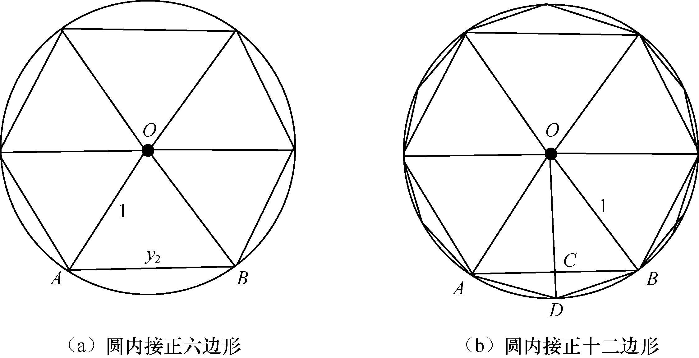
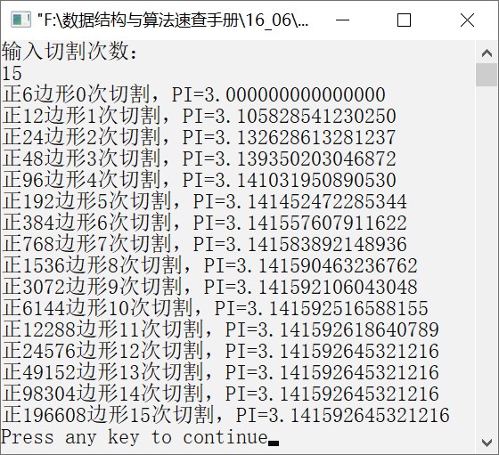

### 16.6　计算π的近似值


**问题描述**


利用割圆术计算π的近似值。割圆术是我国魏晋时期刘徽发明的计算圆周率的方法，它最早记录在公元263年刘徽撰写的《九章算术注》中。所谓“割圆术”，是用圆内接正多边形的面积无限逼近圆面积，并求圆周率的方法。


**【分析】**

对于圆内接正六边形，设圆半径为1。根据数学知识，圆内接正六边形的边长y<sub class="my_markdown">2</sub>也为1，圆的周长近似等于6y<sub class="my_markdown">2</sub>=6。圆周长=2πr，则π=圆周长/(2r)=6/(2×1)=3=3×2<sup class="my_markdown">0</sup>y<sub class="my_markdown">2</sub>，如图16.9（a）所示。对于圆内接正十二边形，可从圆内接正六边形继续切割得到，如图16.9（b）所示。假设圆内接正十二边形的边长AB=y<sub class="my_markdown">2</sub>，圆内接正六边形的边长BD=y<sub>1</sub>，三角形△AOC和△ADC都是直角三角形。对于△AOC，设OC=a，则有
；对于△ADC，设CD=b，则有。又由于a+b=1，因此依据以上公式，可得，圆周率。


<center class="my_markdown"><b class="my_markdown">图16.9　圆内接正六边形和圆内接正十二边形</b></center>

对于圆内接正二十四边形，设其边长为y<sub class="my_markdown">2</sub>，圆内接正十二边形的边长为y<sub>1</sub>，则可得
，圆周率π的近似值为3×2<sup class="my_markdown">2</sup> y<sub class="my_markdown">2</sub>。更一般地，经过若干次切割，得到的圆内接正多边形的边长趋近于圆的周长，可得，其圆周率π≈3×2<sup class="my_markdown">n</sup>y<sub class="my_markdown">2</sub>。


第16章\实例16-06.cpp

```c
/********************************************
*实例说明：计算π的近似值
*********************************************/
#include<iostream.h>
#include<iomanip.h>
#include<math.h>
void main()
{
    int i,n,c;
    double k,yn;
    i=0;       //切割次数
    k=3.0;     //初始值
    yn=1.0;    //圆内接正六边形的边长
    c=6;       //初始圆内接正多边形的边数
    cout<<"输入切割次数："<<endl;
    cin>>n;
    while(i<=n)
    {
        cout<<setiosflags(ios::fixed)<<setprecision(20);
        cout<<"正"<<c<<"边形"<<i<<"次切割，PI="<<k*sqrt(yn)<<endl;
        c*=2;           //边数增加一倍
        k*=2.0;         //3*2^n
        yn=2-sqrt(4-yn);//弦长
        i++;
    }    
}
```

运行结果如图16.10所示。


<center class="my_markdown"><b class="my_markdown">图16.10　运行结果</b></center>


