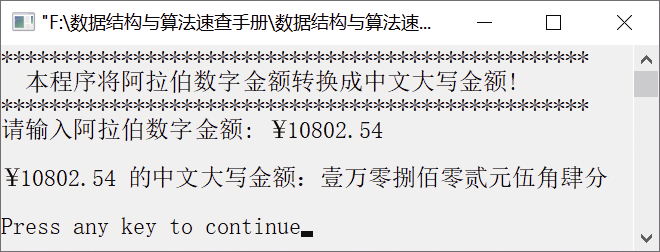

### 17.1　阿拉伯数字/中文大写金额的转换


**问题描述**


在实际工作中，当我们填写人民币数据时，比如报销差旅费时，就需要使用中文大写金额，有时候需要把一系列表格中的阿拉伯数字金额转换为中文大写，这就是阿拉伯数字/中文大写金额转换。例如，10 802.54的中文大写金额为壹万零捌佰零贰元伍角肆分。


**【分析】**

将阿拉伯数字金额转换为中文大写金额的方法如下。

（1）求出阿拉伯数字金额对应的整数部分和小数部分。

（2）分别将整数部分和小数部分转换为中文大写金额，即把阿拉伯数字0～9分别转换为零、壹、贰、叁、肆、伍、陆、柒、捌、玖，并在大写金额后面加上人民币的单位（即分、角、元）和“拾、佰、仟、万、亿”。

将整数部分转换为中文大写金额时，若整数部分的某位数字为0，还需要分以下几种情况进行处理。

（1）第1位数字为0，若第2位不是“.”或后面仍有其他字符，则输入有误；否则，输出“零元”。

（2）若为0的数字不是第1位，且不是亿、万、个位，则需要输出“零”；如果是亿、万、个位，则需要添加人民币单位。

其他情况直接将阿拉伯数字转换为中文大写，并输出人民币单位。

在转换小数部分时，当某位数为0时，若该位是小数点后第1位，则输出“零”；若小数点第1位和第2位都为0，则输出“整”；其他情况下则直接将阿拉伯数字转换为中文大写，并输出人民币的单位。


第17章\实例17-01.cpp

```c
/********************************************
*实例说明：阿拉伯数字/中文大写金额的转换
*********************************************/
1  #include<stdio.h>
2  #include<stdlib.h>
3  #include<string.h>
4  #define N 30
5  void rmb_units(int k);
6  void big_write_num(int l);
7  void main()
8  {
9      char c[N],*p;
10     int a,i,j,len,len_integer=0,len_decimal=0;
11         //len_integer为整数部分长度,len_decimal为小数部分长度
12     printf("***************************************\n");
13     printf("  本程序是将阿拉伯数字金额转换成中文大写金额!\n");
14     printf("***************************************\n");
15     printf("请输入阿拉伯数字金额: ¥");
16     scanf("%s",c);
17     printf("\n");
18     p=c;
19     len=strlen(p);
20     /*求出整数部分的长度*/
21     for(i=0;i<=len-1 && *(p+i)<='9' && *(p+i)>='0';i++);
22     if(*(p+i)=='.' || *(p+i)=='\0')//*(p+i)=='\0'是没小数点的情况
23         len_integer=i;
24     else
25     {
26         printf("\n输入有误，整数部分含有错误的字符!\n");
27         exit(-1);
28     }
29     if(len_integer>13)
30     {
31         printf("超过范围，最大万亿！整数部分最多13位!\n");
32         printf("注意：超过万亿部分只读出数字的中文大写!\n");
33     }
34     printf("¥%s 的中文大写金额：",c);
35     /*转换整数部分*/
36     for(i=0;i<len_integer;i++)
37     {
38         a=*(p+i)-'0';
39         if(a==0)
40         {
41             if(i==0)
42             {
43                 if(*(p+1)!='.' && *(p+1)!='\0' && *(p+1)!='0')
44                 {
45                     printf("\n输入有误！整数部分的第一位后有非法字符，请检查!\n");
46                     printf("程序继续执行,注意：整数部分的剩下部分将被忽略!\n");
47                 }
48                 printf("零元");
49                 break;
50             }
51             //个、万、亿位为0时选择不加零
52             else if(*(p+i+1)!='0' && i!=len_integer-5 && i!=len_integer-1 &&i!=len_ integer-9)
53             {
54                 printf("零");
55                 continue;
56            }
57            //个、万、亿单位不能掉
58            else if(i==len_integer-1 || i==len_integer-5 || i==len_integer-9)
59           {
60               rmb_units(len_integer+1-i);
61               continue;
62           }
63           else
64               continue;
65       }
66       big_write_num(a);             //阿拉伯数字以中文大写输出
67       rmb_units(len_integer+1-i);    
68   }
69   /*求出小数部分的长度*/
70   len_decimal=len-len_integer-1;
71   if(len_decimal<0)        //若只有整数部分，则在最后输出“整”
72   {
73       len_decimal=0;
74       printf("整");
75   }
76   if(len_decimal>2)        //只取两位小数
77       len_decimal=2;
78   p=c;
79   /*转换小数部分*/
80   for(j=0;j<len_decimal;j++)
81   {
82       a=*(p+len_integer+1+j)-'0';
83       //定位到小数部分，等价于a=*(p+len-len_decimal+j)-'0';
84       if(a<0 || a>9)
85       {
86           printf("\n输入有误，小数部分含有错误的字符!\n");
87           system("pause");
88           exit(-1);
89       }
90       if(a==0)
91       {
92           if(j+1<len_decimal)
93           {
94               if(*(p+len_integer+j+2)!='0')
95                   printf("零");
96               else
97               {
98                   printf("整");
99                   break;
100               }
101           }
102           continue;
103       }
104       big_write_num(a);
105       rmb_units(1-j);
106   }
107   printf("\n\n");
108 }
109 void rmb_units(int k)
110 {
111   //相当于const char rmb_units[]="fjysbqwsbqisbqw";
112   switch(k)
113   {
114       case 3:case 7:case 11: printf("拾");break;
115       case 4:case 8:case 12: printf("佰");break;
116       case 5:case 9:case 13: printf("仟");break;
117       case 6: case 14:       printf("万");break;
118       case 10:               printf("亿");break;
119       case 2:                printf("元");break;
120       case 1:                printf("角");break;
121       case 0:                printf("分");break;
122       default:               break;
123   }
124 }
125 void big_write_num(int l)
126 {
127     //相当于const char big_write_num[]="0123456789";
128     //"零壹贰叁肆伍陆柒捌玖"
129     switch(l)
130     {
131         case 0:printf("零");break;
132         case 1:printf("壹");break;
133         case 2:printf("贰");break;
134         case 3:printf("叁");break;
135         case 4:printf("肆");break;
136         case 5:printf("伍");break;
137         case 6:printf("陆");break;
138         case 7:printf("柒");break;
139         case 8:printf("捌");break;
140         case 9:printf("玖");break;
141         default:break;
142   }
143 }
```

运行结果如图17.1所示。


<center class="my_markdown"><b class="my_markdown">图17.1　运行结果</b></center>

**【说明】**

第18～19行求出字符串的长度，即整数部分位数和小数部分位数之和（包括小数点）。

第21～23行求出整数部分的长度。

在第40～50行中，若第一位整数部分为0，则输出“零元”。

在第40～50行中，如果当前位上数字为0且不在个位、万位、亿位上，则输出“零”。

在第51～56行中，如果当前位上数字为0且在个位、万位、亿位上，则输出人民币单位。

在第66～67行中，当前位上数字不为0，则直接将其转换为大写金额且输出对应的人民币单位。

在第71～74行中，若只有整数部分，则在最后输出“整”。

在第92～99行中，若小数部分第一位数字为0，且第二位数字不为0，则输出“零”；若第一位数字为0，且第二位数字也为0，则输出“整”。

在第104～105行中，其他情况下，直接将阿拉伯数字金额转换为大写金额，并输出人民币单位。

在第109～124行中，rmb_units函数的功能是输出对应位上的大写人民币单位。

在第125～141行中，big_write_num函数的功能是将阿拉伯数字金额转换为对应的中文大写金额。

