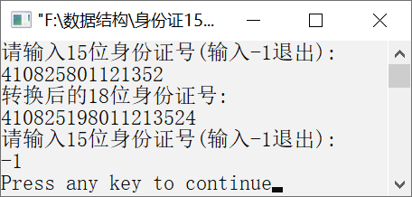

### 17.2　将15位身份证号转换为18位


**问题描述**


我国第一代身份证号是15位，这主要是自1984年起发放的身份证。因为15位的身份证号只能为1900年1月1日到1999年12月31日出生的人编号，所以后来将原来的15位升级为目前的18位。为了验证之前的15位身份证号与目前的18位身份证号是同一个人的身份证号，就需要按照身份证号转换规则进行验证。编写算法，将15位身份证号转换为18位身份证号。例如，第一代身份证号为340524800101001，对应的第二代身份证号为34052419800101001X，它们之间的区别是第二代身份证号在年份前多了19，即将出生的年份补充完整，并且最后面多了一位校验位。


**【分析】**

首先要了解身份证号最后一位的校验位是如何得到的。要计算第18位数字，先将前面的身份证号的17位数分别乘以不同的系数，从第1位到第17位的系数分别为7、9、10、5、8、4、2、1、6、3、7、9、10、5、8、4、2。然后将这17位数和系数相乘的结果累加，将该结果除以11，得到的余数只可能有0、1、2、3、4、5、6、7、8、9、10这11个数字，其分别对应的身份证最后一位数字为1、0、X、9、8、7、6、5、4、3、2。


第17章\实例17-02.cpp

```c
/********************************************
*实例说明：将15位身份证号转换为18位
*********************************************/
#include<iostream.h>
#include<string.h>
void main()
{
    char strID[19];
    int weight[]={7,9,10,5,8,4,2,1,6,3,7,9,10,5,8,4,2},m=0,i;
    char verifyCod[]={'1','0','X','9','8','7','6','5','4','3','2'};
    while(1)
    {
         m=0;
        cout<<"请输入15位身份证号(输入-1退出):"<<endl;
        cin>>strID;
        if(strcmp(strID,"-1")==0)
            break;
        for(i=strlen(strID);i>5;i--)
            strID[i+2]=strID[i];
        strID[6]='1';
        strID[7]='9';
        for(i=0; i<strlen(strID);i++)
        {
            m+=(strID[i]-'0')*weight[i];
        }
        strID[17]=verifyCod[m%11];
        strID[18]='\0';
        cout<<"转换后的18位身份证号:"<<endl;
        cout<<strID<<endl;
    }
}
```

运行结果如图17.2所示。


<center class="my_markdown"><b class="my_markdown">图17.2　运行结果</b></center>

