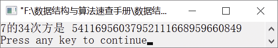

### 17.3　计算7的34次方


**问题描述**


编写算法，计算7的34次方。


**【分析】**

计算一个数的n次方可通过简单的一重循环实现，但7的34次方是一个非常大的数，它超过了计算机的表示范围。这其实是一个大整数存储问题，可利用数组来存储。

要计算7的34次方，将1存储在数组a中，不断地将其与7相乘，循环34次，数组a的值就是7的34次方。任何一个整数（假设位数为n）与7相乘，其结果的位数不会超过n+1。从最低位到最高位，依次将每位数与7相乘；如果有进位，则将进位存入临时变量c中，把余数存入当前位。在将下一位数与7相乘时，还需将此时的相乘结果加上进位c。某一次相乘的代码如下。

```c
for (j=0;j<=k;j++)
{
    a[j]=a[j]*7+c;
    c=a[j]/10;
    a[j]%=10;
}
```

若最高位上还有进位，则将位数增加1，并将进位作为乘积的最高位。代码如下。

```c
if (c)
    {
        k++;
        a[k]=c;
        c=0;
    }
```

例如，若当前得到了7的2次方，即49，其中a[0]=9，a[1]=4，接下来要计算49×7的值。因此，先计算9×7，得到63，存入a[0]中，把进位6存入c中，把3存入a[0]中。然后计算4×7，得到28，并加上进位6，把34存入a[1]中，把3存入c中，把4存入a[1]中。最高位仍然有进位，故将3存入a[2]中。于是就得到最终的结果343。


第17章\实例17-03.cpp

```c
/********************************************
*实例说明：计算7的34次方
*********************************************/
1  #include<stdio.h>
2  void main()
3  {
4      int i,j,k,c=0,a[34];
5      a[0]=1;
6      k=0;
7          printf("7的34次方是 ");
8      for(i=1;i<=34;i++)
9      {
10         for (j=0;j<=k;j++)
11         {
12             a[j]=a[j]*7+c;
13             c=a[j]/10;
14             a[j]%=10;
15         }
16         if (c)
17        {
18            k++;
19            a[k]=c;
20            c=0;
21        }
22    }
23    for (;k>=0;k--)
24        printf("%d",a[k]);
25    printf("\n");
26 }
```

运行结果如图17.3所示。


<center class="my_markdown"><b class="my_markdown">图17.3　运行结果</b></center>

**【说明】**

在第10～15行中， 从最低位到最高位，依次与7相乘，并把与低位数相乘得到结果的加上进位c，存放在a[j]中。此时的进位存入c中，低位存入a[j]中。

在第16～20行中，若最高位与7相乘有进位，则将进位存入a[k+1]中。

在第23～24行中，从高位到低位依次输出数组a中的值，即7的34次方。

