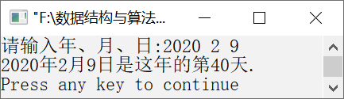

### 17.4　计算某年某月某日是一年中的第几天


**问题描述**


根据输入的年月日，计算它是这一年的第几天。


**【分析】**

输入年（year）、月（month）、日（day），首先根据year判断这一年是闰年还是平年，如果是闰年，则2月份有29天；否则，2月份有28天。然后累加前（month−1）个月的天数，最后加上day，就得到它是这一年的第几天。


第17章\实例17-04.cpp

```c
/********************************************
*实例说明：计算某年某月某日是一年中的第几天
*********************************************/
1 #include<stdio.h>
2 const int leapYear[12] = { 31, 29, 31, 30, 31, 30, 31, 31, 30, 31, 30, 31 };
3 const int nonLeapYear[12] = { 31, 28, 31, 30, 31, 30, 31, 31, 30, 31, 30, 31 };
4 int IsLeapYear( int iYear )
5 {//判断是否为闰年
6     if(iYear %4==0&&iYear%100!=0||iYear%400==0)
7         return 1;
8     else
9         return 0;
10 }
11 int GetDayInYear( int iYear, int iMonth, int iDay )
12 {//计算某年某月某日是一年中的第几天
13    int i;
14    int iCurMonth = iMonth - 1;
15    int iIndex = 0;
16    if( iYear < 0 )
17        return -1;
18    if( iMonth > 13 || iMonth < 1 )
19        return -1;
20       if( IsLeapYear( iYear ) )                //闰年
21    {
22        for( i = 0; i < iCurMonth; i++ )
23        {
24            iIndex += leapYear[i];
25        }
26        if( iDay > leapYear[i] || iDay < 1 )
27            return -1;
28        iIndex += iDay;
29    }
30       else                                    //不是闰年
31    {
32        for( i = 0; i < iCurMonth; i++ )
33        {
34            iIndex += nonLeapYear[i];
35        }
36        if( iDay > nonLeapYear[i] || iDay < 1 )
37            return -1;
38        iIndex += iDay;
39    }
40    return iIndex;
41 }
42 void main( )
43 {
44     int year,month,day;
45        printf("请输入年、月、日:");
46     scanf("%d%d%d",&year,&month,&day);
47        printf( "%d年%d月%d日是这年的第%d天.\n",year,month,day,GetDayInYear(year,month,day ) );
48 }
```

运行结果如图17.4所示。


<center class="my_markdown"><b class="my_markdown">图17.4　运行结果</b></center>

**【说明】**

在第2～3行中，定义两个数组leapYear和nonLeapYear，分别存放闰年和平年每个月的天数。

在第4行中，IsLeapYear函数判断iYear是否为闰年。若某年能被4整除，但不能被100整除，那么这一年就是闰年；此外，能被400整除的年也是闰年。

在第20～29行中，如果iYear是闰年，则先将leapYear数组中1～(iMonth−1)月中的天数相加，然后加上当月的日期iDay。

在第30～38行中，如果iYear是平年，则将nonLeapYear数组中1～(iMonth−1)月中的天数相加，然后加上当月的日期iDay。

