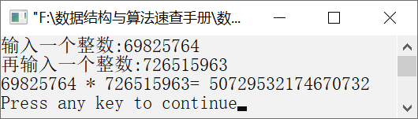

### 17.5　大整数相乘


**问题描述**


利用数组实现算法，求解两个大整数相乘问题。


**【分析】**

一般情况下，求两个大整数相乘往往利用分治法，理解起来较困难。这里我们使用模拟人类大脑计算两个整数相乘的方式求大整数相乘的结果，中间结果和最后结果仍然使用数组来存储。

假设A为被乘数，B为乘数，分别从A和B的最低位开始，将B的最低位分别与A的各位数依次相乘，乘积的最低位存放在数组a[i]中，高位（进位）存放在临时变量d中；再将B的次低位与A的各位数相乘，并加上得到的进位d和a[i]，就是B中该位数字与A中对应位上数字的乘积，其中a[i]是之前得到乘积的第i位数字。以此类推，就可得到两个整数的乘积。代码如下。

```c
for(i1=0,k=n1-1;i1<n1;i1++,k--)
     for(i2=0,j=n2-1;i2<n2;i2++,j--)
     {
         i=i1+i2;
         b=a[i]+(s1[k]-48)*(s2[j]-48)+d;
         a[i]=b%10;
         d=b/10;
     }
```

如果B中的最高位与A中对应位数字相乘后有进位，则需要将该进位存放在a[i+1]中，代码如下。

```c
while(d>0)  
{  
    i++;  
    a[i]=a[i]+d%10;
    d=d/10;  
}
```


第17章\实例17-05.cpp

```c
/********************************************
*实例说明：大整数相乘
*********************************************/
1 #include<stdio.h>
2 #include<string.h>
3 void main()
4 {
5     long b,d;
6     int i,i1,i2,j,k,n,n1,n2,a[256];
7     char s1[256],s2[256];
8     printf("输入一个整数:");
9     scanf("%s",&s1);
10    printf("再输入一个整数:");
11    scanf("%s",&s2);
12    for(i=0;i<255;i++)
13        a[i]=0;
14    n1=strlen(s1);
15    n2=strlen(s2);
16    d=0;
17    for(i1=0,k=n1-1;i1<n1;i1++,k--)
18    {
19        for(i2=0,j=n2-1;i2<n2;i2++,j--)
20        {
21            i=i1+i2;
22            b=a[i]+(s1[k]-48)*(s2[j]-48)+d;
23            a[i]=b%10;
24            d=b/10;
25         }
26 if(d>0)
27         {
28            i++;
29            a[i]=a[i]+d%10;
30            d=d/10;
31         }
32        n=i;
33    }
34    printf("%s * %s= ",s1,s2);
35    for(i=n;i>=0;i--)
36        printf("%d",a[i]);
37    printf("\n");
38 }
```

运行结果如图17.5所示。


<center class="my_markdown"><b class="my_markdown">图17.5　运行结果</b></center>

**【说明】**

在第12～15行中，将大整数上的每一位都初始化为0，分别求出两个整数的位数。

在第17～24行中，分别将被乘数和乘数的每一位数字相乘，并将当前值存入d中。然后，把当前位上的数字存入a[i]中，把进位存入d中。

在第26～30行中，在乘数的每一位与被乘数相乘结束后，若最高位上还有进位，则将进位加到对应位的a[i+1]上。

在第32行中，记下当前结果的位数，存入n中。

在第35～36行中，从高位到低位依次输出大整数相乘后的结果。

