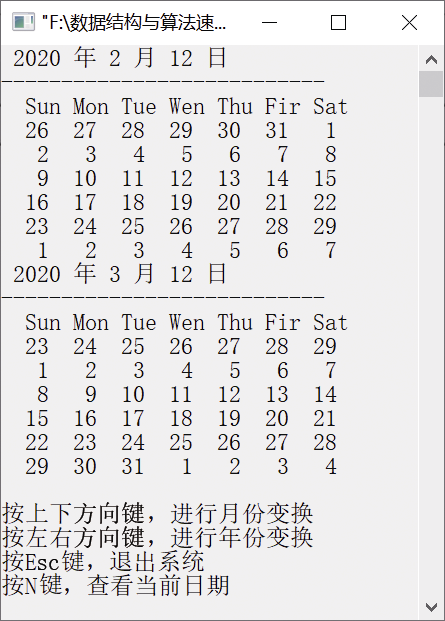

### 17.6　输出万年历


**问题描述**


要求按以下规则输出万年历：每一行输出一周，以“Sun Mon Tue Wed Thu Fri Sat”的形式显示。可根据以下公式获取某年元旦是星期几。

或 

其中，y表示年份；c表示年份的前两位；w表示星期，取值为0～6，0表示星期日，6表示星期六。


**【分析】**

我们根据以上公式可获取当年元旦是星期几，然后利用输入的月份和日期定位当前日期是星期几。可以利用系统时间获取当前日期，计算当前日期前的天数，从而得到当前日期是星期几，然后显示当前月份的日历。


第17章\实例17-06.cpp

```c
/********************************************
*实例说明：输出万年历
*********************************************/
#include<stdio.h>
#include<stdlib.h>
#include<time.h>
#include<conio.h>
typedef struct today
{
    int day;
    int month;
    int year;
} today;
int days[2][13]={ {0,31,28,31,30,31,30,31,31,30,31,30,31},
    {0,31,29,31,30,31,30,31,31,30,31,30,31} };
char *week[]= {"Sun","Mon","Tue","Wen","Thu","Fir","Sat"};
struct tm *todayuse;//定义time的结构体
today today_current;
int GetWeekDay(today today_usenow)
{
    int w=0,y,c,m;
    int year=today_usenow.year;
    int month=today_usenow.month;
    if(today_usenow.month==1 || today_usenow.month==2)
    {
        month+=12;
        year--;
    }
    y=year%100;
    c=year/100;
    m=month;
    w=y + y/4 + c/4 - 2*c+ 26* (m+1) / 10 + today_usenow.day -1;
    while(w<0)
    {
        w+=7;
    }
    return (w%7);
}
int IsLeapYear(int year) //判断是否为闰年
{
    if( (year%4==0 && year%100!=0) || (year%400==0))
        return 1;
    else
        return 0;
}
int GetMonthDays(int year,int month) //得到当前月的天数
{
    return days[IsLeapYear(year)][month];
}
void PrintCalendar(today today_usenow)
{
    int i,j,hang,m,day,days,daysbefore,daysbefoeit,count,newmonth;
    int firstday=0;
    today today_usehere=today_usenow;
    printf("---------------------------\n");
    printf("  Sun Mon Tue Wen Thu Fir Sat\n");
    today_usehere.day=1;
    day=GetWeekDay(today_usehere);//获取当前日期是星期几
    days=GetMonthDays(today_usenow.year,today_usenow.month);//月总数
    daysbefore=0;
    if((today_usenow.month-1)==0)
    {
        //若现在为1月，获取去年的12月份
        daysbefore=GetMonthDays(today_usenow.year-1,12);
    }
    else
    {
        daysbefore=GetMonthDays(today_usenow.year,today_usenow.month-1);
    }
    daysbefoeit=daysbefore-day+1;
    printf("");
    count=1;
    if(day==0)
    {
        daysbefoeit-=7;
        for(i=0;i<day+7;i++)
        {
            printf("%4d", daysbefoeit);
            daysbefoeit++;
        }
        printf("\n");
        count=7;
    }
    else
    {
        for(i=0;i<day;i++)
        {
            printf("%4d", daysbefoeit);
            daysbefoeit++;
        }
        count=day;
    }
    m=1;
    for(i=0;i<=6-day;i++)
    {
        printf("%4d",m);
        m++;
    }
    printf("\n");
    if(day==0)
        count=14;
    else
        count=7;
    hang=0;
    while(m<=days)
    {
        printf("%4d",m);
        hang++;
        if(hang==7)
        {
            printf("\n");
            hang=0;
        }
        m++;
    }
    if(day==0)
    {
        count=days+7;
    }
    else
    {
        count=day+days;
    }
    newmonth=1;
    for(j=hang;j<7;j++)
    {
        printf("%4d",newmonth);
        newmonth++;
    }
    printf("\n");
    count=count+7-hang;
    for(j=0;j< 42-count;j++)
    {
        printf("%4d",newmonth);
        newmonth++;
    }
}
void main()
{
    struct tm *p;
time_t timep;
    time(&timep);
    p =localtime(&timep); //此函数获得tm结构体的时间
    today_current.year=1900+p->tm_year;
    today_current.month=1+p->tm_mon;
    today_current.day= p->tm_mday;
    today use=today_current;
    int c1,c2;
    printf(" %d 年 %d 月 %d 日\n",today_current.year,today_current.month,today_current.day);
    PrintCalendar(today_current);
    while(1)
    {
        c1 = getch();
        if(c1==27)
        {
            printf("您已经退出系统");
            break;
        }
        if(c1==110)
        {
            printf(" %d 年 %d 月 %d 日\n",today_current.year,today_current.month, today_
            current.day);
            PrintCalendar(today_current);
            use=today_current;
            continue;
        }
        c2 = getch();         
        if(c1==224 && c2==72)
        {
            use.month+=1;
            if(use.month==13)
            {
                use.month=1;
                use.year+=1;
            }
            printf(" %d 年 %d 月 %d 日\n",use.year,use.month,use.day);
            PrintCalendar(use);     
        }
        if(c1==224 && c2==80)
        {
            use.month-=1;
            if(use.month==0)
            {
                use.month=12;
                use.year-=1;
            }
            printf(" %d 年 %d 月 %d 日\n",use.year,use.month,use.day);
            PrintCalendar(use);
        }
        if(c1==224 && c2==75)
        {
            use.year-=1;
            printf(" %d 年 %d 月 %d 日\n",use.year,use.month,use.day);
            PrintCalendar(use);
        }
        if(c1==224 && c2==77)
        {
            use.year+=1;
            printf(" %d 年 %d 月 %d 日\n",use.year,use.month,use.day);
            PrintCalendar(use);
        }
        printf("\n");
        printf("按上下方向键，进行月份变换\n");
        printf("按左右方向键，进行年份变换\n");
        printf("按Esc键，退出系统\n");
        printf("按N键，查看当前日期\n");
    }
}
```

运行结果如图17.6所示。


<center class="my_markdown"><b class="my_markdown">图17.6　运行结果</b></center>

