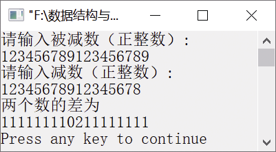

### 17.7　求两个正整数的差


**问题描述**


实现算法，分别输入两个任意长度的正整数，求这两个正整数的差。


**【分析】**

分别用两个字符数组存放输入的两个正整数（被减数和减数），将两个正整数的差存放在一个整型数组中。在求两个正整数的差之前，先分别求出被减数和减数的位数，然后判断被减数和减数两者的大小，用其中较大者减去较小者。在进行相减运算时，应从低位开始到高位依次对每一位数字相减，若被减数上的数字大于减数的数字，则直接相减；否则，先从较高位上进行借位，然后再进行相减运算。若差为负数，还需要在差前面加上“－”。在输出差时，还应该将差最前面的0去掉。


第17章\实例17-07.cpp

```c
/********************************************
*实例说明：求两个正整数的差
*********************************************/
#include<stdio.h>
#include<math.h>
#define N 500
void main()
{
    char s1[N],s2[N];     /*s1[]存放被减数,s2[]存放减数*/
    int r[N]={0};         /*r[]存放两数相减的差*/
    int i,j,k,len1=0,len2=0;
    printf("请输入被减数（正整数）:\n");
    gets(s1);
    printf("请输入减数（正整数）:\n");
    gets(s2);
    while(s1[len1]!='\0')/*统计被减数的位数*/
        len1++;
    while(s2[len2]!='\0')/*统计减数的位数*/
        len2++;
    printf("两个数的差为\n");
    i=0;
    while(s1[i]==s2[i])
        i++;
    if ((len1>len2)||(len1==len2)&&(s1[i]>=s2[i]))    /*若被减数大于减数*/
    {
        for (i=len1-1,k=0,j=len2-1;j>=0;i--,j--,k++)  /*从低位到高位依次相减*/
        {
            if (s1[i]>=s2[j])      /*若无借位,则直接相减*/
                r[k]=s1[i]-s2[j];
            else
            {
                s1[i-1]--;     /*向高位借位*/
                r[k]=s1[i]+10-s2[j];    /*借位后相减*/
            }
        }
        for (j=i-1;(s1[j]<'0')&&(j>=0);j--)
        {
            s1[j]=s1[j]+10;
            s1[j-1]--;
        }
        for (;i>=0;i--,k++)
            r[k]=s1[i]-'0';
    }
    else       /*若被减数小于减数*/
    {
        for (i=len2-1,k=0,j=len1-1;j>=0;i--,j--,k++)
        {
            if (s2[i]>=s1[j])
                r[k]=s2[i]-s1[j];     /*减数减去被减数*/
            else
            {
                s2[i-1]--;     /*向高位借位*/
                r[k]=s2[i]+10-s1[j];
            }
        }
        for (j=i-1;s2[j]<'0'&&j>=0;j--)
        {
            s2[j]=s2[j]+10;
            s2[j-1]--;
        }
        for (;i>=0;i--,k++)
            r[k]=s2[i]-'0';
        printf("-");      /*结果为负数，在前面加上-*/
    }
    while(!r[k])/*去掉差前面的0*/
        k--;
    if(k<=-1) /*若差全为0,应输出一个0*/
        printf("0");
    for (;k>=0;k--)
        printf("%d",r[k]);
    printf("\n");
}
```

运行结果如图17.7所示。


<center class="my_markdown"><b class="my_markdown">图17.7　运行结果</b></center>

