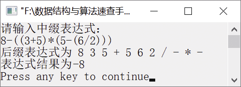

### 17.8　利用二叉树结构计算算术表达式的值


**问题描述**


例如，输入算术表达式8−((3+5)*(5−(6/2)))，利用所学二叉树的知识将其转换为后缀表达式，然后计算该表达式的值。


**【分析】**

为了计算算术表达式的值，需要将算术表达式转换为对应的后缀表达式，可根据输入的算术表达式字符串创建对应的二叉树，然后再利用二叉树的后序遍历计算算术表达式的值。创建二叉树的原则是将运算符作为根节点，操作数作为相应的左右子节点。运算符级别较高的运算符需要优先计算，所以将其放置在二叉树的叶子节点附近，运算符级别较低的运算符放置在二叉树的根节点附近。即运算符优先级越高，其处在二叉树的层数越高；反之，其处在二叉树的层数越低。最后参与运算的运算符为根节点。

为了创建二叉树，需要先确定二叉树的根节点，然后以根节点为分隔符将输入的算术表达式字符串分为左右两棵子树。确定二叉树的根节点，就是查找优先级别较低的运算符。可用变量flag记录找到运算符的位置，用变量in_bracket表示当前字符是否在括号内，初值为0；变量high_level表示运算先后顺序，初值为0。依次扫描算术表达式字符串，如果最外层有括号，则先去掉括号。当遇到“（”时，将in_bracket置为1，表示在括号内；若遇到“）”，再将其置为0，表示不在括号内。若遇到“+”“−”且in_bracket为0，则将high_level置为1，表示可作为根节点。接着判断是否满足不在括号内且不存在“+”“−”节点（即high_level==0）的“*”“/”运算符，若存在，则将其作为根节点。最后，将flag返回，将exp[flag]作为根节点。

然后利用创建的二叉树，通过后序遍历二叉树得到的后缀表达式计算算术表达式的值。


第17章\实例17-08.cpp

```c
/********************************************
*实例说明：利用二叉树结构计算算术表达式的值
*********************************************/
#include<stdio.h>
#include<string.h>
#include<stdlib.h>
typedef struct BNode
{
    char data;
    BNode *lchild;
    BNode *rchild;
}BiNode,*BiTree;
int FindSplit(char exp[], int start, int end);
BiTree CreateBiTree(char *exp, int start, int end)
//根据输入的中缀表达式创建二叉树
{
    BiTree root = NULL;
    int flag;
    if (start == end)//若只有一个节点，则创建叶子节点
    {
        root = (BiTree)malloc(sizeof(BiNode));
        root->data = exp[start];
        root->lchild = NULL;
        root->rchild = NULL;
    }
    else
    {   //查找运算符，创建以此为根节点的左右子树
        flag = FindSplit(exp, start, end);
        if (flag < 0)//若flag<0，则输入的算术表达式无效
        {
            printf("输入的算术表达式无效\n");
            exit(-1);
        }
        else//否则，则创建从exp[flag]为根节点的二叉树
        {
            root = (BiTree)malloc(sizeof(BiNode));//创建根节点
            root->data = exp[flag];
        }
        if (exp[start] == '(' && exp[end] == ')')//去掉左右括号
        {
            start++;
            end--;
        }
        //递归调用, 以flag为分隔符创建算术表达式的对应二叉树
        root->lchild = CreateBiTree(exp, start, flag - 1);
        root->rchild = CreateBiTree(exp, flag + 1, end);
    }
    return root;
}
int FindSplit(char exp[], int start, int end)
/*查找分隔位置*/
{
    int i,in_bracket=0, high_level=0, flag = -1;
    if (exp[start] == '(' && exp[end] == ')')//忽略左右括号
    {
        start++;
        end--;
    }
    for (i = start; i <= end; i++)
    {
        //记录当前字符是否在括号内
        if (exp[i] == '(')
            in_bracket++;
        else if (exp[i] == ')')
            in_bracket--;
        if (in_bracket == 0 && (exp[i] == '+' || exp[i] == '-'))
        //若当前字符不在括号内，且为 + 或 -，则当前运算符在二叉树中的层级较高
        {
            high_level = 1;
            flag = i;
        }
       else if ((exp[i] == '*' || exp[i] =='/') && high_level == 0 && in_bracket == 0)
        //若当前字符不在括号内且之前未遇到 + 或 -，则当前运算符在二叉树中的层级较高
            flag = i;
    }
    return flag;
}
float CalPostExpress(BiTree root)
//递归调用计算二叉树表示的后缀表达式的值
{
    if (root == NULL)
        return -1;
    else if ('0' <= root->data && root->data <= '9')
        return (float)(root->data - '0');
    else if(root->data=='+')
        return CalPostExpress(root->lchild) + CalPostExpress(root->rchild);
    else if(root->data=='-')
        return CalPostExpress(root->lchild) - CalPostExpress(root->rchild);
    else if(root->data=='*')
        return CalPostExpress(root->lchild) * CalPostExpress(root->rchild);
    else if(root->data=='/')
        return CalPostExpress(root->lchild) / CalPostExpress(root->rchild);
}
void PostOrderTraverse(BiTree T)
/*后序遍历二叉树的递归实现*/
{
    if(T)                                /*如果二叉树非空*/
    {
        PostOrderTraverse(T->lchild);    /*后序遍历左子树*/
  PostOrderTraverse(T->rchild);          /*后序遍历右子树*/
        printf("%2c",T->data);           /*访问根节点*/
    }
}
void main()
{
    char a[100],ch;
    BiTree root;
    float r=0;
    printf("请输入中缀表达式：\n");
    scanf("%s", a);
    while ((ch = getchar()) != '\n');    //以回车符作为结束符
    root = CreateBiTree(a, 0, strlen(a)-1);
    r=CalPostExpress(root);
    printf("后缀表达式为");
    PostOrderTraverse(root);
    printf("\n");
    printf("表达式结果为%f\n", r);
}
```

运行结果如图17.8所示。


<center class="my_markdown"><b class="my_markdown">图17.8　运行结果</b></center>


