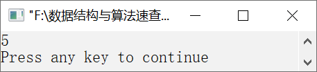
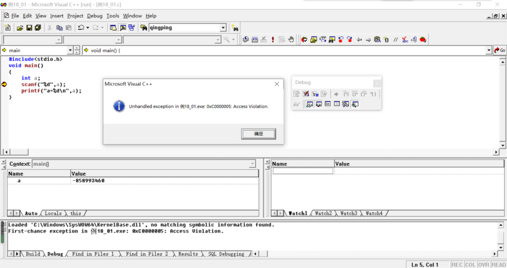
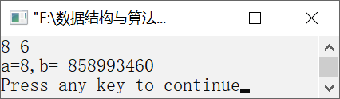

### 18.1.2　常见错误举例

下面是编写C程序时经常出现的一些错误，我们通过这些错误案例和错误提示来说明如何识别这样的错误，帮助初学者调试程序。

#### 1．忘记分号

忘记分号是编程中最常见的错误之一，这种错误属于语法错误，在编译阶段就会被找出来，所以很容易被纠正。例如，有以下代码。

```c
1  #include<stdio.h>
2  void main()
3  {
4       int a=3,b=5,c;
5       c=a+b;
6       printf("c=%d\n",c)
7  }
```

单击工具栏上的
按钮后，编译器将给出如下的错误提示信息。

```c
e:\数据结构与算法速查手册\例18_1\例18_1.c(7) : error C2143: syntax error : missing ';' before '}'
```

双击该错误提示行后，错误指示符将定位在第7行代码。上面的错误提示告诉我们在第7行的花括号之前缺少一个分号。

#### 2．忽略了大小写标识符

在C语言中，大小写英文字母是不同的字母，二者不能混用。例如，有如下代码。

```c
1  #include<stdio.h>
2  void main()
3  {
4       int a=3,b=5,c;
5       c=sum(a,b);
6       printf("c=%d\n",c);
7  }
8  int Sum(int x,int y)
9  {
10      return x+y;
11 }
```

在编译该程序时并不会出现错误，也就是该程序能通过编译。但是在链接该程序时，将出现如下的错误提示信息。

```c
例18_1.obj : error LNK2001: unresolved external symbol _sum
Debug/例21_1.exe : fatal error LNK1120: 1 unresolved externals
例18_1.exe - 2 error(s), 0 warning(s)
```

以上错误提示信息的意思是无法解析sum。这表明sum函数中出现了错误，经过检查就会发现原来是大小写问题。这类错误往往令许多初学者感到莫名其妙，因为编译器并不会指出具体在哪行出现了错误。之所以出现这种错误是因为系统找不到相应的函数，一般是函数名书写错误。

#### 3．忽略了=与==的区别

在C语言中，=与==是不同的，前者表示赋值运算符，后者表示条件运算符中判断两边的值是否相等。在编写程序时，经常会将条件运算符中的==写作=。例如，有如下代码。

```c
1  int a=3;
2  if(a=5)
3        printf("a的值等于5\n");
```

程序的运行结果如下。

```c
a的值等于5
```

这显然是不对的。这种错误不会被编译器发现，这是因为以上书写符合语法规定。经过检查发现原来是将a==5写作了a=5，所以不管a是什么数都会执行第3行的输出语句。这种错误可通过单步跟踪调试找出。

#### 4．输入时忘记了&运算符

在使用scanf函数为变量输入数据时，缺少变量名前的&运算符。例如，有如下代码。

```c
1  #include<stdio.h>
2  void main()
3  {
4       int a;
5       scanf("%d",a);
6           printf("a=%d\n",a);
7  }
```

编译链接程序时都不会出现错误，运行结果如图18.1所示。


<center class="my_markdown"><b class="my_markdown">图18.1　运行结果</b></center>

输入整数5，但是并没有像期望的那样输出结果 `a=5` 。通过设置断点，单步跟踪调试程序，出现图18.2所示的运行时错误提示。


<center class="my_markdown"><b class="my_markdown">图18.2　运行时错误提示</b></center>

这种错误就属于运行时错误，即在运行阶段发现了错误。这种错误也需要单步跟踪调试才能发现，当程序执行到该行时，出现该运行时错误提示，说明这一行存在错误。

#### 5．数据的输入方式与格式要求不符

例如，有如下代码。

```c
1  #include<stdio.h>
2  void main()
3  {
4       int a,b;
5       scanf("%d,%d",&a,&b);
6       printf("a=%d,b=%d\n",a,b);
7  }
```

如果按照以下格式输入数据，则8和6之间有一个空格，运行结果如图18.3所示。


<center class="my_markdown"><b class="my_markdown">图18.3　运行结果</b></center>

造成这样错误的运行结果是因为输入格式不正确，正确的输入格式应该是8和6之间用逗号分隔。这样的错误属于逻辑错误，这是因为错误的输入方式造成的，可以通过提示输入方式减少错误。

```c
86<按Enter键>
```

#### 6．定义数组时误用了变量作为数组的最大长度

在定义数组时，需要指定数组的最大长度。因为数组的空间大小在编译阶段分配，而变量的值在运行阶段才能得到，所以使用变量作为数组的最大长度是错误的。例如，有如下代码。

```c
1  int n;
2  scanf("%d",&n);
3  int a[n];
```

n的值在运行阶段才能得到，而数组a的最大长度必须在编译阶段指定，这样的分配时机不合适。另外，scanf函数是执行语句，而第3行是声明语句，声明语句应在执行语句之前，以上代码的语句顺序也是不符合C语言规定的。

#### 7．数组越界错误

在C语言中，数组的下标从0开始，而不是从1开始。在引用数组元素时必须清楚这一点，否则将会造成错误。例如，有如下代码。

```c
1  int a[10]={1,2,3,4,5,6,7,8,9,10};
2  printf("%d",a[10]);
```

定义数组a[10]，它的元素是a[0]～a[9]的10个元素，不包括a[10]。因此引用a[10]是错误的，但是C语言并不进行数组下标越界检查。运行程序后将输出一个随机的数。

#### 8．在switch语句中漏掉了break语句

在switch语句中，每一个分支都需要一个break语句以便退出该选择语句。例如，下面的代码是有问题的。

```c
1  switch(grade)
2  {
3      case 'A':
4          printf("90～100\n");
5      case 'B':
6          printf("80～89\n");
7      case 'C':
8          printf("70～79\n");
9      case 'D':
10         printf("60～69\n");
11     case 'E':
12         printf("0～59\n");
13   }
```

由于每个分支都没有break语句，因此执行其中一个分支语句后，将继续执行后面的语句，而不是退出switch语句。如果grade的值是“B”，则将输出以下结果。

```c
80～89
70～79
60～69
0～59
```

这样的错误也属于逻辑错误，编译器无法自动检查出错误。

#### 9．直接为指针类型变量赋值

在C语言中，必须先为变量分配内存空间才能使用该变量。对于一般的变量来说，定义变量就是为变量分配内存空间。而对于指针类型变量来说，则需要用户自己分配内存空间。例如，有如下代码。

```c
1  #include<stdio.h>
2  void main()
3  {
4       int *a;
5       *a=5;
6       printf("%d\n",*a);
7  }
```

第5行代码试图将5直接赋值给a指向的内存空间，这样的做法是错误的。对于指针类型变量，它是一个指针，只能指向已经存在的数据。为了将数据正确地保存到内存单元中，必须使用malloc函数动态地为该指针分配一个内存单元，否则将产生运行时错误。正确的代码如下。

```c
1  #include<stdio.h>
2  void main()
3  {
4       int *a;
5       a=(int*)malloc(sizeof(int));
6       *a=5;
7       printf("%d\n",*a);
8  }
```

这样的错误也是初学指针的人常犯的错误之一。

以上仅仅列举了初学者在学习C语言的过程中经常遇到的错误。编译器捕获的时机不同，错误类型就不同。对于初学者来说，了解错误是哪个阶段产生的，属于什么类型的错误，有助于快速选择合适的调试方法找出错误出现的原因和并修改错误。遇到错误时，要静下心对错误逐条进行排查，解决的问题多了，经验就会积累起来，以后就能熟练地运用编译工具快速找出错误并改正。

