### 18.2.1　Visual C++ 6.0开发环境中程序的调试

本节讲解如何调试C语言程序。在调试C语言程序之前需要建立一个Visual C++ 6.0调试环境。

#### 1．建立Visual C++ 6.0调试环境

首先使用Visual C++ 6.0开发环境创建一个项目，假设项目名为Test，然后创建一个C程序文件Test.c。Visual C++ 6.0开发环境中有两个版本——Debug版本和Release版本。Debug版本是开发软件时调试用的版本，Release版本是准备发布的版本。

为了调试程序，需要将调试环境设置成Debug版本。设置方法如下。

在 Visual C++主界面中，从菜单栏中选择Project→Project Settings 命令，弹出对话框，在Settings For列表框中选择Win32 Debug。在默认情况下，项目的版本是Debug版本。

#### 2．设置断点

接下来，就可以调试程序了。调试程序的第1步就是设置断点。所谓断点，就是程序执行停止的地方。这样，我们就可以使程序停止在断点处，以观察变量或程序运行的状态了。

对于C语言程序来说，断点大致可以设置为3种——位置断点、条件断点和数据断点。

1）位置断点

位置断点的设置方法非常简单，只需要在将光标定位在需要设置断点的代码行，并单击工具栏
上的图标，或选择Edit→Breakpoints或按F9键，这样就会在该代码行的左边出现一个圆点，如图18.4所示。

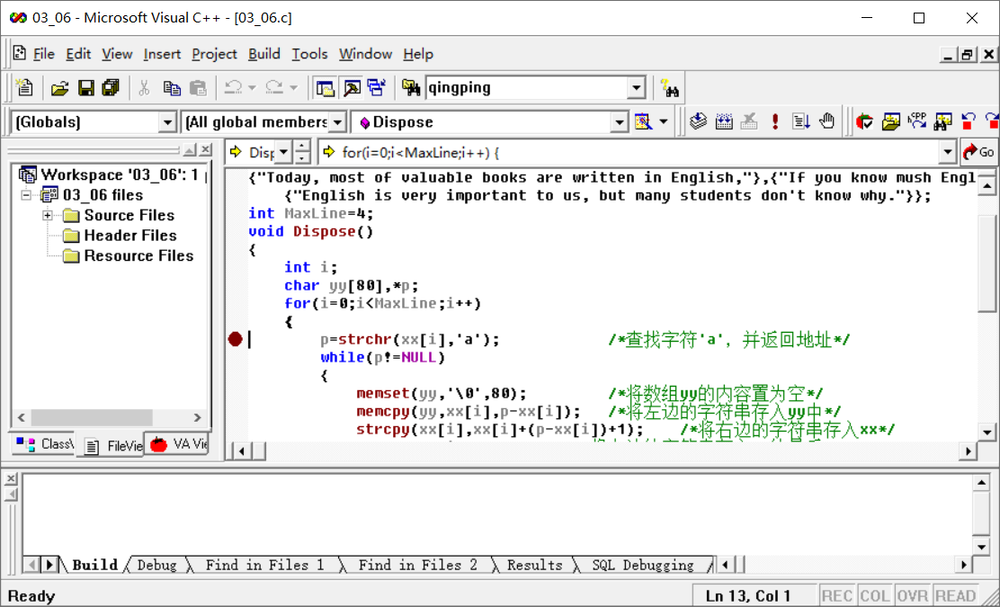
<center class="my_markdown"><b class="my_markdown">图18.4　设置位置断点</b></center>

在调试程序时，程序将运行到该行自动停止，这样就可以观察变量的状态了。

2）条件断点

有时，需要使程序运行到某个条件时停止，然后观察变量的状态。特别是循环次数特别多的情况下，不可能从循环开始每次都观察变量的值，这样的调试效率太低了。为了提高效率，可以使程序直接运行到某个条件后停止，再观察变量的状态。

例如，如果要查看i==6时变量stu的变化情况，需要多次按F10键单步跟踪。为了使程序直接定位到该位置，需要为断点设置条件。具体方法如下。

选择Edit→Breakpoints或按Alt+F9快捷键，弹出Breakpoints对话框，如图18.5所示。

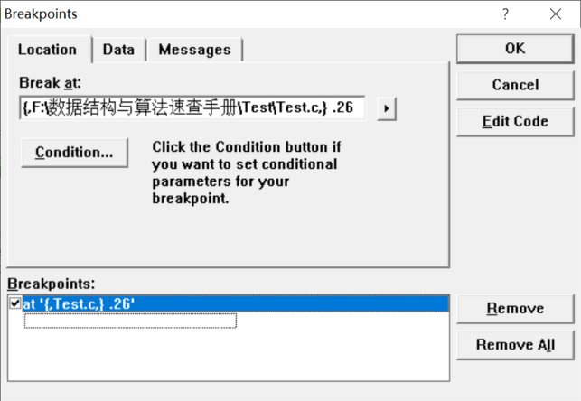
<center class="my_markdown"><b class="my_markdown">图18.5　Breakpoints对话框</b></center>

然后在Location选项卡中单击Condition按钮，弹出Breakpoint Condition对话框，在文本框中输入条件“i==3&&j==6”，如图18.6所示。

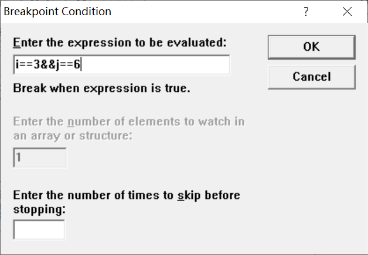
<center class="my_markdown"><b class="my_markdown">图18.6　Breakpoint Condition对话框</b></center>

单击OK按钮，按F5键或单击工具栏上的
的按钮就会弹出图18.7所示的提示对话框。

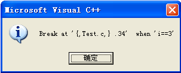
<center class="my_markdown"><b class="my_markdown">图18.7　提示对话框</b></center>

单击“确定”按钮之后，就可以查看数组stu的值了。

3）数据断点

为了监控某些数据是否被修改，可以设置数据断点来观察。当该数据有变化时，编译器就会弹出提示信息。设置数据断点的方法如下。

按Alt+F9快捷键，弹出Breakpoints对话框，选择Data选项卡，在文本框中输入一个全局变量“s”，即当s的值有变化时，将会弹出提示信息，如图18.8所示。

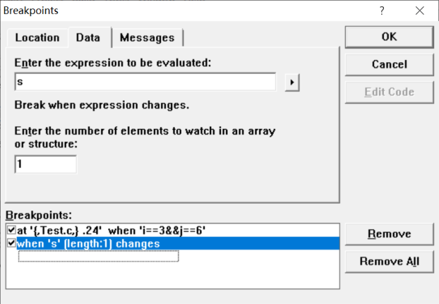
<center class="my_markdown"><b class="my_markdown">图18.8　Breakpoints 对话框</b></center>

单击OK按钮，按F5键调试程序，将弹出图18.9所示的提示对话框。

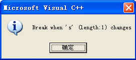
<center class="my_markdown"><b class="my_markdown">图18.9　提示对话框</b></center>

程序将在改变全局变量s的代码处停止。需要注意的是，设置数据断点的变量必须是全局变量。

#### 3．程序调试方法

设置了断点之后，就可以使用调试命令对程序进行调试了。常用的调试方法就是按F10键、F11键和F5键。其中，按F10键和F11键单步跟踪命令，每次只执行一行代码，按F5键开始调试命令。这里主要介绍单步跟踪命令的使用方法。

首先，在需要调试的程序中的开始位置设置一个断点，如图18.10所示。

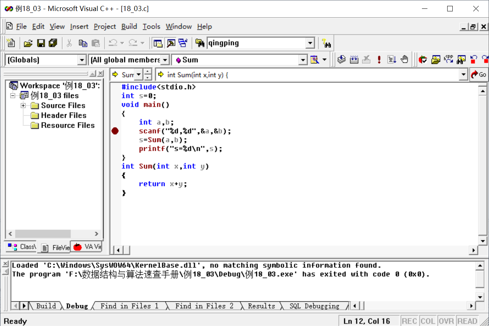
<center class="my_markdown"><b class="my_markdown">图18.10　设置断点</b></center>

按F10键或F5键开始调试程序，程序停留在断点处，通过一个箭头指示该位置，如图18.11所示。


<center class="my_markdown"><b class="my_markdown">图18.11　程序执行到断点处停止</b></center>

然后按F10键单步跟踪该程序，在命令窗口处按照以下形式输入两个值。

```c
12,25按Enter键>
```

此时，程序运行到下一行代码，通过将光标移动到变量a和b的位置，可以查看变量a和b的值，如图18.12所示。

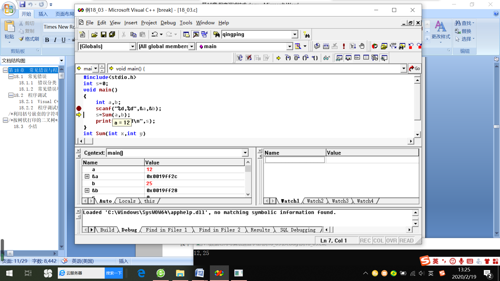
<center class="my_markdown"><b class="my_markdown">图18.12　查看变量a和b的值</b></center>

当前要执行的代码是求和函数Sum。如果按F10键，程序将不会进入Sum函数内部执行，而是直接返回Sum函数的值给s。如果按F10键，程序将进入Sum函数内部，在Sum函数内部逐条语句执行。执行完Sum函数的最后一条语句后，程序返回main函数调用Sum函数处。

按F10键，程序跳转到Sum函数内部，如图18.13所示。

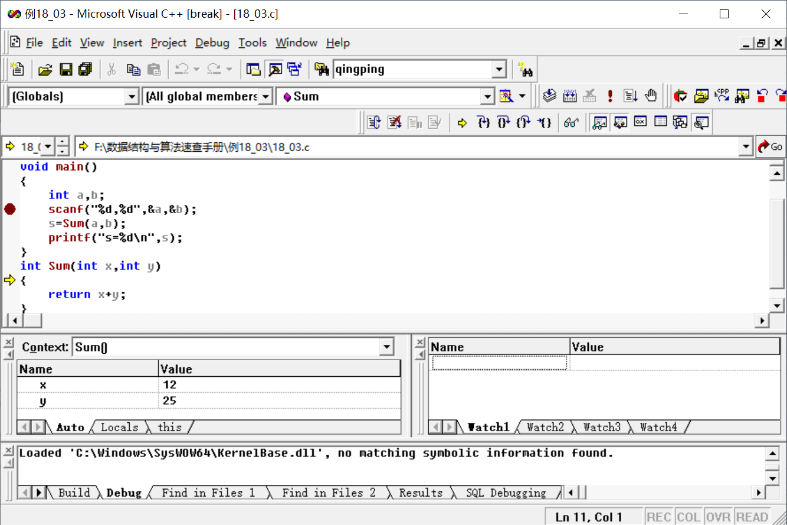
<center class="my_markdown"><b class="my_markdown">图18.13　按F10键，程序跳转到Sum函数内部</b></center>

继续按F10键单步跟踪每一条语句。当遇到Sum函数的最后一条语句时，按F10键程序返回调用函数。然后按F10键或F11键继续执行下一条语句。

**【说明】**

在调试的过程中，执行完一行代码后，可以将光标放置在变量的上面，将出现一个提示标签，显示该变量的值，这样可以观察程序的执行状况。

#### 4．查看工具

要查看程序的运行状态，如变量的值等就需要使用查看工具。Visual C++ 6.0开发工具提供的查看工具包括Watch窗口、Variables窗口、Memory窗口、Call Stack窗口、Registers窗口和Disassembly窗口。

1）Watch窗口

Watch窗口包括4个标签页，每个标签页包含一个电子表格，用来显示变量的信息。Watch窗口如图18.14所示。

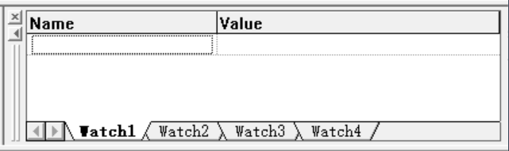
<center class="my_markdown"><b class="my_markdown">图18.14　Watch窗口</b></center>

当程序处于调试阶段时，可通过从菜单栏中选择View→Debug→Watch加载该窗口。调试程序时，可以将要查看的变量输入Name列，按Enter键确定输出，编译器将自动在Value列显示出该变量的值。也可以选中要查看的变量将其拖动到Watch窗口中。

例如，在一段程序中设置一个断点，然后调试该程序。将变量a和b拖曳到Watch窗口中，Watch窗口位于Visual C++ 6.0的右下部，如图18.15所示。

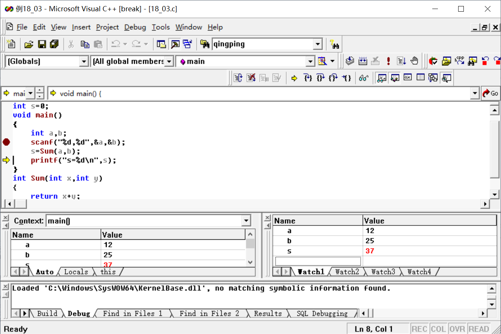
<center class="my_markdown"><b class="my_markdown">图18.15　调试程序时在Watch窗口中查看a和b的值</b></center>

2）Variables窗口

Variables窗口用来显示当前正在执行的函数的变量信息。当执行到某一条语句时，该语句涉及的变量将自动在Variables窗口中突出显示，如图18.16所示。

左下角为Variables窗口。刚刚执行完s=sum(a,b)，当前的变量为s，以红色显示。

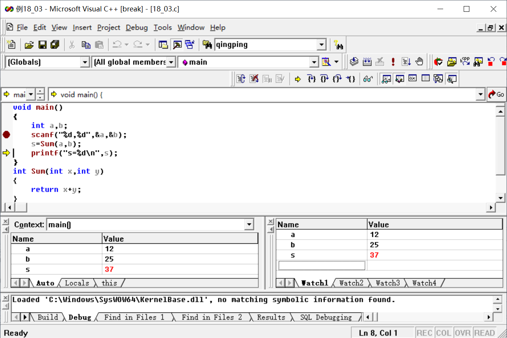
<center class="my_markdown"><b class="my_markdown">图18.16　在Variables窗口中显示的变量</b></center>

3）Memory窗口

Memory窗口用来显示从某个地址开始的内存信息，默认从0x00000000地址开始显示。如果要查看连续多个变量的值，如数组的值，可以使用Memory窗口查看。例如，设置一个断点，开始调试该程序，如图18.17所示。

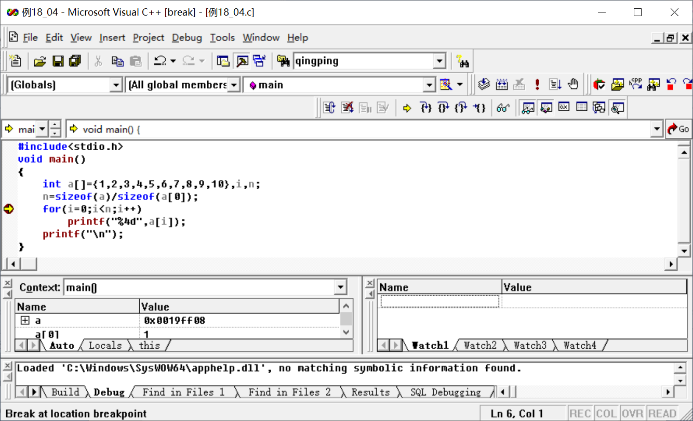
<center class="my_markdown"><b class="my_markdown">图18.17　设置断点</b></center>

按Alt+F6快捷键打开Memory窗口，如图18.18所示。

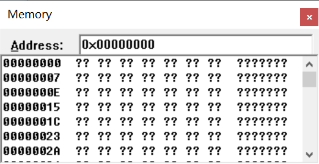
<center class="my_markdown"><b class="my_markdown">图18.18　Memory窗口</b></center>

在文本框中输入数组名“a”，按Enter键自动显示出数组a中的值，如图18.19所示。

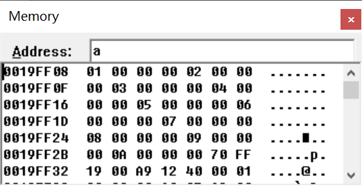
<center class="my_markdown"><b class="my_markdown">图18.19　数组a在Memory窗口中的值</b></center>

如图18.19所示，Memory窗口分为3列，分别表示地址、数组或变量的值、对应的字符。

4）Call Stack窗口

Call Stack窗口用来观察函数的调用情况、每个函数占用的内存情况，如图18.20所示。

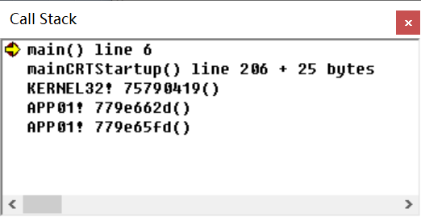
<center class="my_markdown"><b class="my_markdown">图18.20　Call Stack窗口</b></center>

5）Registers窗口

Registers窗口用来显示当前CPU的寄存器的名称、数据和标志位信息，如图18.21所示。

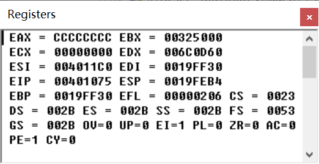
<center class="my_markdown"><b class="my_markdown">图18.21　Registers窗口</b></center>

在Registers窗口中，可以改变任何一个寄存器的值。

6）Disassembly窗口

Disassembly窗口用来显示C语言源代码对应的反汇编命令。Disassembly窗口如图18.22所示。


<center class="my_markdown"><b class="my_markdown">图18.22　Disassembly窗口</b></center>

编辑区显示的是当前行对应的反汇编指令。

