### 18.2.2　程序调试应用举例

下面我们以具体的实例来讲解如何利用Visual C++6.0调试C语言程序，以下实例都是编者在调试C语言过程中遇到的问题。

这个程序用于一个判断二叉树是否为完全二叉树，先运行该程序，查看运行结果。

```c
#include"stdio.h"
#include"stdlib.h"
#include"string.h"
#include<iostream.h>
#define MAXSIZE 100
typedef struct Node
{
        char data;
        struct Node * lchild,*rchild;
}BitNode,*BiTree;
#include"BiTreeQueue.h"
void  CreateBitTree(BiTree *T,char str[]);
void PrintLevel(BiTree T);
int JudgeComplete(BiTree T)
//判断二叉树是否为完全二叉树
{
        int tag=0;                      
        BiTree p=T;
        Queue Q;                         
        if(p==NULL)                     
            return 1;
        InitQueue(&Q);                   
        EnQueue(&Q,p);                   
        while(!QueueEmpty(Q))            
        {
            DeQueue(&Q,&p);              
            if(p->lchild && !tag)        
                EnQueue(&Q,p->lchild);   
            else if(p->lchild)           
                return 0;                
            else                         
                tag=1;                  
            if(p->rchild && !tag)       
                EnQueue(&Q,p->rchild);  
            else if(p->rchild)          
                return 0;               
            else                         
                tag=1;                  
        }
        ClearQueue(&Q);                  
        return 1;                        
}
void  CreateBitTree(BiTree *T,char str[])
/*利用括号嵌套的字符串创建二叉链表*/
{
        char ch;
        BiTree stack[MAXSIZE]; 
        int top=-1;            
        int flag,k;
        BitNode *p;
        *T=NULL,k=0;
        ch=str[k];
        while(ch!='\0')        
        {
            switch(ch)
            {
                case '(':
                    stack[++top]=p;
                    flag=1;
                    break;
                case ')':
                    top--;
                    break;
                case ',':
                    flag=2;
                    break;
                default:
                    p=(BiTree)malloc(sizeof(BitNode));
                    p->data=ch;
                    p->lchild=NULL;
                    p->rchild=NULL;
                    if(*T==NULL)   
                        *T=p;
                    else
                    {
                        switch(flag)
                        {
                        case 1:
                            stack[top]->lchild=p;
                            break;
                        case 2:
                            stack[top]->rchild=p;
                            break;
                        }
                    }
            }
            ch=str[++k];
        }
}
void TreePrint(BiTree T,int level)
/*按树状输出的二叉树*/
{
        int i;
        if(T==NULL)                
            return;
        TreePrint(T->rchild,level+1);  /*输出右子树，并将层次加1*/
        for(i=0;i<level;i++)           /*按照递归的层次输出空格*/
            printf("   ");
        printf("%c\n",T->data);        /*输出根节点*/
        TreePrint(T->lchild,level+1);  /*输出左子树，并将层次加1*/
}
void main()
{
        BiTree T;
        int flag;
        char str[MAXSIZE];
        cout<<"请输入二叉树的广义表形式："<<endl;
        cin>>str;
        cout<<"由广义表形式的字符串构造二叉树："<<endl;
        CreateBitTree(&T,str);
        TreePrint(T,1);
        flag=JudgeComplete(T);
        if(flag)
            cout<<"是完全二叉树!"<<endl;
        else
            cout<<"不是完全二叉树!"<<endl;
        cout<<"请输入二叉树的广义表形式："<<endl;
        cin>>str;
        cout<<"由广义表形式的字符串构造二叉树："<<endl;
        CreateBitTree(&T,str);
        TreePrint(T,1);
        flag=JudgeComplete(T);
        if(flag)
            cout<<"是完全二叉树!"<<endl;
        else
            cout<<"不是完全二叉树!"<<endl;
}
```

运行结果如图18.23所示。

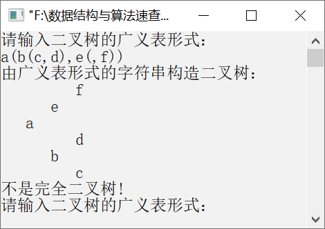
<center class="my_markdown"><b class="my_markdown">图18.23　运行结果</b></center>

这棵二叉树如图18.24所示。

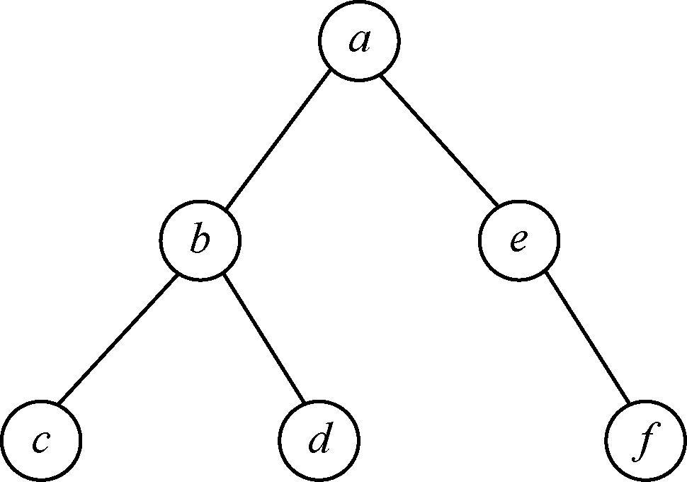
<center class="my_markdown"><b class="my_markdown">图18.24　二叉树</b></center>

显然，这棵二叉树不是完全二叉树。这说明这个程序存在逻辑错误，由于程序本身运行不存在语法错误，初步判断在判断二叉树是否为完全二叉树的函数内有错误。因此，我们在进入JudgeComplete函数时设置一个断点，程序运行到这里会暂停。

只需要将光标定位在需要设置断点的代码行，单击工具栏
上的图标或选择菜单栏中的Edit→Breakpoints，或按F9键，就会在该行的左边出现一个红色的圆点，如图18.25所示。

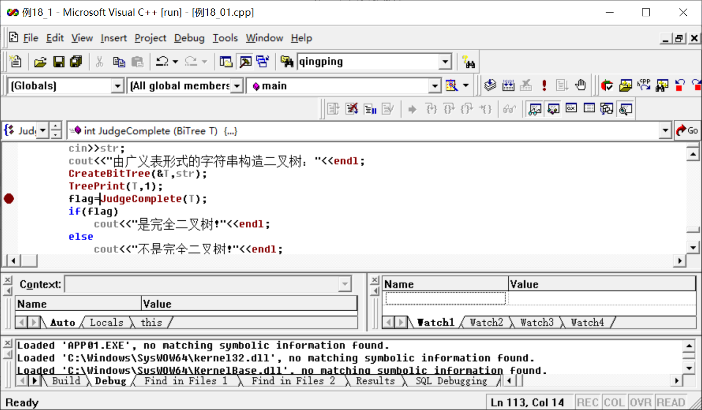
<center class="my_markdown"><b class="my_markdown">图18.25　在语句flag=JudgeComplete(T)处设置断点</b></center>

然后按F5键开始调试程序，弹出图18.26所示的输入窗口。

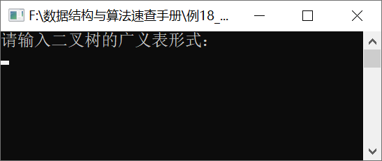
<center class="my_markdown"><b class="my_markdown">图18.26　输入对话框</b></center>

输入二叉树的广义表形式，即a(b(c,d),e(,f))，如图18.27所示。

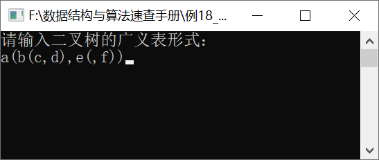
<center class="my_markdown"><b class="my_markdown">图18.27　输入二叉树的广义表形式</b></center>

按Enter键后，进入Visual C++ 6.0的主窗口，程序运行到断点处，如图18.28所示。


<center class="my_markdown"><b class="my_markdown">图18.28　程序运行到断点处</b></center>

这时输出窗口输出了一棵二叉树，如图18.29所示。

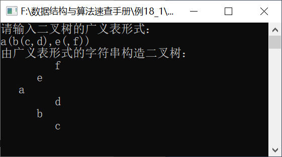
<center class="my_markdown"><b class="my_markdown">图18.29　输出二叉树</b></center>

在Visual C++ 6.0主窗口中按F11键，程序跳转到JudgeComplete函数内部，如图18.30所示。

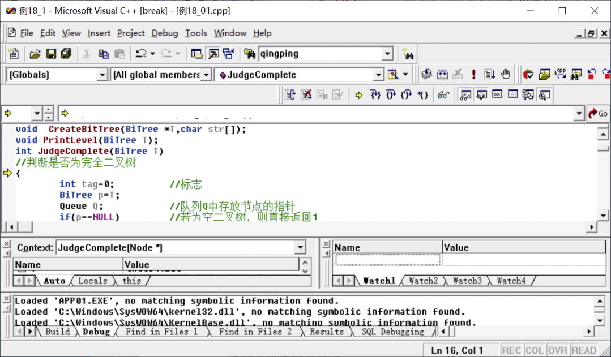
<center class="my_markdown"><b class="my_markdown">图18.30　程序跳转到JudgeComplete函数内部</b></center>

然后不断按F10键，开始单步跟踪程序的执行。每按一次F10键，程序执行一条语句，程序执行到循环判断语句while(!QueueEmpty(Q))，如图18.31所示。

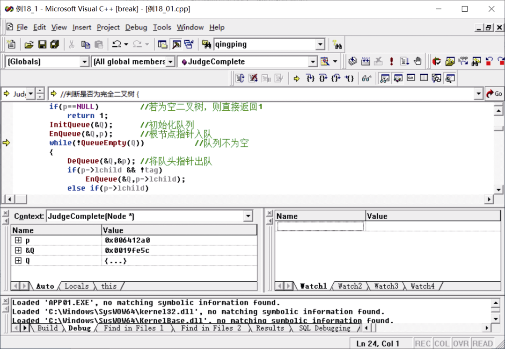
<center class="my_markdown"><b class="my_markdown">图18.31　程序执行到循环判断语句while(!QueueEmpty(Q))</b></center>

当再次按F10键时，程序跳过整个while循环，如图18.32所示。

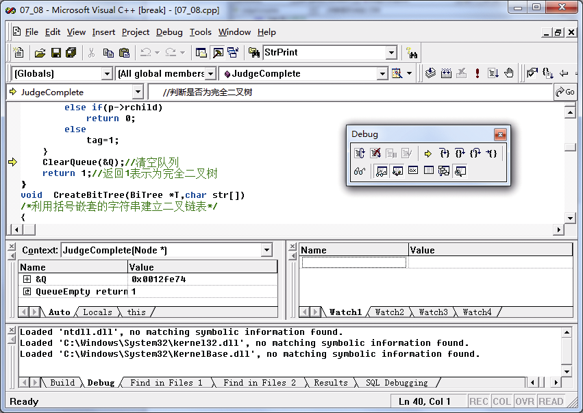
<center class="my_markdown"><b class="my_markdown">图18.32　程序跳过整个while循环</b></center>

这显然是不对的，在while循环语句前有3条关于队列运算的操作，先初始化队列，然后将根节点指针入队，判断队列是否为空，代码如下。

```c
InitQueue(&Q);           //初始化队列
EnQueue(&Q,p);           //根节点指针入队
while(!QueueEmpty(Q))    //队列不为空
```

这表明在循环语句前面就出现了问题，这需要我们进入这两条语句里查看。这时我们需要中断当前的调试，重新执行前面的操作，单步跟踪到以下语句。

```c
InitQueue(&Q);
```

如图18.33所示，按F11键就会进入InitQueue(&Q)函数。

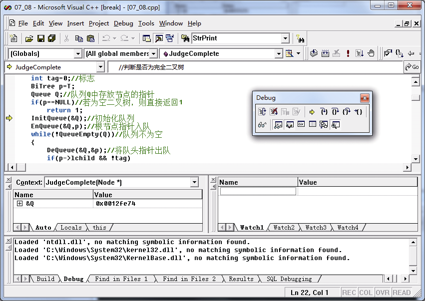
<center class="my_markdown"><b class="my_markdown">图18.33　单步跟踪调试</b></center>

如图18.34所示，在InitQueue函数内部，按F10键单步跟踪每条语句，直到该函数中最后一条语句执行完毕。可以选择变量LQ，将其拖曳到右下角的Watch1窗口中的Name列里，这时就可以观察LQ变量的值（见图18.35）。

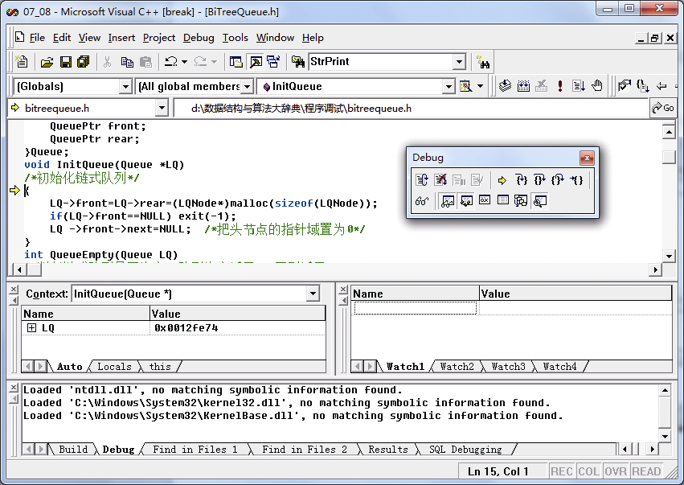
<center class="my_markdown"><b class="my_markdown">图18.34　进入InitQueue函数内部</b></center>

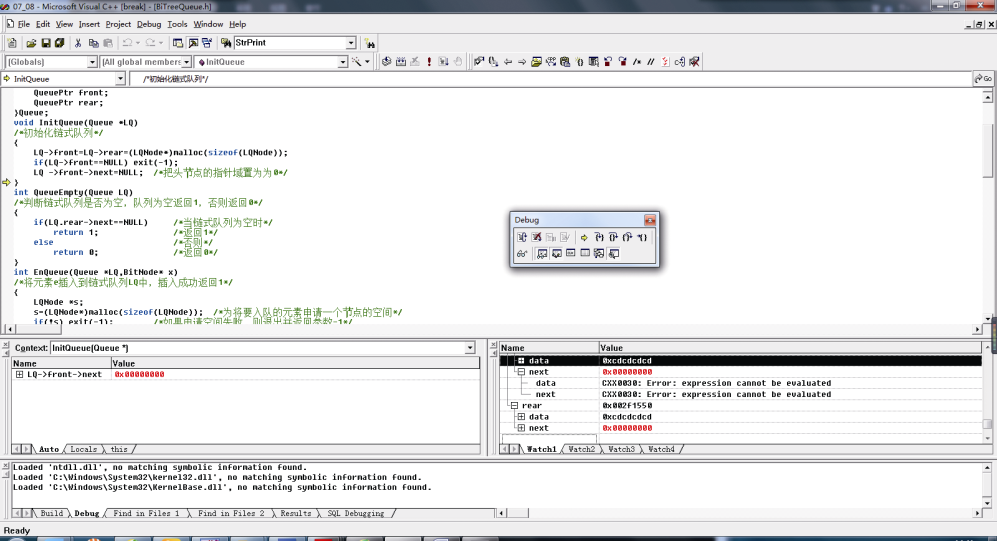
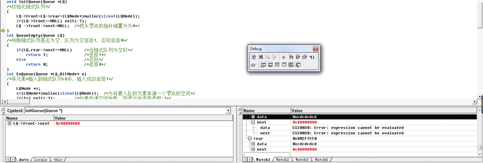
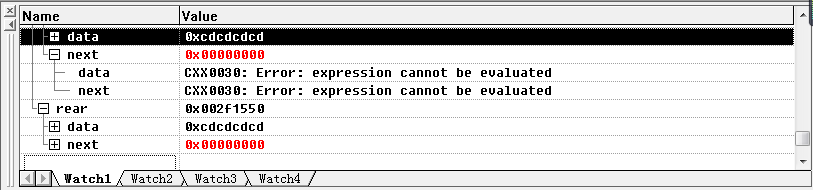
<center class="my_markdown"><b class="my_markdown">图18.35　观察LQ变量的值</b></center>

通过观察发现LQ−>front−>next和LQ−>rear−>next的值均为0，这说明InitQueue函数没有错误。按F10键退出该函数，程序重新返回JudgeComplete函数，如图18.36所示。

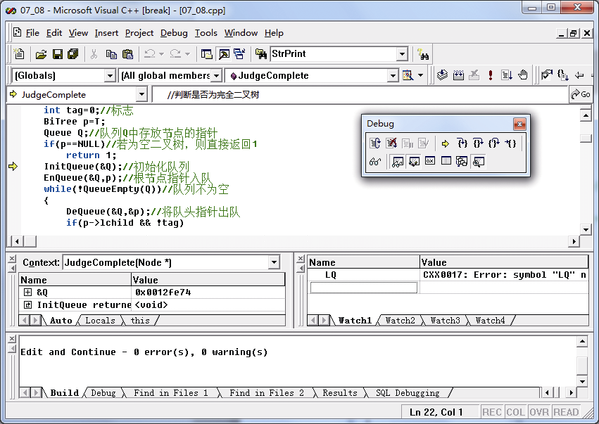
<center class="my_markdown"><b class="my_markdown">图18.36　程序重新返回JudgeComplete函数</b></center>

继续按F10键，程序进入EnQueue函数，如图18.37所示。为了进入EnQueue函数内部，按F11键，如图18.38所示。

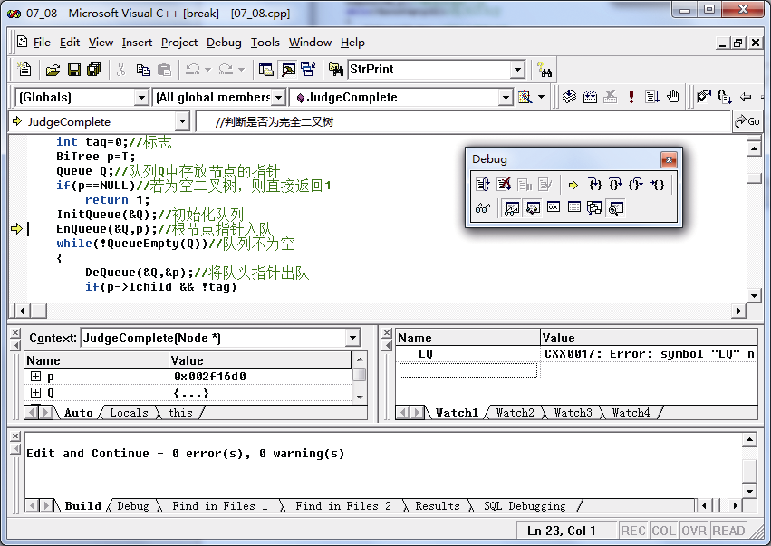
<center class="my_markdown"><b class="my_markdown">图18.37　程序进入EnQueue函数</b></center>

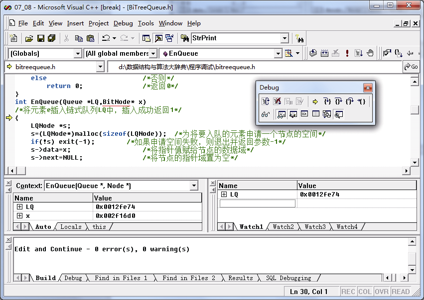
<center class="my_markdown"><b class="my_markdown">图18.38　程序进入EnQueue函数内部</b></center>

在EnQueue函数内部，一直按F10键进行单步跟踪，直到跳出EnQueue函数都没有发现异常，程序又回到JudgeComplete函数，如图18.39所示。

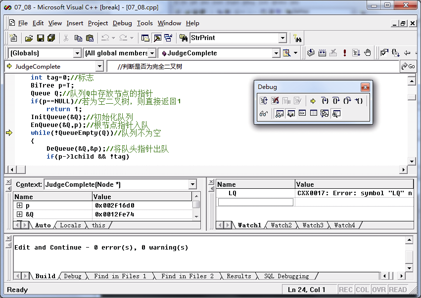
<center class="my_markdown"><b class="my_markdown">图18.39　程序又回到JudgeComplete函数</b></center>

接着按F11键，进入QueueEmpty函数内部，如图18.40所示。

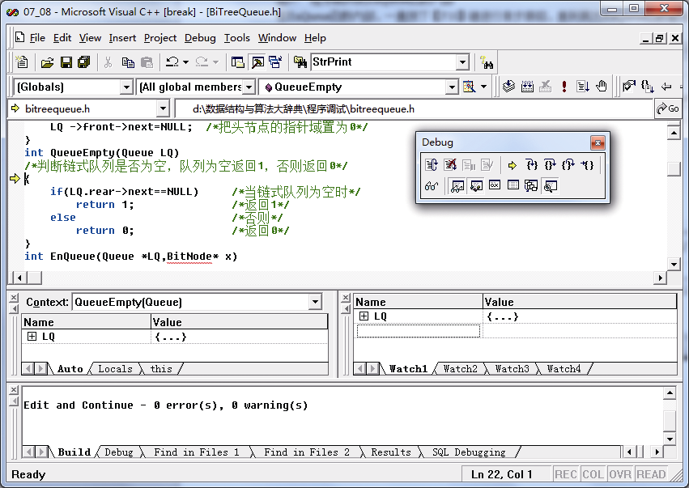
<center class="my_markdown"><b class="my_markdown">图18.40　进入QueueEmpty函数内部</b></center>

按F10键进行单步跟踪，发现程序进入if(LQ.rear−>next==NULL)内部，如图18.41所示。

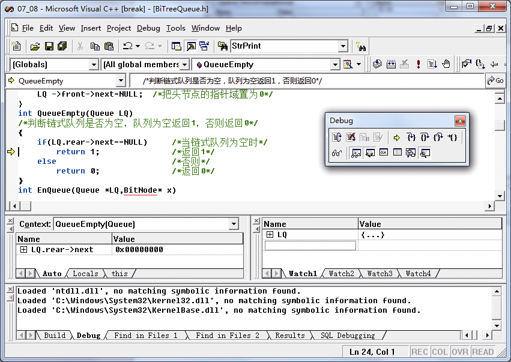
<center class="my_markdown"><b class="my_markdown">图18.41　程序进入if（LQ.rear->next==NULL）内部</b></center>

观察LQ的值，发现LQ.rear−>next的值为空，如图18.42所示。

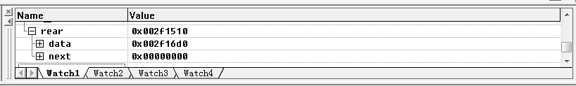
<center class="my_markdown"><b class="my_markdown">图18.42　观察LQ.rear−>next的值</b></center>

这样就会返回1给while语句，如图18.43所示。

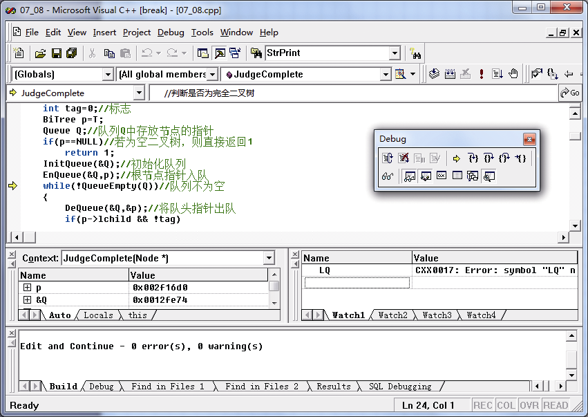
<center class="my_markdown"><b class="my_markdown">图18.43　返回1 给while语句</b></center>

这就是为什么程序并没有执行while循环语句中的内容，输出了错误的结果。通过以上调试，我们发现是QueueEmpty函数的判断语句出现了错误，队列其实并不为空，但是判断为空，导致产生错误的结果。

在下面的判断链队列是否为空的函数中。

```c
int QueueEmpty(Queue LQ)
/*判断链式队列是否为空，队列为空返回1，否则返回0*/
{
    if(LQ.rear->next==NULL)      /*当链式队列为空时*/
       return 1;                 /*返回1*/
    else                         /*否则*/
       return 0;                 /*返回0*/
}
```

根据判断条件LQ.rear−>next==NULL，因为rear永远指向最后一个节点，所以rear−>next一直是NULL，于是需要修改这个判断条件为LQ.front−>next==NULL，修改后的QueueEmpty函数如下。

```c
int QueueEmpty(Queue LQ)
/*判断链式队列是否为空，队列为空返回1，否则返回0*/
{
    if(LQ.front->next==NULL)     /*当链式队列为空时*/
       return 1;                 /*返回1*/
    else                         /*否则*/
       return 0;                 /*返回0*/
}
```

然后重新运行程序，程序就没有问题了，运行结果如图18.44所示。

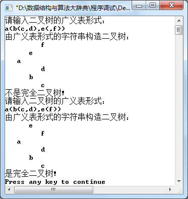
<center class="my_markdown"><b class="my_markdown">图18.44　运行结果</b></center>

