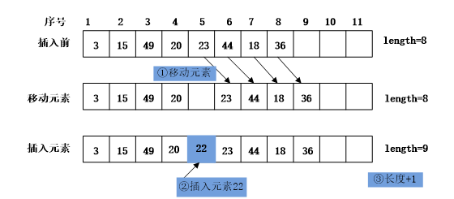
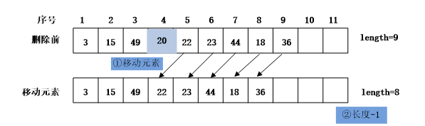

### 1.1　顺序表及其应用

**【定义】**

线性表是由n个类型相同的数据元素组成的有限序列，记为 (a<sub class="my_markdown">1</sub>, a<sub>2</sub>,…, a<sub class="my_markdown">i</sub><sub>−1</sub>, a<sub class="my_markdown">i</sub>, a<sub class="my_markdown">i</sub><sub>+1</sub>,…, a<sub class="my_markdown">n</sub>)。线性表的数据元素之间存在着序偶关系，即数据元素之间具有一定的次序。在线性表中，数据元素a<sub class="my_markdown">i</sub><sub>−1</sub>位于a<sub class="my_markdown">i</sub>的前面，a<sub class="my_markdown">i</sub>又在a<sub class="my_markdown">i</sub><sub>+1</sub>的前面，我们把a<sub class="my_markdown">i</sub><sub>−1</sub>称为a<sub class="my_markdown">i</sub>的直接前驱元素，a<sub class="my_markdown">i</sub>称为a<sub class="my_markdown">i</sub><sub>+1</sub>的直接前驱元素。a<sub class="my_markdown">i</sub>称为a<sub class="my_markdown">i</sub><sub>−1</sub>的直接后继元素，a<sub class="my_markdown">i</sub><sub>+1</sub>称为a<sub class="my_markdown">i</sub>的直接后继元素。

线性表 (a<sub class="my_markdown">1</sub>, a<sub>2</sub>,a<sub>3</sub>, a<sub>4</sub>, a<sub>5</sub>, a<sub>6</sub>)的逻辑结构如图1.1所示。


<center class="my_markdown"><b class="my_markdown">图1.1　线性表的逻辑结构</b></center>

线性表按照存储方式可以分为顺序存储和链式存储。线性表的顺序存储指的是将线性表中的各个元素依次存放在一组地址连续的存储单元中。

线性表中第i个元素的存储位置与第一个元素a<sub class="my_markdown">1</sub>的存储位置满足以下关系。

LOC(a<sub class="my_markdown">i</sub>)=LOC(a<sub>1</sub>)+(i−1)m

其中，m表示一个元素占用的存储单元数量，第一个元素的位置LOC(a<sub class="my_markdown">1</sub>)称为起始地址或基地址。

线性表的这种表示称为线性表的顺序存储结构或顺序映像。通常，将以这种方式存储的线性表称为顺序表。

**【特点】**

顺序表具有以下特征：逻辑上相邻的元素，在物理上也是相邻的。只要确定了第一个元素的起始位置，线性表中的任意元素都可以随机存取。因此，线性表的顺序存储结构是一种随机存取的存储结构。

**【存储结构】**

```c
#define ListSize 100
typedef struct
{
    DataType list[ListSize];
    int length;
}SeqList;
```

其中，DataType表示数据元素类型，list用于存储线性表中的数据元素，length表示线性表中数据元素的个数，SeqList是结构类型名。

如果要定义一个顺序表，代码如下。

```c
SeqList L;
```

如果要定义一个指向顺序表的指针，代码如下。

```c
SeqList *L;
```

**【基本运算】**

（1）初始化线性表。

```c
void InitList(SeqList *L)
/*初始化线性表*/
{
    L->length=0;    /*把线性表的长度设置为0*/
}
```

（2）判断线性表是否为空。

```c
int ListEmpty(SeqList L)
/*判断线性表是否为空*/
{
    if(L.length==0)
        return 1;  
    else           
        return 0;  
}
```

（3）按序号查找。

```c
int GetElem(SeqList L,int i,DataType *e)
/*查找线性表中第i个元素*/
{
    if(i<1||i>L.length)/*在查找第i个元素之前，判断该序号是否合法*/
    return -1;
    *e=L.list[i-1];    /*将第i个元素的值赋值给e*/
    return 1;
}
```

（4）按内容查找。

```c
int LocateElem(SeqList L,DataType e)
/*查找线性表中元素值为e的元素*/
{
    int i;
    for(i=0;i<L.length;i++)    
        if(L.list[i]==e)       
           return i+1;         
    return 0;                  
}
```

（5）插入操作。要在顺序表中的第i个位置插入元素e，首先将第i个位置以后的元素依次向后移动1个位置，然后把元素e插入第i个位置。

例如，要在顺序表(3,15,49,20,23,44,18,36)的第5个元素之前插入一个元素22，需要先将序号为8、7、6、5的元素依次向后移动一个位置，然后在第5个位置插入元素22，顺序表就变成了(3,15,49,20,22,23,44,18,36），如图1.2所示。


<center class="my_markdown"><b class="my_markdown">图1.2　在顺序表中插入元素22的过程</b></center>

```c
int InsertList(SeqList *L,int i,DataType e)
/*在顺序表的第i个位置插入元素e*/
{
    int j;
    if(i<1||i>L->length+1)/*在插入元素前，判断插入位置是否合法*/
    {
        printf("插入位置i不合法！\n");
        return -1;
    }
    else if(L->length>=ListSize)    /*在插入元素前，判断顺序表是否已满*/
    {
        printf("顺序表已满，不能插入元素。\n");
        return 0;
    }
    else
    {
        for(j=L->length;j>=i;j--)    /*将第i个位置以后的元素依次后移*/
            L->list[j]=L->list[j-1];
        L->list[i-1]=e;            /*把元素插入第i个位置*/
        L->length=L->length+1;    /*将顺序表的表长增1*/
        return 1;
     }
}
```

插入元素的位置i的合法范围应该是1
i
L−>length+1。当i=1时，插入位置在第一个元素之前；当i=L−>length+1时，插入位置在最后一个元素之后。当插入位置是i=L−>length+1时，不需要移动元素；当插入位置是i=0时，则需移动所有元素。

（6）删除第i个元素。在进行删除操作时，先判断顺序表是否为空。若非空，接着判断序号是否合法。若非空且合法，则将要删除的元素赋给e，并把该元素删除，将表长减1。

例如，要删除顺序表(3,15,49,20,22,23,44,18,36)的第4个元素，则需要将序号为5、6、7、8、9的元素依次向前移动一个位置，这样就删除了第4个元素，最后将表长减1，如图1.3所示。


<center class="my_markdown"><b class="my_markdown">图1.3　在顺序表中删除元素20的过程</b></center>

```c
int DeleteList(SeqList *L,int i,DataType *e)
{
    int j;
    if(L->length<=0)
    {
        printf("顺序表已空，不能进行删除!\n");
        return 0;
    }
    else if(i<1||i>L->length)
    {
        printf("删除位置不合适!\n");
        return -1;
    }
    else
    {
        *e=L->list[i-1];
        for(j=i;j<=L->length-1;j++)
           L->list[j-1]=L->list[j];
        L->length=L->length-1;
        return 1;
    }
}
```

被删除元素的位置i的合法范围应该是1
i
L−>length。当i=1时，表示要删除第一个元素，对应C语言数组中的第0个元素；当i=L−>length时，要删除的是最后一个元素。

（7）求线性表的长度。

```c
int ListLength(SeqList L)
{
    return L.length;
}
```

（8）清空顺序表。

```c
void ClearList(SeqList *L)
{
    L->length=0;
}
```


如何使用顺序表的基本运算？


将以上顺序表存储结构的定义及基本运算保存在SeqList.h文件中，在使用时可通过#include"SeqList.h"使用这些基本运算。


