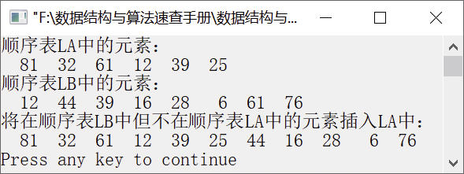

### 1.1.2　将两个无序的线性表合并为一个线性表


**问题描述**


假设线性表LA和LB分别表示两个集合A和B，利用线性表的基本运算，实现新的集合，即扩大线性表LA，将存在于线性表LB中且不存在于LA中的元素插入LA中。


**【分析】**

为了依次从线性表LB中取出每个元素，并将该元素依次与线性表LA中的元素进行比较，可调用LocateElem(SeqList L,DataType e)。若LA中不存在该元素，则将该元素插入LA中。


第1章\实例1-02.c

```c
/********************************************
*实例说明：将两个无序的线性表元素合并（相同元素只保留一个）
*********************************************/
#include<stdio.h>                          
#define ListSize 200
typedef int DataType;                      
#include"SeqList.h"    
void UnionAB(SeqList *A,SeqList B);        
void main()
{
    int i,flag;
    DataType e;
    DataType a[]={81,32,61,12,39,25};
    DataType b[]={12,44,39,16,28,6,61,76};
    SeqList LA,LB;                         
    InitList(&LA);                        
    InitList(&LB);                        
    for(i=0;i<sizeof(a)/sizeof(a[0]);i++)    /*将数组a中的元素插入LA中*/
    {
        if(InsertList(&LA,i+1,a[i])==0)
        {
            printf("位置不合法");
            return;
        }
    }
    for(i=0;i<sizeof(b)/sizeof(b[0]);i++)    /*将数组a中的元素插入表LB中*/
    {
        if(InsertList(&LB,i+1,b[i])==0)
        {
            printf("位置不合法");
            return;
        }
    }
    printf("顺序表LA中的元素：\n");
    for(i=1;i<=LA.length;i++)      /*输出顺序表LA中的每个元素*/
    {
        flag=GetElem(LA,i,&e);     /*返回顺序表LA中的每个元素并放入e中*/
        if(flag==1)
            printf("%4d",e);
    }
    printf("\n");
    printf("顺序表LB中的元素：\n");
    for(i=1;i<=LB.length;i++)      /*输出顺序表LB中的每个元素*/
    {
        flag=GetElem(LB,i,&e);     /*返回顺序表LB中的每个元素并放入e中*/
        if(flag==1)
            printf("%4d",e);
    }
    printf("\n");
    printf("将在顺序表LB中但不在顺序表LA中的元素插入LA中：\n");
    UnionAB(&LA,LB);               /*将在顺序表LB中但不在顺序表LA中的元素插入顺序表LA中*/
    for(i=1;i<=LA.length;i++)      /*输出顺序表LA中的所有元素*/
    {
        flag=GetElem(LA,i,&e);
        if(flag==1)
            printf("%4d",e);    
    }
    printf("\n");
}
void UnionAB(SeqList *LA,SeqList LB)
/*删除LA中出现LB的元素的函数实现*/
{
    int i,flag,pos;
    DataType e;
    for(i=1;i<=LB.length;i++)        
    {
        flag=GetElem(LB,i,&e);              
        if(flag==1)
        {
            pos=LocateElem(*LA,e);   /*在顺序表LA中查找和顺序表LB中取出的元素e相等的元素*/
            if(!pos)
                InsertList(LA,LA->length+1,e);/*若找到该元素，将其插入顺序表LA中*/
        }
    }
}
```

运行结果如图1.5所示。


<center class="my_markdown"><b class="my_markdown">图1.5　运行结果</b></center>

