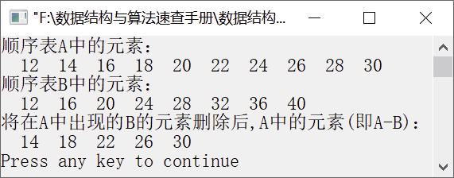

### 1.1.3　求两个线性表的差集


**问题描述**


利用线性表的基本运算实现，如果在线性表A中出现的元素，在线性表B中也出现，则将A中该元素删除。


**【分析】**

其实这是求两个线性表的差集，即A−B。依次检查线性表B中的每一个元素，如果在线性表A中也出现，则在A中删除该元素。


第1章\实例1-03.c

```c
/********************************************
*实例说明：求两个线性表的差集
*********************************************/
#include<stdio.h>                
#define ListSize 200
typedef int DataType;
#include"SeqList.h"                   
void DelElem(SeqList *A,SeqList B);   
void main()
{
    int i,j,flag;
    DataType e;
    SeqList A,B;                     
    InitList(&A);                    
    InitList(&B);                    
    for(i=1;i<=10;i++)               
    {
        if(InsertList(&A,i,i*2+10)==0)
        {
            printf("位置不合法");
            return;
        }
    }
    for(i=1,j=10;i<=8;j=j+2,i++)       /*插入顺序表B中8个元素*/
    {
        if(InsertList(&B,i,j+i*2)==0)
        {
            printf("位置不合法");
            return;
        }
    }
    printf("顺序表A中的元素：\n");      /*输出顺序表A中的每个元素*/
    for(i=1;i<=A.length;i++)         
    {
        flag=GetElem(A,i,&e);         /*返回顺序表A中的每个元素并放入e中*/
        if(flag==1)
            printf("%4d",e);
    }
    printf("\n");
    printf("顺序表B中的元素：\n");      /*输出顺序表B中的每个元素*/
    for(i=1;i<=B.length;i++)     
    {
        flag=GetElem(B,i,&e);         /*返回顺序表B中的每个元素并放入e中*/
        if(flag==1)
            printf("%4d",e);    
    }
    printf("\n");
    printf("将在A中出现的B的元素删除后,A中的元素(即A-B)：\n");
    DelElem(&A,B);                       /*将在顺序表A中出现的顺序表B的元素删除*/
    for(i=1;i<=A.length;i++)             /*显示删除后顺序表A中所有元素*/
    {
        flag=GetElem(A,i,&e);
        if(flag==1)
            printf("%4d",e);    
    }
    printf("\n");
}
void DelElem(SeqList *A,SeqList B)
/*求A-B，即删除顺序表A中出现的B的元素*/
{
    int i,flag,pos;
    DataType e;
    for(i=1;i<=B.length;i++)        
    {
        flag=GetElem(B,i,&e);            
        if(flag==1)
        {
            pos=LocateElem(*A,e);        /*在顺序表A中查找元素e*/
            if(pos>0)                    /*如果该元素存在*/
                DeleteList(A,pos,&e);    /*则将其从顺序表A中删除*/
        }
    }
}
```

运行结果如图1.6所示。


<center class="my_markdown"><b class="my_markdown">图1.6　运行结果</b></center>

