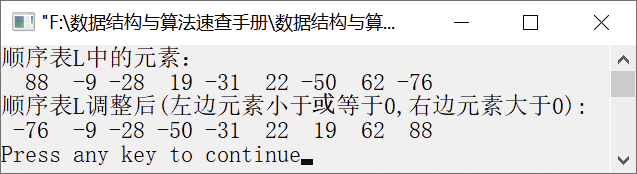

### 1.1.4　分解顺序表，使左边的元素小于或等于0，右边的大于0


**问题描述**


实现一个算法，把一个顺序表分解成两个部分，使顺序表中小于或等于0的元素位于左边，大于0的元素位于右边。要求不占用额外的存储空间。例如，顺序表(−12,3,−6,−10,20,−7,9,−20)经过分解调整后变为(−12,−20,−6,−10,−7,20,9,3)。


**【算法思想】**

设置两个指示器i和j，分别扫描顺序表中的元素，i和j分别从顺序表的左边和右边开始扫描。如果i遇到小于或等于0的元素，略过不处理，继续向前扫描；如果遇到大于0的元素，暂停扫描。如果j遇到大于0的元素，略过不处理，继续向前扫描；如果遇到小于或等于0的元素，暂停扫描。如果i和j都停下来，则交换i和j指向的元素。重复执行直到i≥j为止。


第1章\实例1-04.c

```c
/********************************************
*实例说明：分解顺序表，使左边的元素小于或等于0，右边的大于0
*********************************************/
#include<stdio.h>    
#define ListSize 200
typedef int DataType;            
#include"SeqList.h"                    
void SplitSeqList(SeqList *L);        
void main()
{
    int i,flag,n;
    DataType e;
    SeqList L;                
    int a[]={88,-9,-28,19,-31,22,-50,62,-76};
    InitList(&L);                 /*初始化顺序表L*/
    n=sizeof(a)/sizeof(a[0]);
    for(i=1;i<=n;i++)             /*将数组a的元素插入顺序表L中*/
    {
        if(InsertList(&L,i,a[i-1])==0)
        {
            printf("位置不合法");
            return;
        }
    }
    printf("顺序表L中的元素：\n");  /*输出顺序表L中的每个元素*/
    for(i=1;i<=L.length;i++)    
    {
        flag=GetElem(L,i,&e);     /*返回顺序表L中的每个元素并放入e中*/
        if(flag==1)
            printf("%4d",e);
    }
    printf("\n");
    printf("顺序表L调整后(左边元素小于或等于0,右边元素大于0):\n");
    SplitSeqList(&L);             /*调整顺序表*/
    for(i=1;i<=L.length;i++)      /*输出调整后顺序表L中的所有元素*/
    {
        flag=GetElem(L,i,&e);
        if(flag==1)
            printf("%4d",e);    
    }
    printf("\n");    
}
void SplitSeqList(SeqList *L)
/*将顺序表L分成两个部分*/
{
    int i,j;                      /*定义两个指示器i和j*/
    DataType e;
    i=0,j=(*L).length-1;          /*指示器i与j分别指示顺序表的左边和右边元素*/
    while(i<j)        
    {
        while(L->list[i]<=0)     
            i++;                 
        while(L->list[j]>0)      
            j--;                 
        if(i<j)                  
        {
            e=L->list[i];
            L->list[i]=L->list[j];
            L->list[j]=e;
        }    
    }
}
```

运行结果如图1.7所示。


<center class="my_markdown"><b class="my_markdown">图1.7　运行结果</b></center>

