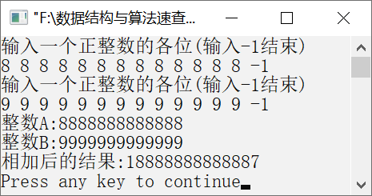

### 1.1.5　求两个任意长度的整数之和


**问题描述**


试设计一种表示任意长度的整数的数据结构，并设计计算任意给定的两个整数之和的算法。


**【分析】**

C语言提供的整数范围为−2<sup class="my_markdown">31</sup>～2<sup class="my_markdown">31</sup>−1，超出这个范围的整数该如何存储呢？可以利用数组来存储，数组中的每一个元素存放一个数字，数组A和B分别存储两个整数，在将两个整数相加时，从数组低位到高位依次将对应位相加，如果和大于9，则将高位加上进位1，并将和减去10后存储到当前位。


第1章\实例1-05.c

```c
/********************************************
*实例说明：求两个任意长度的整数之和
*********************************************/
#include<stdio.h>
#define MaxLen 100
typedef int sqlist[MaxLen];
int input(sqlist A)
{
    int i;
    for(i=0;i<MaxLen;i++)
        A[i]=0;
    printf("输入一个正整数的各位(输入-1结束)\n");
    i=0;
    while(1)
    {
        scanf("%d",&A[i]);
        if(A[i]<0)
            break;
        i++;
    }
    return i;
}
void output(sqlist A,int low,int high)
{
    int i;
    for(i=low;i<high;i++)
        printf("%d",A[i]);
    printf("\n");
}
void move(sqlist A,int na)
{
    int i;
    for(i=0;i<na;i++)
        A[MaxLen-i-1]=A[na-i-1];
}
int add(sqlist *A,int na,sqlist B,int nb)
{
    int nc,i,j,length=0;
    if(na>nb)
        nc=na;
    else
        nc=nb;
    move(*A,na);
    move(B,nb);
    for(i=MaxLen-1;i>=MaxLen-nc;i--)
    {
        j=(*A)[i]+B[i];
        if(j>9)/*和大于9*/
        {
            (*A)[i-1]=(*A)[i-1]+1;      /*高位加上1*/
            (*A)[i]=j-10;               /*和减去10后存储到当前位*/
        }
        else
            (*A)[i]=j;
        if(i==MaxLen-nc)                /*处理最高位*/
        {
            if(j>9)
            {
                (*A)[i-1]=1;
                length=nc+1;
            }
            else
                length=nc;
        }
    }
    return length;
}
void main()
{
    sqlist A,B;
    int na,nb,nc;
    na=input(A);
    nb=input(B);
    printf("整数A:");
    output(A,0,na);
    printf("整数B:");
    output(B,0,nb);
    nc=add(&A,na,B,nb);
    printf("相加后的结果:");
    output(A,MaxLen-nc,MaxLen);
}
```

运行结果如图1.8所示。


<center class="my_markdown"><b class="my_markdown">图1.8　运行结果</b></center>

