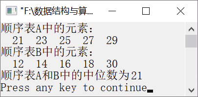

### 1.1.6　求两个元素序列的中位数


**问题描述**


设有一个长度为L（L
1）的升序序列S，位于序列中位置为的元素称为S的中位数。例如，如果有序列S1={21, 23, 25, 27, 29}，则25为S1的中位数。对于两个元素序列，其中位数为两个元素序列中元素合并在一起后的中位数，如果S2={12, 14, 16, 18, 30}，则S1和S2的中位数是21。要求设计一个时间和空间尽可能高效的算法，求两个升序序列A和B的中位数。


**【分析】**

这是某年全国考研计算机统考试题。为了设计一个尽可能高效的算法得到两个升序序列中的中位数，可通过不断缩小两个元素序列的长度，这样就可以减少运算次数。分别求两个升序序列A和B的中位数，记作mida和midb，求A和B的中位数的算法过程如下。

（1）若mida==midb，则mida或midb即为中位数。

（2）若mida<midb，则舍弃A中较小的一半，同时舍弃B中较大的一半，舍弃的元素个数必须相等。

（3）若mida>midb，则舍弃A中较大的一半和B中较小的一半，舍弃的元素个数必须相等。

令A和B中剩下的元素序列重复执行以上过程，直到两个序列均只剩下一个元素为止，其中较小者即为中位数。

第1章\实例1-06


```c
/********************************************
*实例说明：求两个元素序列的中位数
*********************************************/
#include<stdio.h>    
#define ListSize 200
typedef int DataType;            
#include"SeqList.h"                    
int MidSeqList(SeqList A, SeqList B);    
void DispList(SeqList L);    
void main()
{
    int i,n;
    DataType mid;
    SeqList A,B;                
    int a[]={21, 23, 25, 27, 29};
    int b[]={12, 14, 16, 18, 30};
    InitList(&A);    /*初始化顺序表A*/
    InitList(&B);    /*初始化顺序表B*/
    n=sizeof(a)/sizeof(a[0]);
    for(i=1;i<=n;i++)                /*将数组a的元素插入顺序表A中*/
        if(InsertList(&A,i,a[i-1])==0)
        {
            printf("位置不合法");
            return;
        }
    }
    n=sizeof(b)/sizeof(b[0]);
    for(i=1;i<=n;i++)                /*将数组b的元素插入顺序表B中*/
    {
        if(InsertList(&B,i,b[i-1])==0)
        {
            printf("位置不合法");
            return;
        }
    }
    printf("顺序表A中的元素：\n");
    DispList(A);
    printf("\n");
    printf("顺序表B中的元素：\n");
    DispList(B);
    printf("\n");
    mid=MidSeqList(A,B);                    /*求A和B的中位数*/
    printf("顺序表A和B中的中位数为%d\n",mid);
}
DataType MidSeqList(SeqList A, SeqList B)
/*求A和B中的中位数*/
{
    int first1,first2,last1,last2,mid1,mid2;    /*定义指示器*/
    first1=first2=1;   /*first1和first2分别指示顺序表A和B的最左端元素*/
    last1=last2=A.length;/*last1和last2分别指示顺序表A和B的最右端元素*/        
    while(first1!=last1 || first2!=last2)        
    {
        mid1=(first1+last1)/2;/*mid1指示顺序表A的中位数*/    
        mid2=(first2+last2)/2;/*mid2指示顺序表B的中位数*/    
        if(A.list[mid1-1]==B.list[mid2-1])/*若两个序列的中位数相等*/    
            return A.list[mid1];
        else if(A.list[mid1-1]<B.list[mid2-1])/*若A的中位数小于B的中位数*/    
        {/*则取A的右端元素和B的左端元素组成新的序列*/
            if((first1+last1)%2==0)/*若元素个数为奇数*/
            {
                first1=mid1;
                last2=mid2;
            }
            else
            {
                first1=mid1+1;
                last2=mid2;
            }
        }
        else                    /*若A的中位数大于B的中位数*/
        {/*则取B的右端元素和A的左端元素组成新的序列*/
            if((first2+last2)%2==0)
            {
                last1=mid1;
                first2=mid2;
            }
            else
            {
                last1=mid1;
                first2=mid2+1;
            }
        }    
    }
    return A.list[first1-1] < B.list[first2-1] ? A.list[first1-1] : B.list[first2-1];
}
void DispList(SeqList L)
/*输出顺序表L中的每个元素*/
{
    int i,flag;
    DataType e;
    for(i=1;i<=L.length;i++)        
    {
        flag=GetElem(L,i,&e);        
        if(flag==1)
            printf("%4d",e);
    }
}
```

运行结果如图1.9所示。


<center class="my_markdown"><b class="my_markdown">图1.9　运行结果</b></center>

