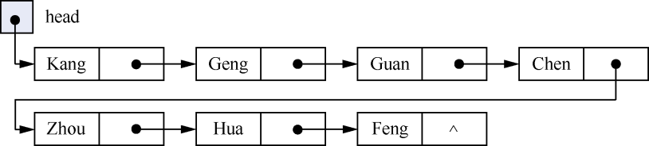
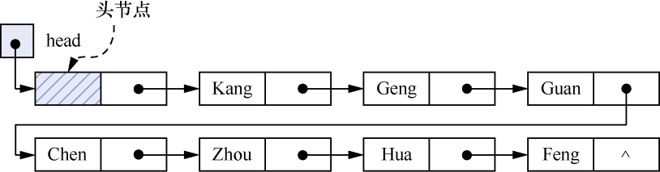
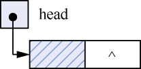
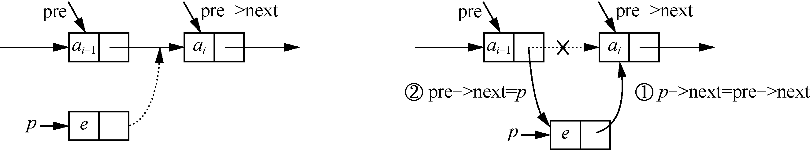
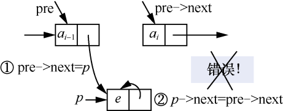
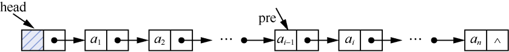
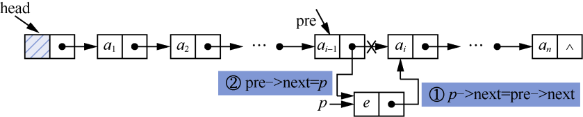
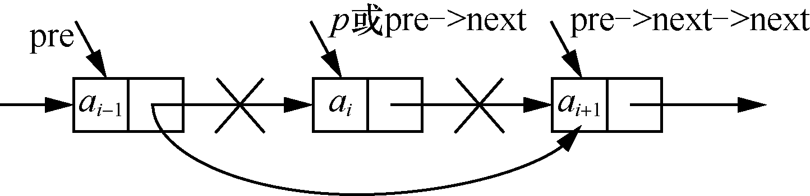
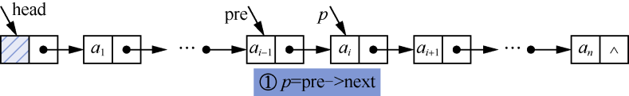
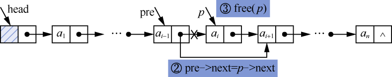

### 1.2　单链表及其应用

**【定义】**

所谓线性表的链式存储，是采用一组任意的存储单元存放线性表的元素。这组存储单元可以是连续的，也可以是不连续的。为了表示元素a<sub class="my_markdown">i</sub>与其直接后继a<sub class="my_markdown">i</sub>+1的逻辑关系，还需要存储一个指示其直接后继元素的信息（即直接后继元素的地址）。这两部分构成的存储结构称为 **节点** （node）。即节点包括两个域——数据域和指针域。节点结构如图1.10所示。


<center class="my_markdown"><b class="my_markdown">图1.10　节点结构</b></center>

通过指针域将线性表中的n个节点按照逻辑顺序链接在一起就构成了单链表。

一般情况下，我们只关心单链表中节点的逻辑顺序，而不关心它的实际存储位置。通常用箭头表示指针，把单链表表示成通过箭头链接起来的序列。线性表(Kang,Geng,Guan,Chen,Zhou,Hua,Feng)的单链表的逻辑状态如图1.11所示。


<center class="my_markdown"><b class="my_markdown">图1.11　单链表的逻辑状态</b></center>

为了便于实现插入、删除等操作，在单链表的第一个节点之前增加一个节点，称为头节点。头节点的数据域可以存放如单链表的长度等信息，头节点的指针域存放第一个节点的地址信息，使其指向第一个节点。带头节点的单链表如图1.12所示。


<center class="my_markdown"><b class="my_markdown">图1.12　带头节点的单链表</b></center>

若带头节点的单链表为空链表，则头节点的指针域为“空”，如图1.13所示。


<center class="my_markdown"><b class="my_markdown">图1.13　带头节点的单链表</b></center>

**【存储结构】**

单链表的存储结构用C语言描述如下。

```c
typedef struct Node
{
    DataType data;
    struct Node *next;
}ListNode,*LinkList;
```

其中，ListNode是单链表的节点类型，LinkList是指向单链表节点的指针类型。如果有以下定义，则L被定义为指向单链表的指针类型。

```c
LinkList L;
```

以上语句相当于以下定义。

```c
ListNode *L;
```

**【基本运算】**

（1）初始化单链表。

```c
void InitList(LinkList *head)
/*初始化单链表*/
{
    if((*head=(LinkList)malloc(sizeof(ListNode)))==NULL)
       exit(-1);
    (*head)->next=NULL;
}
```

（2）判断单链表是否为空。若单链表为空，返回1；否则，返回0。

```c
int ListEmpty(LinkList head)
/*判断单链表是否为空*/
{
    if(head->next==NULL) 
        return 1;        
    else                 
        return 0;        
}
```

（3）按序号查找操作。

```c
ListNode *Get(LinkList head,int i)
/*按序号查找单链表中的第i个节点。若查找成功，则返回该节点的指针；否则，返回NULL*/
{
    ListNode *p;
    int j;
    if(ListEmpty(head))     
        return NULL;        
    if(i<1)                 
        return NULL;        
    j=0;
    p=head;
    while(p->next!=NULL&&j<i)
    {
        p=p->next;
        j++;
    }
    if(j==i)                
        return p;           
    else                    
        return NULL;        
}
```

（4）查找元素值与e相等的节点。

```c
ListNode *LocateElem(LinkList head,DataType e)
/*按内容查找单链表中元素值与e相等的节点。若查找成功，则返回对应节点的节点指针；否则，返回NULL*/
{
    ListNode *p;
    p=head->next;              
    while(p)
    {
        if(p->data!=e)         
            p=p->next;         
        else                   
            break;             
    }
    return p;
}
```

（5）定位操作，确定节点在单链表中的序号。从头指针出发，依次访问每个节点，并将节点的元素值与e比较。如果相等，返回该序号；如果没有与e相等的元素值，返回0。

```c
int LocatePos(LinkList head,DataType e)
/*查找线性表中元素值与e相等的节点*/
{
    ListNode *p;
    int i;
    if(ListEmpty(head))    /*查找第i个节点前，判断链表是否为空*/
        return 0;
    p=head->next;          /*指针p指向第一个节点*/
    i=1;
    while(p)
    {
        if(p->data==e)     /*找到与e相等的元素值*/
            return i;      /*返回该节点序号*/
        else
        {
            p=p->next;
            i++;
        }
    }
    if(!p)                /*若没有找到与e相等的元素值*/
    return 0;             /*返回0 */
}
```

（6）在第i个位置插入元素e。

先来看如何在单链表中插入一个节点。假设存储元素e的节点为p指向的节点，要将p指向的节点插入pre和pre−>next之间，无须移动节点，只需要改变p和pre指针的指向即可。先把*pre的直接后继节点变成*p的直接后继节点，然后把*p变成*pre的直接后继节点，如图1.14所示，代码如下。

```c
p->next=pre->next;
pre->next=p;
```


<center class="my_markdown"><b class="my_markdown">图1.14　在*pre节点之后插入*p节点</b></center>


**注意：**
不能颠倒插入节点操作的顺序。如果先执行pre−>next=p，后执行p−>next= pre−>next，则第一条代码就会覆盖pre−>next的地址，pre−>next的地址就变成了p的地址，执行p−>next=pre−>next就等于执行p−>next=p，这样pre−>next就会与上级断开链接，如图1.15所示。


<center class="my_markdown"><b class="my_markdown">图1.15　颠倒插入操作顺序后，*(pre->next)节点与上一个节点断开链接</b></center>


在单链表的第i个位置插入一个新元素e的步骤如下。

① 在单链表中找到其直接前驱节点，即第i−1个节点，并由指针pre指向该节点，如图1.16所示。


<center class="my_markdown"><b class="my_markdown">图1.16　找到第i个节点的直接前驱节点</b></center>

② 申请一个新节点空间，由p指向该节点，将e赋值给p所指向节点的数据域。

③ 修改*p和*pre节点的指针域，如图1.17所示。


<center class="my_markdown"><b class="my_markdown">图1.17　将新节点插入第i个位置</b></center>

在单链表中插入元素e的算法实现如下。

```c
int InsertList(LinkList head,int i,DataType e)
/*在单链表中第i个位置插入一个节点，节点存放元素e*/
{
    ListNode *pre,*p;    /*定义第i个节点的前驱节点指针pre，指针p指向新生成的节点*/
    int j;
    pre=head;            /*指针p指向头节点*/
    j=0;
    while(pre->next!=NULL&&j<i-1)/*找到第i－1个节点，即第i个节点的前驱节点*/
    {
       pre=pre->next;
       j++;
    }
    if(j!=i-1)           /*如果没找到，则说明插入位置错误*/
    {
        printf("插入位置错误！");
        return 0;
    }
    /*新生成一个节点，并将e赋值给该节点的数据域*/
    if((p=(ListNode*)malloc(sizeof(ListNode)))==NULL)
        exit(-1);
    p->data=e;
    /*插入节点操作*/
    p->next=pre->next;
    pre->next=p;
    return 1;
}
```

（7）删除第i个节点。

先来观察删除单链表中的第i个节点是如何操作的。假设p指向第i个节点，要将*p节点删除，只需将它的直接前驱节点的指针（即pre的指针域）直接指向它的直接后继节点即可，如图1.18所示。


<center class="my_markdown"><b class="my_markdown">图1.18　删除*pre节点的直接后继节点</b></center>

删除单链表中第i个节点的步骤如下。

① 找到第i个节点的直接前驱节点（即第i−1个节点）和第i个节点，分别用pre和p指向这两个节点，如图1.19所示。


<center class="my_markdown"><b class="my_markdown">图1.19　找到第（i−1）个节点和第i个节点</b></center>

② 将*p节点的数据域赋给e，并删除第i个节点，即pre−>next=p−>next。

③ 释放*p的节点空间。删除过程如图1.20所示。


<center class="my_markdown"><b class="my_markdown">图1.20　删除第i个节点</b></center>

删除第i个节点的算法实现如下。

```c
int DeleteList(LinkList head,int i,DataType *e)
/*删除单链表中的第i个位置的节点。删除成功返回1，失败返回0*/
{
    ListNode *pre,*p;
    int j;
    pre=head;
    j=0;
    while(pre->next!=NULL&&pre->next->next!=NULL&&j<i-1)
    /*判断是否找到前驱节点*/
    {
        pre=pre->next;
        j++;
    }
    if(j!=i-1)      /*如果没找到要删除的节点的位置，则说明删除位置有误*/
    {
        printf("删除位置有误");
        return 0;
    }
    p=pre->next;
    *e=p->data;
    pre->next=p->next;
    free(p);        /*释放p指向的节点*/
    return 1;
}
```


**注意：**  在查找第（i−1）个节点时，要注意不可遗漏判断条件pre−>next−>next!=NULL，以确保第i个节点非空。如果没有此判断条件，且pre指针指向单链表的最后一个节点，那么在执行循环后的 "p=pre−>next；*e=p−>data" 操作时，p指针指向的就是NULL指针域，这样就会产生致命错误。


（8）求表长操作。

```c
int ListLength(LinkList head)
/*求表长操作*/
{
    ListNode *p;
    int count=0;
    p=head;
    while(p->next!=NULL)
    {
        p=p->next;
        count++;
    }
    return count;
}
```

（9）销毁链表操作。

```c
void DestroyList(LinkList head)
/*销毁链表*/
{
    ListNode *p,*q;
    p=head;
    while(p!=NULL)
    {
        q=p;
        p=p->next;
        free(q);
    }
}
```

以上基本运算存放在#include"LinkList.h"文件中，供其他函数在需要这些基本运算时调用。

