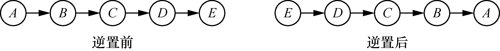
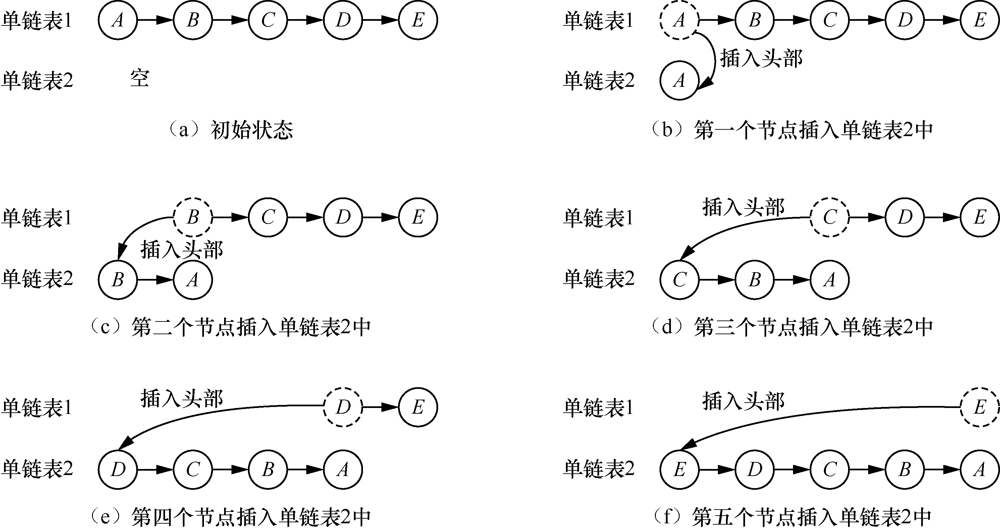
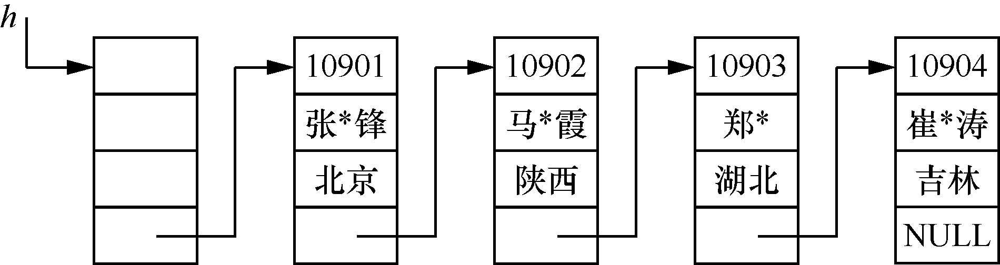
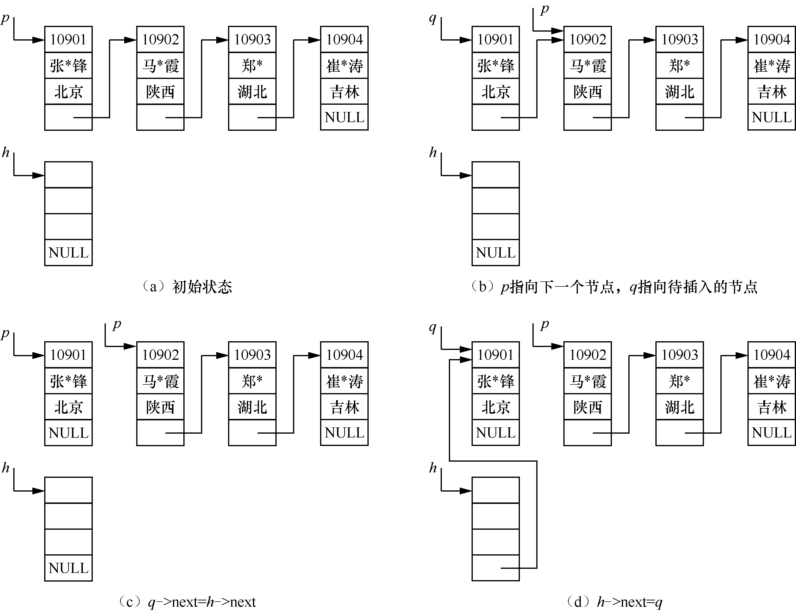
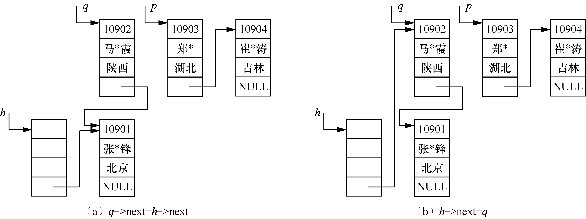
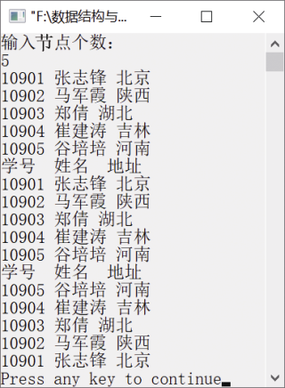

### 1.2.1　逆置单链表


**问题描述**


实现算法，将一个单链表逆置。所谓单链表的逆置，就是将一个单链表中的所有节点按照逆序存放。例如，一个单链表中有5个节点，节点中分别存放的数据是A、B、C、D、E，逆置后单链表中的节点数据次序是E、D、C、B、A，如图1.21所示。


<center class="my_markdown"><b class="my_markdown">图1.21　单链表逆置前后的状态</b></center>


**【分析】**

将一个单链表逆置其实就是用头插法建立单链表。定义一个空链表，分别将原单链表中的第一个节点、第二个节点，……，第n个节点依次插入新单链表的头部，即插入的节点成为新单链表的第一个节点。例如，将单链表1逆置为单链表2的过程如图1.22（a）～（f）所示。


<center class="my_markdown"><b class="my_markdown">图1.22　单链表1逆置为单链表2的过程</b></center>

从图1.22可以看出，依次将单链表1的每个节点插入单链表2的头部，就得到了一个单链表1的逆置单链表。

假设已经创建了一个带头节点的单链表，其中节点包含工号、姓名和籍贯等信息，如图1.23所示。


<center class="my_markdown"><b class="my_markdown">图1.23　带头节点的单链表</b></center>

单链表逆置就是指依次取出单链表中的每个节点，用头插法建立新单链表的过程。初始时，有h−>next=NULL。然后从单链表中依次取出每个节点，将其插入新单链表的头部，这样就得到了一个逆置单链表。例如，将p指向的单链表的第一个节点插入h指向的空单链表的过程如图1.24（a）～（d）所示。

初始时，h指向头节点，将头节点的指针域设置为NULL，表示得到的逆置单链表为空，如图1.24（a）所示。然后准备将第一个节点插入该空单链表中，先让q指向原单链表的第一个节点，即将要插入新单链表的节点，p指向原单链表的第二个节点，表示原单链表的头指针，如图1.24（b）所示。接下来要将q指向的节点插入h指向的单链表中。先将q指向的节点的指针域指向h指向的下一个节点，即q−>next=h−>next，此时，h−>next=NULL，所以q的指针域为空，如图1.24（c）所示。最后让h的指针域指向q，即要插入的节点。这样h指向的单链表中就有了一个节点如图1.24（d）所示。


<center class="my_markdown"><b class="my_markdown">图1.24　将p指向的单链表的第一个节点插入h指向的空单链表的过程</b></center>

接下来，将p指向的原单链表的第2个节点插入h指向的单链表中。先让q指向p，然后让p指向下一个节点以记录原节点的位置。按照以上方法将工号为“10902”的节点插入逆置单链表的过程如图1.25（a）和（b）所示。


<center class="my_markdown"><b class="my_markdown">图1.25　插入第2个节点的过程</b></center>

按照以上方法，即可实现将单链表逆置。


第1章\实例1-07.c

```c
/********************************************
*实例说明：将单链表逆置
*********************************************/
#include<stdio.h>
struct Node                            /*定义节点类型*/
{
    long no;
    char name[20];
    char addr[30];
    struct Node *next;
};
typedef struct Node ListNode;          
ListNode *CreateList();                
ListNode * ReverseList(ListNode *h);   
void DispList(ListNode *h);            
void main()
{
    ListNode *head,*p;                 
    head=CreateList();                 
    DispList(head);                    
    head=ReverseList(head);            
    DispList(head);                    
}
ListNode *CreateList()                 
{
    ListNode *pre,*cur,*h;             
    int i,n;                          
    h=NULL;                           
    printf("输入节点个数：\n");
    scanf("%d",&n);                   
    for(i=0;i<n;i++)
    {
        cur=(ListNode *)malloc(sizeof(ListNode));     /*生成新节点*/
        cur->next=NULL;
        if(h==NULL)               
            h=cur;                
        else                      
            pre->next=cur;        
        scanf("%d %s %s",&cur->no,cur->name,cur->addr);    /*输出单链表的节点的数据*/
        pre=cur;                   /*pre指向当前节点，即最后一个节点*/
    }
    return h;                      /*返回头指针*/
}
void DispList(ListNode *h)
{
    ListNode *p=h;
    printf("学号  姓名  地址\n");
    while(p!=NULL)
    {
        printf("%d %s %s\n",p->no,p->name,p->addr);
        p=p->next;
    }
}
ListNode  * ReverseList(ListNode *h)
/*将单链表逆置*/
{
    ListNode *q,*p=h;              /*p指向第一个节点*/
    h=(ListNode*)malloc(sizeof(ListNode));
    h->next=NULL;                
    while(p)                     
    {
        q=p;                     
        p=p->next;               
        q->next=h->next;         
        h->next=q;               
    }
    return h->next;                /*返回单链表的第一个节点的指针*/
}
```

运行结果如图1.26所示。


<center class="my_markdown"><b class="my_markdown">图1.26　运行结果</b></center>

