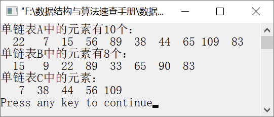

### 1.2.2　求两个单链表的差集


**问题描述**


利用单链表的基本运算求A−B。即如果单链表A中出现的元素，在B中也出现，则删除A中的该元素。例如，单链表A中的元素为(22,7,15,56,89,38,44,65,109,83），B中的元素为(15,9,22,89, 33,65,90,83），则执行A−B操作后，A中的元素为(7,56,38,44,109）。


**【分析】**

这是上海大学考研试题，下面是一个求两个集合A和B之差C=A−B的算法，即当且仅当e是A中的一个元素，但不是B中的一个元素时，e才是C中的一个元素。集合用有序单链表表示，先把集合A、B中的元素按递增顺序排列，C为空；操作完成后，A、B保持不变，C中元素按递增顺序排列。函数Append(last，e)把新节点元素e链接在由指针last指向的节点的后面，并返回新节点的地址。函数Difference(A，B)实现集合运算A−B，并返回表示结果集合C的单链表的头节点的地址。在执行A−B运算之前，用于表示结果集合的单链表中首先增加一个头节点，以方便新节点的添加。当A−B运算执行完毕后，再删除并释放表示结果集合的单链表的头节点。


第1章\实例1-08.c

```c
/********************************************
*实例说明：求单链表的差集
*********************************************/
#include<stdio.h>
#include<malloc.h>
#include<stdlib.h>
typedef int DataType;
#include"LinkList.h"               /*包含单链表实现文件*/
void SortList(LinkList S);
ListNode *Append(ListNode *last,DataType e);
ListNode *Difference(ListNode *A,ListNode *B);
void main()
{
    int i;
    DataType a[]={22,7,15,56,89,38,44,65,109,83};
    DataType b[]={15,9,22,89,33,65,90,83};
    LinkList A,B,C;                /*声明单链表A、B、C*/
    ListNode *p;
    InitList(&A);                  /*初始化单链表A*/
    InitList(&B);                  /*初始化单链表B*/
    /*将数组a中的元素插入单链表A中*/
    for(i=1;i<=sizeof(a)/sizeof(a[0]);i++)
    {
        if(InsertList(A,i,a[i-1])==0)
        {
            printf("位置不合法");
            return;
        }
    }
    /*将数组b中的元素插入单链表B中*/
    for(i=1;i<=sizeof(b)/sizeof(b[0]);i++)
    {
        if(InsertList(B,i,b[i-1])==0)
        {
            printf("位置不合法");
            return;
        }
    }
    printf("单链表A中的元素有%d个：\n",ListLength(A));
    p=A->next;
    while(p!=NULL)
    {
        printf("%4d",p->data);    /*输出单链表A中的每个元素*/
        p=p->next;
    }
    printf("\n");
    printf("单链表B中的元素有%d个：\n",ListLength(B));
    p=B->next;
    while(p!=NULL)
    {
        printf("%4d",p->data);    /*输出单链表B中的每个元素*/
        p=p->next;
    }
    printf("\n");
    SortList(A);
    SortList(B);
    C=Difference(A,B);
    printf("单链表C中的元素：\n");
    p=C;
    while(p!=NULL)
    {
        printf("%4d",p->data);
        p=p->next;
    }
    printf("\n");
}
void SortList(LinkList S)
/*利用选择排序法对单链表S中的元素进行排序*/
{
    ListNode *p,*q,*r;
    DataType t;
    p=S->next;
    while(p->next)
    {
        r=p;
        q=p->next;
        while(q)
        {
            if(r->data>q->data)
                r=q;
            q=q->next;
        }
        if(p!=r)
        {
            t=p->data;
            p->data=r->data;
            r->data=t;
        }
        p=p->next;
    }    
}
ListNode *Append(ListNode *last,DataType e)
//释放头节点
{
    last->next=(ListNode*)malloc(sizeof(ListNode));
    last->next->data=e;
    return last->next;
}
ListNode *Difference(ListNode *A,ListNode *B)
//求A-B，将结果存放在C中
{
    ListNode *C,*last;
    C=last=(ListNode*)malloc(sizeof(ListNode));
    while(A!=NULL&&B!=NULL)
        if(A->data<B->data)
        {
            last=Append(last,A->data);
            A=A->next;
        }
        else if(A->data==B->data)
        {
            A=A->next;
            B=B->next;
        }
        else
            B=B->next;
    while(A!=NULL)             //如果A中还有剩余元素，则把剩余元素追加到C中
    {
        last=Append(last,A->data);
        A=A->next;
    }
    last->next=NULL;       //最后一个节点的指针域设置为空
    last=C;
    C=C->next;             //指向第一个节点
    free(last);            //释放头节点
    return C;
}
```

运行结果如图1.27所示。


<center class="my_markdown"><b class="my_markdown">图1.27　运行结果</b></center>

这个算法也可以利用单链表的基本运算实现（无须对单链表进行排序）。对于单链表A中的每个元素，在单链表B中进行查找，如果在B中存在与A相同的元素，则将元素从A中删除。算法如下。

```c
void DelElem(LinkList A,LinkList B)
/*删除在单链表A中出现的单链表B的元素的算法实现*/
{
    int i,pos;
    DataType e;
    ListNode *p;
    /*在单链表B中，取出每个元素与单链表A中的元素比较，如果相等，则删除单链表A中元素对应的节点*/
    for(i=1;i<=ListLength(B);i++)        
    {
        p=Get(B,i);                   /*取出单链表B中的每个节点，将指针返回给p*/
        if(p)
        {
            pos=LocatePos(A,p->data);
            if(pos>0)
                DeleteList(A,pos,&e);
        }
    }
}
```

