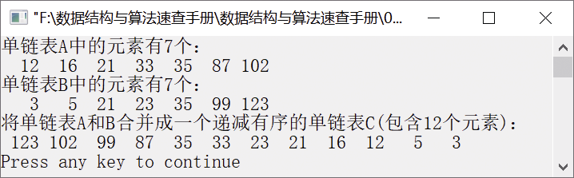

### 1.2.3　合并两个单链表


**问题描述**


已知两个单链表A和B，其中的元素都是非递减排列的，实现算法将单链表A和B合并成一个有序递减的单链表 C（值相同的元素只保留一个），并要求利用原单链表的节点空间。例如，A=(12,16,21,33,35,87,102)，B=(3,5,21,23,35,99,123)，则合并后 C=(123,102,99,87,35,33,23,21,16, 12,5,3)。


**【分析】**

此题为单链表合并问题。利用头插法建立单链表，使先插入的元素值小的节点在单链表末尾，后插入的元素值大的节点在单链表开头。初始时，单链表C为空（插入的是C的第一个节点），将单链表A和B中有较小的元素值的节点插入C中；单链表C不为空时，比较C和将插入节点的元素值，当值不同时，插入C中，当值相同时，释放该节点。当A和B中有一个单链表为空时，将剩下的节点依次插入C中。


第1章\实例1-09.c

```c
/********************************************
*实例说明：合并两个单链表
*********************************************/
#include<stdio.h>                
#include<malloc.h>
#include<stdlib.h>
typedef int DataType;
#include"LinkList.h"                              /*单链表基本运算实现文件*/
void MergeList(LinkList A,LinkList B,LinkList *C);/*函数声明：将单链表A和B的元素合并到C中*/
void main()
{
   int i;
   DataType a[]={12,16,21,33,35,87,102};
   DataType b[]={3,5,21,23,35,99,123};
   LinkList A,B,C;                    
   ListNode *p;
   InitList(&A);                      
   InitList(&B);                      
   for(i=1;i<=sizeof(a)/sizeof(a[0]);i++)
   /*利用数组元素创建单链表A*/
   {
       if(InsertList(A,i,a[i-1])==0)
       {
           printf("插入位置不合法!");
           return;
       }
    }
    for(i=1;i<=sizeof(b)/sizeof(b[0]);i++)
    /*利用数组元素创建单链表B*/
    {
       if(InsertList(B,i,b[i-1])==0)
       {
           printf("插入位置不合法!");
           return;
       }
    }
    printf("单链表A中的元素有%d个：\n",ListLength(A));
    for(i=1;i<=ListLength(A);i++)    /*输出单链表A*/
   {
        p=Get(A,i);    /*返回单链表A中的每个节点的指针*/
        if(p)
            printf("%4d",p->data); /*输出单链表A中的每个元素*/
    }
    printf("\n");
    printf("单链表B中的元素有%d个：\n",ListLength(B));
    for(i=1;i<=ListLength(B);i++)    /*输出单链表B*/
    {
        p=Get(B,i);    /*返回单链表B中的每个节点的指针*/
        if(p)
            printf("%4d",p->data);    /*输出单链表B中的每个元素*/
    }
        printf("\n");
    MergeList(A,B,&C);    /*将单链表A和B中的元素合并到单链表C中*/
    printf("将单链表A和B合并成一个有序递减的单链表C(包含%d个元素)：\n",ListLength(C));
    for(i=1;i<=ListLength(C);i++)        
    {
        p=Get(C,i);        /*返回单链表C中的每个节点的指针*/
        if(p)
            printf("%4d",p->data);    /*输出单链表C中的所有元素*/
    }
    printf("\n");
}
void MergeList(LinkList A,LinkList B,LinkList *C)
{
    ListNode *pa,*pb,*qa,*qb;    /*定义指向单链表A、B的指针*/
    pa=A->next;    /*pa指向单链表A*/
    pb=B->next;    /*pb指向单链表B*/
    free(B);    /*释放单链表B的头节点*/
    *C=A;    /*初始化单链表C，利用单链表A的头节点作为C的头节点*/
    (*C)->next=NULL;    
    while(pa&&pb)   
    {
          if(pa->data<pb->data)  /*pa指向元素值较小的节点时，将pa指向的节点插入单链表C中*/
          {
              qa=pa;
              pa=pa->next;
              if((*C)->next==NULL)    /*单链表C为空时，直接将节点插入单链表C中*/
              {
                 qa->next=(*C)->next;
                 (*C)->next=qa;
              }
              else if((*C)->next->data<qa->data)
              {
                   qa->next=(*C)->next;
                   (*C)->next=qa;
              }
              else/*否则，释放元素值相同的节点*/
                  free(qa);
          }
          else/*pb指向元素值较小的节点时，将pb指向的节点插入单链表C中*/
          {
              qb=pb;
              pb=pb->next;
              if((*C)->next==NULL)/*单链表C为空时，直接将节点插入单链表C中*/
              {
                 qb->next=(*C)->next;
                 (*C)->next=qb;
              }
              else if((*C)->next->data<qb->data)
              {
                 qb->next=(*C)->next;
                 (*C)->next=qb;
              }
              else/*否则，释放元素值相同的节点*/
                 free(qb);
          }
    }
    while(pa)/*若pb为空、pa非空，则将pa指向的后继节点插入单链表C中*/
    {
          qa=pa;
          pa=pa->next;
          if((*C)->next&&(*C)->next->data<qa->data)
          {
              qa->next=(*C)->next;
              (*C)->next=qa;
          }
          else
              free(qa);
    }
    while(pb)/*若pa为空、pb非空，则将pb指向的后继节点插入单链表C中*/
    {
          qb=pb;
          pb=pb->next;
          if((*C)->next&&(*C)->next->data<qb->data)
          {
              qb->next=(*C)->next;
              (*C)->next=qb;
          }
          else
              free(qb);
    }
}
```

运行结果如图1.28所示。


<center class="my_markdown"><b class="my_markdown">图1.28　运行结果</b></center>

